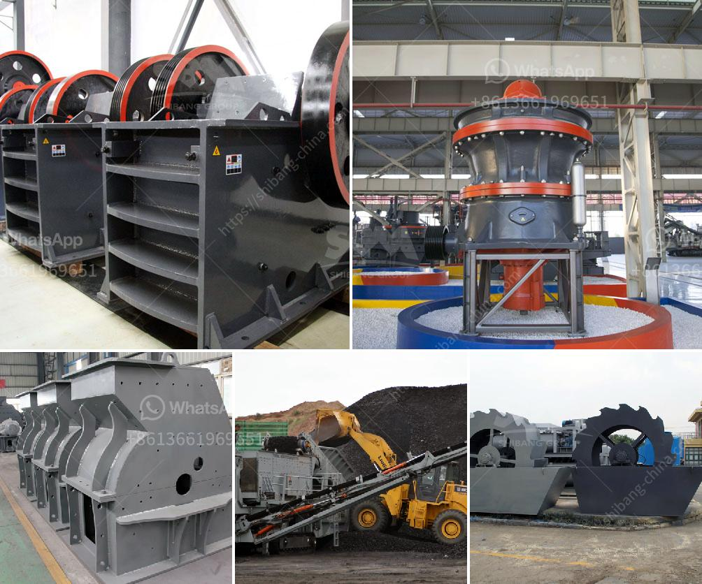

<h3>How to crush hard stones into powder?</h3>
Have you ever come across a piece of hard stone that you wished could be turned into fine powder? Whether it's for construction purposes, artistic endeavors, or scientific experiments, there are various reasons why one might need to crush hard stones into powder. While the process may seem challenging, it is entirely possible with the right tools and techniques. In this article, we will guide you on how to crush hard stones into powder effectively.

Firstly, you need to gather the necessary materials and equipment. You will require safety goggles, gloves, a respirator mask, and a sturdy hammer. Additionally, you will need a mortar and pestle, which can be made of various materials such as ceramic or stone, to further crush the stones into powder.

Before you start crushing the stones, ensure that you are working on a stable surface. It could be a concrete floor or a solid workbench. Safety is paramount, so be cautious and choose an area where you have plenty of space to work.

Once you have all the necessary materials and a suitable workspace, put on your safety goggles, gloves, and a respirator mask. Crushing hard stones can generate dust, which can be harmful when inhaled. Therefore, taking these precautions is essential to protect yourself from any potential health risks.

Next, place the stone on the stable surface and firmly grip the hammer. Start by lightly tapping the stone with the hammer to create a small fracture. Be sure to strike the stone in a controlled manner to prevent it from shattering unpredictably. It may take several taps in the same place to create a crack, especially if the stone is exceptionally hard.

Once a small fracture is formed, continue hammering along the same line to extend the fracture. Work slowly and deliberately, gradually moving along the stone's surface. It's crucial to avoid excessive force, as it can lead to an uncontrollable break. With careful precision and patience, you will be able to create a large enough crack to proceed further.

After successfully creating a fracture along the stone, it's time to use the mortar and pestle. Place a piece of the fractured stone inside the mortar and firmly hold the pestle with both hands. Start crushing the stone by applying downward pressure while rotating the pestle in a circular motion. This technique helps grind the stone into powder gradually.

Continue crushing the stone with the mortar and pestle until you achieve the desired consistency. It may take some time and effort, especially if the stone is particularly hard. However, with persistence, you will eventually obtain the desired result of powdered stone.

Remember, safety is of the utmost importance throughout this process. Frequently check the condition of your safety gear and replace it if necessary. Additionally, always work in a well-ventilated area to minimize dust inhalation.

In conclusion, crushing hard stones into powder requires patience, precision, and the right equipment. By following the steps outlined in this article, you can successfully crush hard stones into fine powder. Whether you require the powdered stone for construction purposes or creative projects, the process will become easier as you gain experience. Remember to prioritize safety at all times and enjoy the satisfaction of achieving your desired result.
<h3>Contact us</h3><ul><li><strong>Whatsapp:&nbsp;<a href="https://wa.me/8613661969651">+8613661969651</a></strong></li><li><a href="https://swt.shibang-china.com/?git&amp;zhl&amp;How to crush hard stones into powder"><strong>Online Service(chat now)</strong></a></li></ul><h3>Related</h3><ul><li><a href='How to plan to build a rock crusher production line.md'>How to plan to build a rock crusher production line?</a></li><li><a href='How to start crushed limestone production.md'>How to start crushed limestone production?</a></li><li><a href='How much does a stone crusher of 150 tonnes cost.md'>How much does a stone crusher of 150 tonnes cost?</a></li><li><a href='How to improve the sound of crusher machine.md'>How to improve the sound of crusher machine?</a></li><li><a href='how to replace dryer bearing ？.md'>how to replace dryer bearing ？</a></li></ul>