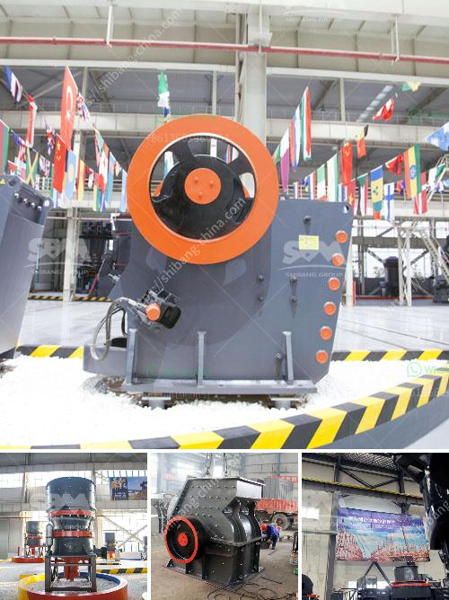

<h3>How to crush limestone?</h3>
Limestone is a sedimentary rock that is found in abundance around the world. It is widely used for various construction purposes because of its durability, versatility, and aesthetic appeal. Whether you are working on a construction project or looking to create a beautiful landscape in your backyard, crushing limestone can be an effective way to achieve your goals.

Crushing limestone involves several steps and considerations. To ensure the process is carried out efficiently and safely, here is a step-by-step guide on how to crush limestone:

1. Determine the Purpose: Before starting the crushing process, it is essential to clarify why you need to crush limestone. Whether you are looking to create a base for a road or driveway, use it as a raw material for cement production, or enhance the aesthetics of your landscaping, understanding your purpose will help you plan accordingly.

2. Identify the Equipment: The crushing process requires specialized equipment to ensure the limestone is crushed to the desired size and consistency. Depending on the scale of the project, you will need to choose between different types of crushers such as jaw crushers, impact crushers, cone crushers, or a combination of these.

3. Safety Precautions: Prioritize safety before, during, and after the crushing process. Make sure you have the appropriate personal protective equipment (PPE) for yourself and your team, such as gloves, safety goggles, and hard hats. Familiarize yourself with the operating manuals and safety guidelines provided by the equipment manufacturer.

4. Preparing the Site: Clear the area where the crushing will take place, removing any debris or obstacles that may interfere with the process. Ensure the workspace is well-ventilated and properly illuminated to minimize accidents or hazards.

5. Feeding the Limestone: Load the limestone into the crusher's hopper or feed the material into the crushing chamber. Make sure the crusher is set to the appropriate settings for your desired output size. Avoid overloading the crusher to prevent inefficiencies or equipment damage.

6. Crushing Process: Activate the crusher's motor and feed the limestone gradually into the crushing chamber. Use the appropriate controls to adjust the speed and settings to achieve the desired final product size. Monitor the crushing process closely and adjust as needed to ensure efficiency and quality.

7. Sieving or Screening: Once the limestone is crushed, you can opt to sieve or screen the crushed material to remove any unwanted particles or separate different sizes for specific purposes. This step is crucial in achieving the desired consistency and quality of the final product.

8. Removal of Debris: After the crushing and sieving process is complete, remove any leftover debris or unwanted materials from the crushed limestone. This may include pieces of metal, wood, or other foreign objects that may have been present in the original limestone.

By following these steps, you can efficiently crush limestone and achieve the desired results for your construction or landscaping project. Remember to prioritize safety, choose the right equipment, and monitor the process closely to ensure a successful outcome. With proper planning and execution, you can enjoy the benefits of crushed limestone, such as increased durability, improved drainage, and enhanced aesthetic appeal.
<h3>Contact us</h3><ul><li><strong>Whatsapp:&nbsp;<a href="https://wa.me/8613661969651">+8613661969651</a></strong></li><li><a href="https://swt.shibang-china.com/?git&amp;zhl&amp;How to crush limestone"><strong>Online Service(chat now)</strong></a></li></ul><h3>Related</h3><ul><li><a href='How to choose manganese ore crushing machinery.md'>How to choose manganese ore crushing machinery?</a></li><li><a href='How to Artificially Make Concrete Sand？.md'>How to Artificially Make Concrete Sand？</a></li><li><a href='How to decide on ball mill grinding media.md'>How to decide on ball mill grinding media?</a></li><li><a href='How can one avoid chalking during kaolin crushing.md'>How can one avoid chalking during kaolin crushing?</a></li><li><a href='How to Build a Sand Screening Plant.md'>How to Build a Sand Screening Plant?</a></li></ul>