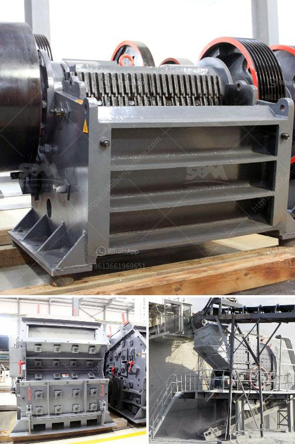

<h3>How to crush lumps of coal?</h3>
Coal has long been used as a primary source of energy worldwide, mainly for electricity generation and industrial processes. However, before being transformed into a useful fuel, coal often needs to be crushed into more manageable sizes for transportation and further processing. Whether you're a hobbyist fascinated by coal processing or a professional within the industry, this article will guide you through the steps of crushing lumps of coal effectively.

Coal is combustible and can release potentially harmful gases, so it's essential to take proper precautions before starting the crushing process. Make sure you're wearing appropriate personal protective equipment (PPE), including goggles and a dust mask, to minimize the risk of inhaling harmful particles or getting debris in your eyes.

To crush lumps of coal effectively, you'll need the proper tools. There are several options available, depending on the scale and purpose of your crushing operation. For large-scale industrial applications, heavy-duty crushers or lump breakers are commonly used. However, for smaller projects or personal use, a mortar and pestle or hammer and a solid surface can suffice.

Prior to crushing the lumps of coal, it's crucial to prepare them adequately. Remove any impurities, such as rocks or debris, that may have been mixed to ensure the coal is pure and manageable. Additionally, if the coal is excessively wet, allow it to dry out in a well-ventilated area to prevent clogging and improve the crushing efficiency.

Select an appropriate location where you have ample space to work with and easy access to necessary tools. A sturdy table or workbench is ideal, as it provides stability and support during the crushing process. Ensure the area is well-lit to promote accurate handling and avoid accidents.

The next step is to start the crushing process itself. If using a heavy-duty crusher or lump breaker, carefully feed the lumps of coal into the machinery, ensuring proper positioning. Follow the manufacturer's recommendations regarding the capacity and speed of operation to minimize the risk of equipment malfunction or injury.

If using a mortar and pestle or hammer, place the coal lump on a solid surface and apply firm pressure repeatedly until the desired size reduction is achieved. Be mindful of the force applied to prevent the coal from scattering and maintain control over the process.

Once the coal lumps are sufficiently crushed, it's essential to handle and store the resulting particles properly. Collect the crushed coal in appropriate containers to prevent spillage and contamination. Additionally, if analyzing or experimenting with the crushed coal, adequately label and document the samples for future reference.

In conclusion, crushing lumps of coal can be a fascinating and essential process in various industries. However, it's crucial to prioritize safety, choose the right equipment, prepare the coal adequately, and follow the proper crushing procedures. By taking these steps, you can efficiently crush lumps of coal to match your specific needs or project requirements, ensuring optimal fuel utilization or other applications within the industry.
<h3>Contact us</h3><ul><li><strong>Whatsapp:&nbsp;<a href="https://wa.me/8613661969651">+8613661969651</a></strong></li><li><a href="https://swt.shibang-china.com/?git&amp;zhl&amp;How to crush lumps of coal"><strong>Online Service(chat now)</strong></a></li></ul><h3>Related</h3><ul><li><a href='How to Buy a Stone Crusher in India ？.md'>How to Buy a Stone Crusher in India ？</a></li><li><a href='How to set up a clinker grinding unit.md'>How to set up a clinker grinding unit?</a></li><li><a href='How big is a 100 tph rock crushing plant.md'>How big is a 100 tph rock crushing plant</a></li><li><a href='How to start gold ball mill unit.md'>How to start gold ball mill unit?</a></li><li><a href='how to crush ore to 100 mesh grinding mill china？.md'>how to crush ore to 100 mesh grinding mill china？</a></li></ul>