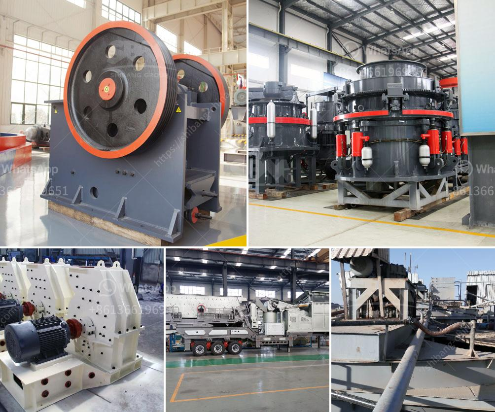

<h3>How to crush material from 12mm to 6mm?</h3>
Crushing material from 12mm to 6mm can be a challenging task as it requires the use of effective techniques and appropriate equipment. Whether you are a construction professional, a mining operator, or a DIY enthusiast, understanding the process of crushing material can help you achieve the desired particle size. In this article, we will explore various methods and equipment options to help you successfully crush material from 12mm to 6mm.

Before beginning the crushing process, it is crucial to know the properties of the material you are working with. Some materials are hard and brittle, while others are soft and ductile. Understanding these characteristics will help you choose the appropriate method and equipment for the job.

Several techniques can be employed to crush material effectively. The choice depends on the material properties and the desired outcome. Here are some commonly used techniques:

   a. Compression: This technique involves applying force to the material until it breaks or deforms. Jaw crushers and cone crushers are primary examples of compression crushers. They are used for hard materials, such as limestone or granite, and are capable of reducing material size by compression.

   b. Impact: Impact crushers are widely used in mining and construction industries. They work by using a high-speed rotor to strike the material, causing it to break into smaller pieces. Impact crushers are excellent for crushing brittle materials like glass or concrete.

   c. Shearing: Shearing crushers, like double-roll crushers or rotary crushers, are designed to crush material by applying shear force. They are suitable for materials with low to medium hardness and allow for precise size reduction.

Once you have determined the crushing technique, selecting the right equipment is vital. Consider the capacity, power requirements, and maintenance features of the machine. It should also be easily adjustable to achieve the desired particle size range. Consult with experts or equipment manufacturers to find the most suitable machine for your application.

When operating the crushing equipment, adhere to safety guidelines and protocols. Wear appropriate personal protective equipment like goggles, gloves, and earplugs to prevent injuries. Follow the manufacturer's instructions for proper equipment operation, maintenance, and troubleshooting.

Monitoring the crushing process is necessary to achieve the desired particle size. Consider using sieving or screening techniques to determine if the crushed material meets the required size range. Adjust the equipment settings if necessary to attain the desired results.

After successfully crushing the material from 12mm to 6mm, consider properly disposing or recycling the crushed material. Appropriate waste management techniques will help reduce environmental impact and ensure responsible handling of the crushed material.

In conclusion, crushing material from 12mm to 6mm requires a systematic approach to choose the right technique and equipment. Understanding the material properties and the desired outcome are crucial factors in achieving the desired particle size. By following the steps mentioned above, you can effectively crush material and achieve the desired results. Always prioritize safety while operating the crushing equipment and ensure responsible waste management.
<h3>Contact us</h3><ul><li><strong>Whatsapp:&nbsp;<a href="https://wa.me/8613661969651">+8613661969651</a></strong></li><li><a href="https://swt.shibang-china.com/?git&amp;zhl&amp;How to crush material from 12mm to 6mm"><strong>Online Service(chat now)</strong></a></li></ul><h3>Related</h3><ul><li><a href='How does a mobile crushing plant work.md'>How does a mobile crushing plant work?</a></li><li><a href='How to choose the jaw crusher motor ？.md'>How to choose the jaw crusher motor ？</a></li><li><a href='How to move a mobile screen crusher.md'>How to move a mobile screen crusher?</a></li><li><a href='How to determine the value of a rock quarry.md'>How to determine the value of a rock quarry?</a></li><li><a href='How to feed a jaw crusher from a concrete hopper.md'>How to feed a jaw crusher from a concrete hopper?</a></li></ul>