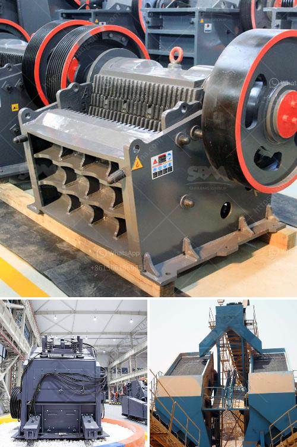

<h3>How to crush metallurgical coke?</h3>
Metallurgical coke is an essential material in various industries, particularly in iron and steel production. It is a carbon-rich product that is derived from the destructive distillation of coal. Typically, metallurgical coke is produced by heating bituminous coal in the absence of air, resulting in the removal of volatile components and leaving behind a solid and porous material.

Crushing metallurgical coke is a vital step in the production process as it enables the coke to have a specific size, which is required for the efficient operation of the blast furnace. Crushing coke into smaller sizes also increases its surface area, allowing for better combustion and rapid gasification. If you are involved in the production of metallurgical coke or require crushed coke for your operations, continue reading to understand how to crush metallurgical coke effectively.

One of the primary methods for crushing metallurgical coke is through the use of specialized equipment called coke crushers. These machines are designed to break large coke chunks into smaller particles or fines. They employ various mechanisms such as compression, impact, or shear forces to achieve the desired reduction in size.

To crush metallurgical coke properly, it is essential to select the appropriate type of coke crusher for the specific application. There are primarily two types of coke crushers commonly used: hammer crushers and roll crushers.

Hammer crushers work on the principle of impacting the coke with high-speed hammers. The coke chunks are fed into the crushing chamber, where the rotating hammers strike them, shattering them into smaller fragments. Hammer crushers are ideal for primary and secondary crushing operations, offering high throughput and uniform coke size distribution.

Roll crushers, on the other hand, are composed of two large rolls that rotate in opposite directions. As the coke chunks pass between the rolls, they are compressed and crushed into smaller sizes. Roll crushers are suitable for finer crushing operations and are often used to produce coke fines or powder.

When crushing metallurgical coke, it is crucial to ensure reliable and smooth operation of the coke crusher. Regular maintenance and inspection of the crushing equipment are necessary to prevent unexpected breakdowns and maximize production efficiency. Additionally, it is important to monitor the coke size after crushing, ensuring that it meets the required specifications for your particular application.

In conclusion, crushing metallurgical coke holds significant importance in various industries, particularly in iron and steel production. The process of crushing coke enables the material to have a specific size, facilitating its efficient use in blast furnaces. By employing specialized coke crushers such as hammer crushers or roll crushers, the coke can be crushed into the desired size range. However, it is vital to ensure proper maintenance and inspection of the crushing equipment to avoid any disruptions in the production process. Remember, the quality and size of the crushed coke play a crucial role in achieving optimal performance and productivity in your operations.
<h3>Contact us</h3><ul><li><strong>Whatsapp:&nbsp;<a href="https://wa.me/8613661969651">+8613661969651</a></strong></li><li><a href="https://swt.shibang-china.com/?git&amp;zhl&amp;How to crush metallurgical coke"><strong>Online Service(chat now)</strong></a></li></ul><h3>Related</h3><ul><li><a href='How does a work of impact crusher.md'>How does a work of impact crusher?</a></li><li><a href='How to increase the output of jaw crusher ？.md'>How to increase the output of jaw crusher ？</a></li><li><a href='How to get gold from ore crushing.md'>How to get gold from ore crushing?</a></li><li><a href='How to operate a hp cone crusher.md'>How to operate a hp cone crusher?</a></li><li><a href='how to crush ore to 100 mesh grinding mill china？.md'>how to crush ore to 100 mesh grinding mill china？</a></li></ul>