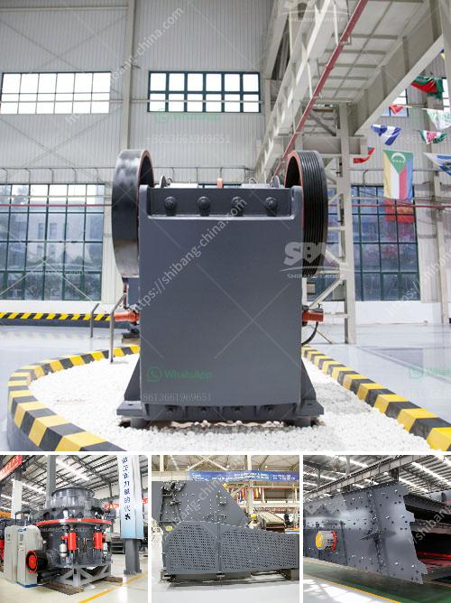

<h3>How to crush small gravel into sand?</h3>
Gravel is a versatile material that can be used for various purposes in both construction and landscaping projects. However, if you have a large pile of gravel that you want to turn into sand, it may seem like a challenging task. Fortunately, with the right tools and techniques, it is possible to crush small gravel into sand efficiently. In this article, we will guide you through the process of crushing small gravel into sand.

Firstly, it is essential to understand the difference between gravel and sand. Gravel is a loose aggregation of small, medium, or big stones, while sand is a granular material composed of finely divided particles. Although both materials are extracted from similar sources, their particle sizes distinguish them.

To begin the process, you will need some essential tools and equipment. These include a crushing machine, a sifter, and a transport container. A crusher is required to break down the gravel into smaller particles that can be sifted through a screen or sifter. The sifter separates the grains of sand from the larger stones. Lastly, a container like a wheelbarrow or bucket is needed to collect the sand, ready for use.

Before starting the crushing process, consider the particle size you need for your particular project. For example, if you're using the sand for a construction project, you may need fine sand with a specific size range. Knowing this information will help you adjust the settings on your crusher accordingly.

Position the crushing machine on a stable and level surface to ensure safe and efficient operation. Ensure that the machine is connected to a reliable power source and that all safety precautions are followed, including wearing protective gear such as goggles and gloves.

Feed the gravel into the crushing machine's hopper. Adjust the crushing machine's settings to achieve the desired particle size. Some machines have adjustable plates that allow you to control the size of the output material. Ensure that the gravel is crushed evenly and doesn't clump together.

After crushing the gravel, pass it through a sifter or screen to separate the sand from the larger stones. The sifter will capture the sand particles, allowing the larger stones to be discarded or crushed further if necessary.

Once the sand has been sifted, collect it in a container for later use. A wheelbarrow or bucket works well for this purpose. Make sure the container is clean and free from any contaminants before collecting the sand.

By following these steps, you can successfully crush small gravel into sand for your construction or landscaping project. Remember to always prioritize safety and wear appropriate protective gear when working with heavy machinery.

In conclusion, crushing small gravel into sand is a relatively straightforward process if you have the right tools and follow the necessary steps. With the proper equipment and careful execution, you can transform your pile of gravel into high-quality sand that can be used for various applications.
<h3>Contact us</h3><ul><li><strong>Whatsapp:&nbsp;<a href="https://wa.me/8613661969651">+8613661969651</a></strong></li><li><a href="https://swt.shibang-china.com/?git&amp;zhl&amp;How to crush small gravel into sand"><strong>Online Service(chat now)</strong></a></li></ul><h3>Related</h3><ul><li><a href='How to install a conveyor belt for the coal mill.md'>How to install a conveyor belt for the coal mill?</a></li><li><a href='how can work the crusher house in thermal power plant .md'>how can work the crusher house in thermal power plant ?</a></li><li><a href='How to maintenance coal mill.md'>How to maintenance coal mill?</a></li><li><a href='How to make a coal primary jaw crusher machine.md'>How to make a coal primary jaw crusher machine?</a></li><li><a href='How to choose the size of jaw crusher ？.md'>How to choose the size of jaw crusher ？</a></li></ul>