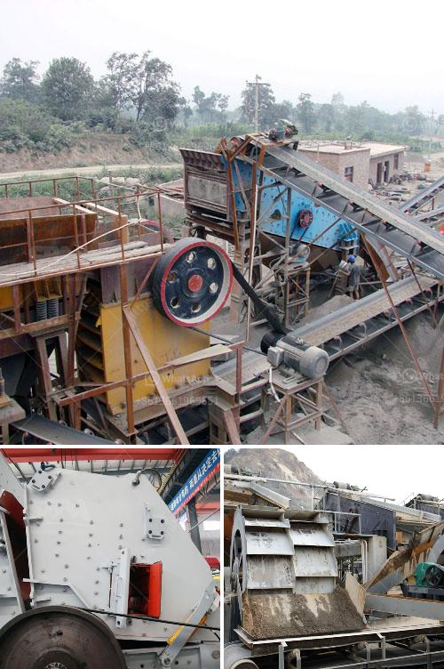

<h3>How to crush spongy limestone?</h3>
Limestone is an abundant natural resource found worldwide, which is primarily used in construction and manufacturing industries. It is a sedimentary rock formed by the accumulation of skeletal fragments of marine organisms such as coral and shells. However, not all limestone is equal. Some limestone is softer and more porous, commonly known as spongy limestone. Crushing spongy limestone can pose specific challenges due to its composition and characteristics. In this article, we will explore effective techniques to crush spongy limestone, ensuring maximum efficiency and high-quality output.

To effectively crush spongy limestone, it is crucial to understand its composition. Spongy limestone contains a high percentage of moisture, which considerably affects its physical properties. The high moisture content makes it softer and more prone to sticking and clumping during the crushing process, hence requiring specialized methods.

Before crushing spongy limestone, it is important to undertake certain preparatory steps to enhance the efficiency and effectiveness of the crushing process. Firstly, dry the limestone to reduce excess moisture content. This can be achieved by exposing the limestone to natural sunlight or using drying techniques such as air-drying or heat drying. Secondly, ensure that the limestone is of a suitable size for crushing, as larger chunks may be more difficult to process.

To crush spongy limestone effectively, mechanical crushing techniques can be employed. The primary method is using compression or jaw crushers. These machines apply pressure to the material, reducing it into smaller fragments. Additionally, impact crushers can be used to further break down the limestone into even smaller sizes. These machines use quick rotational speeds and impact forces to shatter the limestone.

Optimizing crushing parameters is crucial to efficiently crush spongy limestone. The selection of the appropriate crusher and its settings is important. Adjusting the gap between the two crushing plates in a jaw crusher, or the rotor speed in an impact crusher, can influence the final product size, as well as the production rate. Balancing the factors such as rotational speed, feed rate, and crushing chamber configuration can result in better crushing efficiency.

Controlling moisture during the crushing process is essential to crushing spongy limestone effectively. Adding a moisture control agent such as water or polymer can help reduce dust and enhance the flowability of the limestone, preventing it from sticking to the crusher components. However, it is crucial to strike a balance, as too much moisture can cause clumping and decrease efficiency.

Maintain regular maintenance of the crushing equipment to ensure optimal performance. Regular inspection, cleaning, and lubrication of the machinery will help prevent any potential issues that may arise from sticky limestone or excessive wear and tear.

In conclusion, crushing spongy limestone can pose specific challenges due to its composition and characteristics. Employing effective techniques such as understanding its composition, undertaking preparatory steps, utilizing mechanical crushing techniques, optimizing crushing parameters, utilizing moisture control techniques, and regular maintenance will ensure efficient and high-quality limestone crushing. By following these guidelines, businesses in construction and manufacturing industries can crush spongy limestone with ease, resulting in excellent output for their respective applications.
<h3>Contact us</h3><ul><li><strong>Whatsapp:&nbsp;<a href="https://wa.me/8613661969651">+8613661969651</a></strong></li><li><a href="https://swt.shibang-china.com/?git&amp;zhl&amp;How to crush spongy limestone"><strong>Online Service(chat now)</strong></a></li></ul><h3>Related</h3><ul><li><a href='How to import stone crusher machine from China to Canada.md'>How to import stone crusher machine from China to Canada?</a></li><li><a href='How to adjust impact crusher 7 key steps.md'>How to adjust impact crusher? 7 key steps</a></li><li><a href='How do highpressure grinding rolls mills work.md'>How do high-pressure grinding rolls mills work?</a></li><li><a href='how to biuld a small rock crusher ？.md'>how to biuld a small rock crusher ？</a></li><li><a href='how to install stone crusher plant .md'>how to install stone crusher plant ?</a></li></ul>