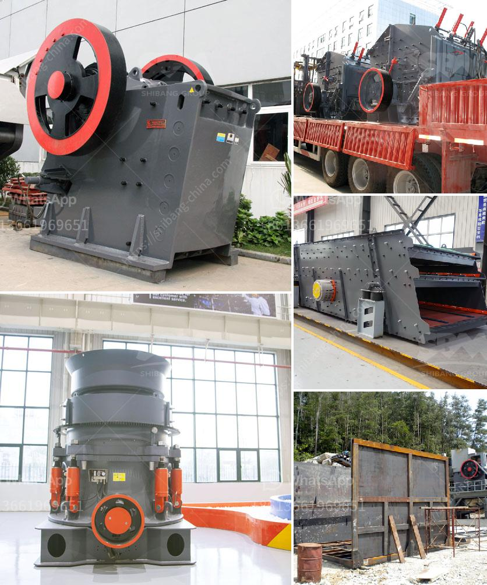

<h3>How to crush the California sandstone ?</h3>
California sandstone is a beautiful and popular natural stone used in various construction and landscaping projects. It is known for its vibrant colors, durability, and unique textures. However, there are instances where crushing the California sandstone becomes necessary, such as when creating gravel for driveways or pathways. This article will provide a step-by-step guide on how to crush California sandstone effectively.

Before embarking on the crushing process, it is essential to gather the necessary equipment and tools. Here is a list of items you will need:

1. Safety goggles: Protect your eyes from any flying debris or particles during the crushing process.

2. Hammer: A sledgehammer or a heavy-duty hammer will work well for breaking down the large sandstone pieces.

3. Chisel: A chisel with a sharp edge will help in cutting the sandstone into smaller, more manageable pieces.

4. Safety gloves: It is crucial to protect your hands from any potential injuries while handling the sandstone pieces.

Once you have gathered the necessary equipment, follow these steps to effectively crush California sandstone:

Step 1: Safety first - Put on your safety goggles and gloves to ensure your eyes and hands are protected throughout the process.

Step 2: Prepare the sandstone - Start by identifying the sandstone pieces you want to crush. It is important to ensure that these pieces are not too large for easy handling. Assess the overall condition of the sandstone and make sure it is stable.

Step 3: Break down the sandstone - Using the hammer, strike the sandstone pieces firmly in the center. Begin with smaller strikes to prevent any accidents or injuries. Gradually increase the force until the sandstone starts to crack or break into smaller fragments.

Step 4: Cut the sandstone - After breaking down the larger pieces, use the chisel to cut the sandstone into even smaller, manageable pieces. Carefully position the chisel at the desired break point and strike it with the hammer. Repeat this process until you achieve the desired size of crushed sandstone.

Step 5: Collect the crushed sandstone - Once you have crushed the sandstone into the desired size, carefully collect the fragments for further use or disposal. It is crucial to handle the crushed sandstone with care to minimize any potential injuries.

Step 6: Clean up - After completing the crushing process, take the time to clean up the area and store all tools safely. Dispose of any debris or unused sandstone responsibly.

By following these steps, you will be able to effectively crush California sandstone and utilize it for various applications, whether it is as a base material for construction projects or as decorative gravel for landscaping.

In conclusion, crushing California sandstone requires the proper equipment, safety precautions, and a systematic approach. By breaking down the sandstone using a hammer and chisel, you can create crushed sandstone that can be used in various applications. Remember to prioritize safety at all times and clean up after completing the process. With proper execution, you can successfully crush California sandstone and make the most of this stunning natural stone.
<h3>Contact us</h3><ul><li><strong>Whatsapp:&nbsp;<a href="https://wa.me/8613661969651">+8613661969651</a></strong></li><li><a href="https://swt.shibang-china.com/?git&amp;zhl&amp;How to crush the California sandstone "><strong>Online Service(chat now)</strong></a></li></ul><h3>Related</h3><ul><li><a href='How to replace the vertical impact crusher on the production line.md'>How to replace the vertical impact crusher on the production line?</a></li><li><a href='How to install a jaw crusher.md'>How to install a jaw crusher?</a></li><li><a href='How to crush borax .md'>How to crush borax ?</a></li><li><a href='How to improve the sound of crusher machine.md'>How to improve the sound of crusher machine?</a></li><li><a href='how the mine crusher operate .md'>how the mine crusher operate ?</a></li></ul>