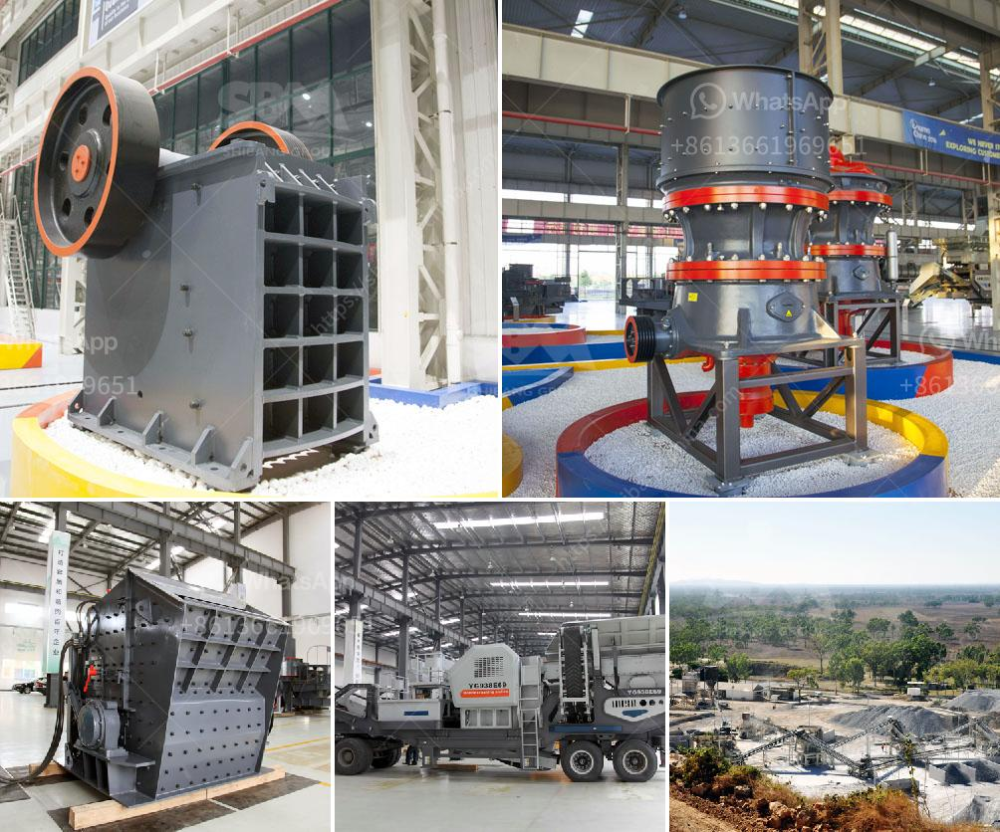

<h3>How to crush the very hard iron ore magnetite?</h3>
Iron ore is one of the most abundant and commonly mined substances in the world. It is primarily used in the production of steel, which is essential for many industries such as construction, transportation, and manufacturing. Magnetite is a type of iron ore that is particularly well-known for its magnetic properties, making it a valuable resource for iron and steel production. However, magnetite is also one of the hardest forms of iron ore, making it very difficult to crush.

Crushing magnetite requires a scientific approach and specialized equipment. Here are some steps and methods that can be employed to successfully crush magnetite ore:

Before attempting to crush magnetite, it is important to understand its properties. Magnetite has a Mohs hardness scale rating of 5.5-6.5, which indicates its toughness and resistance to scratching. Additionally, magnetite has a high density and is strongly magnetic. This knowledge helps in choosing the appropriate crushing method and equipment.

To prepare magnetite ore for further crushing, it is usually initially processed through a jaw crusher. This step helps to reduce large chunks into manageable pieces for subsequent crushing stages. The jaw crusher uses compression force to break the ore by exerting pressure on it between a fixed and a moving jaw plate.

After the magnetite ore has been reduced to a manageable size, it is necessary to further crush it to achieve the desired particle size. Cone crushers and impact crushers are commonly used for secondary crushing. These crushers operate by applying force to the ore through a rotating cone or rotor, respectively.

Once the magnetite ore has been crushed into small particles, it may be necessary to grind it further to achieve the desired particle size for subsequent processing. Grinding mills such as ball mills and rod mills are commonly used for this purpose. These mills contain a rotating drum that grinds the magnetite ore by repeatedly striking it with steel balls or rods.

Magnetite ore is often separated from other minerals using magnetic separation techniques. This process relies on the magnetic properties of magnetite, which can be attracted and separated by a magnetic field. Magnetic separators are used to separate magnetite from the remaining non-magnetic materials.

After crushing and grinding, magnetite ore may undergo a beneficiation process to remove impurities and increase its iron content. Beneficiation processes can include flotation, gravity separation, and magnetic separation. These processes aim to further refine magnetite ore and improve its overall quality.

In conclusion, crushing magnetite ore poses unique challenges due to its hardness and magnetic properties. However, with the appropriate equipment and methods, it is possible to crush magnetite ore effectively. Understanding the properties of magnetite, employing preliminary and secondary crushing, grinding, magnetic separation, and beneficiation processes all contribute to successfully crushing magnetite ore.
<h3>Contact us</h3><ul><li><strong>Whatsapp:&nbsp;<a href="https://wa.me/8613661969651">+8613661969651</a></strong></li><li><a href="https://swt.shibang-china.com/?git&amp;zhl&amp;How to crush the very hard iron ore magnetite"><strong>Online Service(chat now)</strong></a></li></ul><h3>Related</h3><ul><li><a href='How does a work of impact crusher.md'>How does a work of impact crusher?</a></li><li><a href='How calcite is mined and processed .md'>How calcite is mined and processed ?</a></li><li><a href='how to change hammer in rock crusher.md'>how to change hammer in rock crusher?</a></li><li><a href='how vibrating screen works .md'>how vibrating screen works ?</a></li><li><a href='How to select a reversible hammer crusher as a coal crusher.md'>How to select a reversible hammer crusher as a coal crusher?</a></li></ul>