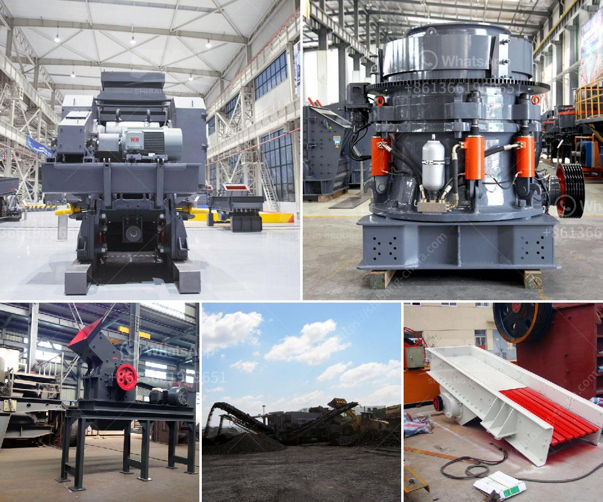

<h3>How to deal with the vicious competition in the mining industry ?</h3>
In the fierce realm of the mining industry, competition can be ruthless and unyielding. Mining companies face challenges ranging from declining ore grades to increased environmental regulations, which further intensify the struggle for survival. As companies vie for limited resources and seek to maximize profits, developing effective strategies to deal with this vicious competition becomes paramount. So, how can mining companies navigate these treacherous waters?

To gain a competitive edge, mining companies must prioritize technological advancements. Incorporating automation, sensors, and analytics into mining operations can optimize productivity, reduce costs, and improve safety. By utilizing data analytics and real-time monitoring, companies can make informed decisions and swiftly adapt to changing market conditions.

Forward-thinking companies that foster a culture of innovation are more likely to navigate the challenges of the mining industry. Encouraging employees to think outside the box, explore new technologies, and streamline processes can lead to significant improvements. Additionally, staying agile and adaptable allows businesses to respond quickly to market fluctuations and ever-evolving demands.

In the competitive mining landscape, strategic partnerships and collaborations can be advantageous. Pooling resources and knowledge through joint ventures or consortiums can help mining companies share risks, expertise, and costs. Consolidating operations can also lead to economies of scale, enabling companies to compete more effectively.

Environmental conservation is no longer an option but an imperative in the mining industry. Companies that adopt sustainable practices have a better chance of staying ahead of the competition. By adhering to stringent environmental regulations, minimizing waste, and implementing responsible mining practices, companies can strengthen their reputation and gain a competitive advantage.

A skilled and engaged workforce can make a significant difference in navigating the competitive mining industry. Investing in employee training and development programs enhances productivity, safety, and morale. Emphasizing strong leadership, fostering a positive work culture, and offering competitive compensation packages will attract and retain top talent.

Relying solely on a single resource can make a company vulnerable to market fluctuations. Diversifying product offerings allows businesses to spread risks and take advantage of emerging opportunities. Mining companies should consider expanding into related commodities or exploring new markets to ensure a more stable and resilient operation.

Thriving in the fiercely competitive mining industry necessitates an unwavering commitment to innovation, sustainability, collaboration, and workforce development. Embracing technological advancements, fostering a culture of innovation, and prioritizing sustainable practices will provide companies with an edge. Collaborations, consolidations, and diversifying product offerings can also help mining companies adapt to market dynamics and gain a competitive advantage. By strategically implementing these practices, mining companies can navigate the treacherous waters of the industry and position themselves for long-term success.
<h3>Contact us</h3><ul><li><strong>Whatsapp:&nbsp;<a href="https://wa.me/8613661969651">+8613661969651</a></strong></li><li><a href="https://swt.shibang-china.com/?git&amp;zhl&amp;How to deal with the vicious competition in the mining industry "><strong>Online Service(chat now)</strong></a></li></ul><h3>Related</h3><ul><li><a href='How to adjust the conveyor belt.md'>How to adjust the conveyor belt?</a></li><li><a href='how to intall a jaw crusher ？.md'>how to intall a jaw crusher ？</a></li><li><a href='how the mine crusher operate .md'>how the mine crusher operate ?</a></li><li><a href='How much does an 800ton jaw crusher cost.md'>How much does an 800-ton jaw crusher cost?</a></li><li><a href='How does a Raymond mill work.md'>How does a Raymond mill work?</a></li></ul>