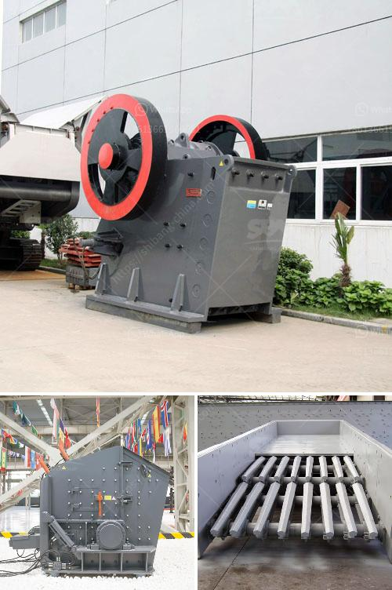

<h3>How to design a ball mill for cement ？</h3>
Designing a ball mill for cement is a complex process that requires a deep understanding of the cement manufacturing process and the physical and chemical properties of the materials used. Today, we will discuss the key steps and considerations involved in designing a ball mill for cement grinding.

Firstly, it is important to understand the cement manufacturing process. The main raw materials used in cement production are limestone, clay, and shale. These materials are quarried, crushed, and ground into a fine powder called raw meal. This raw meal is then heated in a kiln at extremely high temperatures to form clinker. The clinker is cooled and ground together with gypsum, which acts as a setting regulator, to produce cement.

The main purpose of a ball mill in the cement manufacturing process is to grind the clinker and raw materials to the desired size. The design of a ball mill varies depending on the nature of the materials being processed and the equipment used.

Traditionally, ball mills have been cylindrical. This design takes advantage of the large grinding surface area that a cylinder provides. However, this design has limitations as the length-to-diameter ratio of the cylinder needs to be kept within a certain range to prevent excessive flexing and distortion. To address this issue, modern ball mill designs often incorporate multi-chamber configurations or use trunnion-supported mills which have larger diameter-to-length ratios.

The choice of material for the ball mill liners is also crucial. Liners need to withstand the impact and wear of the grinding media and the material being ground. Commonly used materials for liner construction are rubber, steel, and alloyed steels. The liner design and material should be selected based on the type and size of the grinding media and the expected abrasion and impact forces.

Another important consideration in ball mill design is the rotational speed at which the mill operates. This is typically measured in revolutions per minute (rpm). The rotational speed affects the grinding efficiency and the power consumption of the mill. Higher rotational speeds result in more efficient grinding, but also increase the risk of overheating and excessive wear on the mill components. Therefore, the speed should be carefully chosen based on the specific requirements of the cement production process.

In addition to these considerations, ball mill design should also take into account the space available for installation, the ease of maintenance and access for repairs, and the level of automation desired. A well-designed ball mill should be efficient, reliable, and easy to operate.

In conclusion, designing a ball mill for cement grinding is a complex process that requires a deep understanding of the cement manufacturing process, the physical and chemical properties of the materials used, and the equipment involved. We hope that this article has provided a basic understanding of the key factors to consider in designing a ball mill for cement production.
<h3>Contact us</h3><ul><li><strong>Whatsapp:&nbsp;<a href="https://wa.me/8613661969651">+8613661969651</a></strong></li><li><a href="https://swt.shibang-china.com/?git&amp;zhl&amp;How to design a ball mill for cement ？"><strong>Online Service(chat now)</strong></a></li></ul><h3>Related</h3><ul><li><a href='How to set up a stone crusher plant.md'>How to set up a stone crusher plant?</a></li><li><a href='How can I get more production out of my impact crusher.md'>How can I get more production out of my impact crusher?</a></li><li><a href='how to separate iron from basalt？.md'>how to separate iron from basalt？</a></li><li><a href='How to run a crushing plant.md'>How to run a crushing plant?</a></li><li><a href='7 Factors Affecting the Price of Jaw Crusher.md'>7 Factors Affecting the Price of Jaw Crusher</a></li></ul>