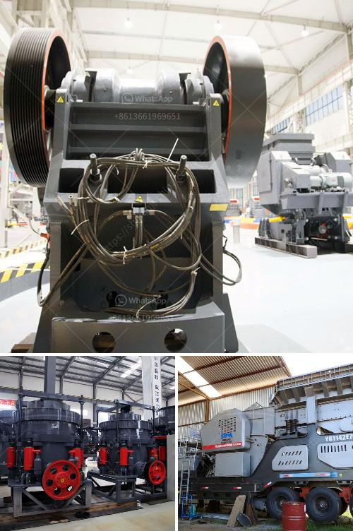

<h3>How to design a belt feed bin ?</h3>
A belt feed bin refers to a storage container specifically designed to store and dispense materials that are conveyed using a conveyor belt system. These bins are commonly used in various industries such as mining, agriculture, and manufacturing. Effective design of a belt feed bin ensures efficient material flow, prevents spillage, and maximizes storage capacity. In this article, we will explore the step-by-step process of designing a belt feed bin.

1. Determine Material Characteristics: The first step in designing a belt feed bin is to understand the characteristics of the material to be stored. Factors like particle size, bulk density, angle of repose, and flowability need to be considered. Each material has unique properties that affect how it will flow and behave in the bin.

2. Calculate the Required Storage Capacity: Once the material characteristics are known, the next step is to calculate the storage capacity needed for the operation. This is determined by factors like anticipated flow rate, storage duration, and material density. The objective is to ensure that the bin has sufficient capacity to accommodate the required volume of material.

3. Determine Bin Geometry: The bin's geometry plays a crucial role in ensuring proper material flow and preventing structural issues. Factors like outlet size, hopper angle, and convergence angle need to be carefully considered. Convergent sections are commonly used to ensure mass flow and prevent stagnant zones that may lead to arching or bridging of the material.

4. Structural Analysis: A belt feed bin needs to be structurally sound to withstand the weight of the stored material and any additional loadings. Hence, a structural analysis is crucial to determine the appropriate thickness of the bin wall, reinforcing members, and support structure. The bins are usually designed with stiffening elements to counteract any bending or deformation.

5. Evaluate Outlet Design: The design and dimensions of the outlet are critical for efficient material flow onto the conveyor belt. Factors like outlet shape, gate or valve design, and clearance play a significant role. The goal is to ensure a smooth and consistent material flow without any blockages or spillages.

6. Consider Environmental Conditions: It is essential to consider the environmental conditions in which the belt feed bin will be operating. This includes factors like temperature, humidity, and exposure to corrosive substances. Appropriate material selection and protective coatings should be considered to prevent degradation and ensure long-term durability.

7. Safety Measures: Lastly, incorporating safety measures in the design of the belt feed bin is of utmost importance. This includes features like access platforms, guard rails, and safety switches to prevent accidents during operation and maintenance activities.

In conclusion, designing a belt feed bin necessitates a systematic approach and careful consideration of various factors. The process includes understanding material characteristics, calculating storage capacity, determining bin geometry, conducting structural analysis, evaluating outlet design, considering environmental conditions, and incorporating safety measures. By following these steps, one can ensure an optimized belt feed bin design that maximizes storage capacity and facilitates efficient material flow.
<h3>Contact us</h3><ul><li><strong>Whatsapp:&nbsp;<a href="https://wa.me/8613661969651">+8613661969651</a></strong></li><li><a href="https://swt.shibang-china.com/?git&amp;zhl&amp;How to design a belt feed bin "><strong>Online Service(chat now)</strong></a></li></ul><h3>Related</h3><ul><li><a href='how to size a limestone screen？.md'>how to size a limestone screen？</a></li><li><a href='How to make quartz powder grinding mill in Kenya ？.md'>How to make quartz powder grinding mill in Kenya ？</a></li><li><a href='How to improve the output of stone crushing plant .md'>How to improve the output of stone crushing plant ?</a></li><li><a href='how to repair a vibrating Sand Washer  ？.md'>how to repair a vibrating Sand Washer  ？</a></li><li><a href='How to make talcum powder.md'>How to make talcum powder?</a></li></ul>