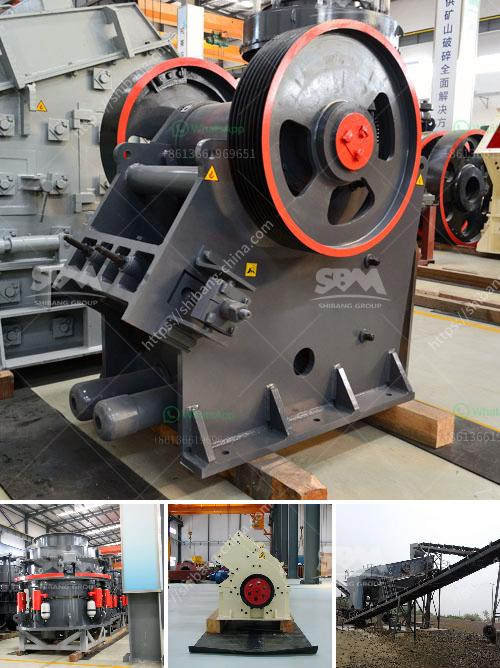

<h3>How to design a cement processing plant?</h3>
Designing a cement processing plant requires a thoughtful approach to ensure efficient and cost-effective operations. The process starts by selecting a suitable location to establish the plant. Factors such as proximity to raw materials, transportation infrastructure, and availability of utilities play a crucial role in determining the ideal site.

Once the site is finalized, the next step is to create a comprehensive design that optimizes the layout of the plant. The design should consider the flow of materials, the sequence of manufacturing processes, and the arrangement of machinery and equipment. A well-designed layout ensures smooth operations, minimizes bottlenecks, and maximizes productivity.

The first step in the cement production process is the extraction and preparation of raw materials. The plant design should include an efficient system to receive, unload, and store raw materials such as limestone, clay, shale, iron ore, and sand. Adequate space should be allocated for stockpiling and blending of these materials to achieve the desired chemical composition.

After the raw materials are prepared, the next stage involves the actual manufacturing of cement. This includes processes such as crushing, grinding, blending, and kiln burning. Each of these processes requires specific machinery, equipment, and utilities. The plant design should incorporate these components in a logical and efficient manner, ensuring smooth material flow and minimizing energy consumption.

In addition to the main manufacturing processes, a cement processing plant also requires auxiliary systems and facilities. These include a power supply system, a water treatment plant, a wastewater treatment system, and a dust collection system. Proper integration of these systems within the plant design is essential to ensure the plant's environmental sustainability and compliance with regulations.

Furthermore, the design of a cement processing plant should prioritize safety measures. Adequate space should be allocated for fire protection systems, emergency exits, and equipment maintenance areas. Safety protocols should be developed and communicated to all employees to minimize the risk of accidents.

Apart from the technical aspects, sustainability should be a key consideration in the design of a cement processing plant. Incorporating energy-efficient equipment, waste heat recovery systems, and alternative fuel sources can significantly reduce the plant's carbon footprint and operational costs. The use of environmentally friendly construction materials and landscaping can further enhance the plant's sustainability profile.

Once the initial design is completed, it is critical to review and iterate the plans based on input from various stakeholders, including engineers, architects, and plant managers. Their expertise and experience can help identify potential design flaws and suggest improvements.

In conclusion, designing a cement processing plant requires a multidisciplinary approach, considering factors such as site selection, layout optimization, material flow, safety, sustainability, and stakeholder input. A well-designed plant ensures efficient operations, compliance with regulations, and a sustainable future for the cement industry.
<h3>Contact us</h3><ul><li><strong>Whatsapp:&nbsp;<a href="https://wa.me/8613661969651">+8613661969651</a></strong></li><li><a href="https://swt.shibang-china.com/?git&amp;zhl&amp;How to design a cement processing plant"><strong>Online Service(chat now)</strong></a></li></ul><h3>Related</h3><ul><li><a href='How to Buy a Stone Crusher in India ？.md'>How to Buy a Stone Crusher in India ？</a></li><li><a href='How to improve grinding efficiency of a mill.md'>How to improve grinding efficiency of a mill?</a></li><li><a href='how to set up a vertical mill ？.md'>how to set up a vertical mill ？</a></li><li><a href='How to make the design of gold mining plant .md'>How to make the design of gold mining plant ?</a></li><li><a href='How to fit a jaw crusher flywheel.md'>How to fit a jaw crusher flywheel?</a></li></ul>