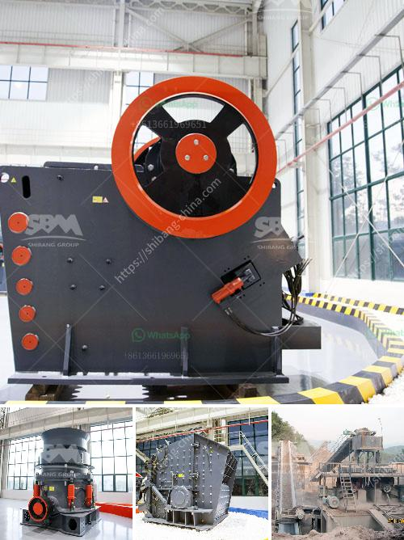

<h3>How to design a crushing plant ?</h3>
Designing a crushing plant can be an overwhelming task, especially when you have little or no prior experience in this field. However, with careful planning and attention to detail, it is possible to create a functional and efficient crushing plant that meets the needs of your project.

The first step in designing a crushing plant is to determine the raw materials that need to be crushed. This can include rock, minerals, ores, and even recyclable materials such as concrete and asphalt. Understanding the characteristics and properties of these materials will help you select the right equipment for your crusher plant.

Once you have identified the raw materials, it is important to determine the required production capacity of the plant. This will depend on factors such as the size of the project, the type of material being processed, and the desired end product. By accurately estimating the production requirements, you can choose the appropriate crushers, screens, feeders, and conveyors to ensure a smooth and efficient operation.

The next step is to choose the appropriate equipment for your crushing plant. Various types of crushers are available, including jaw crushers, impact crushers, cone crushers, and hammer crushers. Each type has its own unique features and advantages, so it is important to carefully evaluate your needs and select the best crusher for your application.

In addition to crushers, you will also need to consider the screening equipment for your plant. Screens are used to separate the crushed materials into different sizes, allowing for the production of various end products. Depending on your specific requirements, you may choose from vibrating screens, scalping screens, or grizzly screens.

To ensure the efficient operation of your crushing plant, it is important to properly size the feeding and conveying equipment. This will prevent bottlenecks and ensure a steady supply of material to the crushers. The size and capacity of the feeders and conveyors should be carefully matched to the crushers and screening equipment to avoid overloading or underfeeding.

Moreover, it is also important to consider the layout of your crushing plant. This includes the arrangement of equipment, access roads, and stockpiles. A well-designed layout can improve the efficiency of your operation and minimize the time and effort required for maintenance and repairs.

Lastly, it is crucial to consider the safety and environmental aspects of your crushing plant design. This includes implementing proper dust control measures, installing safety guards and emergency stops, and ensuring compliance with all relevant regulations and standards.

In conclusion, designing a crushing plant requires careful planning and attention to detail. By understanding the raw materials, production requirements, and selecting the appropriate equipment, you can create a crushing plant that efficiently processes your materials and meets your project needs. Remember to consider safety and environmental aspects, as well as the layout of the plant, for a successful and sustainable operation.
<h3>Contact us</h3><ul><li><strong>Whatsapp:&nbsp;<a href="https://wa.me/8613661969651">+8613661969651</a></strong></li><li><a href="https://swt.shibang-china.com/?git&amp;zhl&amp;How to design a crushing plant "><strong>Online Service(chat now)</strong></a></li></ul><h3>Related</h3><ul><li><a href='How to do the maintenance of crushing screening plant.md'>How to do the maintenance of crushing screening plant?</a></li><li><a href='how the mine crusher operate .md'>how the mine crusher operate ?</a></li><li><a href='How to remove feldspars from sand production.md'>How to remove feldspars from sand production?</a></li><li><a href='How to crush granite.md'>How to crush granite?</a></li><li><a href='How the limestone crusher works .md'>How the limestone crusher works ?</a></li></ul>