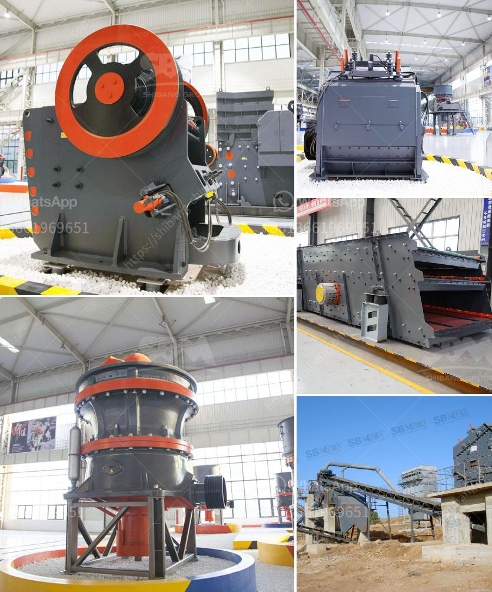

<h3>How to design a crushing plant?</h3>
Designing a crushing plant requires careful consideration of several factors. These include the type of material to be crushed, the target production rate, and the size and shape of the final product. To ensure efficient operation and maximum productivity, there are certain steps to follow when designing a crushing plant.

Firstly, it is important to understand the material that will be processed in the plant. Different materials have different characteristics, such as hardness, abrasiveness, and moisture content. This information is crucial in determining the appropriate type and size of crushers to use. For example, a material with high hardness requires a crusher with higher crushing forces to break it down, while a material with high moisture content may require additional steps, such as drying, before crushing.

The second step is to determine the desired production rate. This is the amount of material that needs to be crushed per hour or per day. The production rate will depend on factors such as the size of the final product, the feed size of the material, and the efficiency of the crushers. It is important to carefully analyze these factors to ensure that the plant is designed to meet the desired production rate.

Next, the size and shape of the final product need to be considered. This will determine the type and configuration of crushers, screens, and conveyors to be used. For example, if a plant needs to produce a specific size of aggregate, it may require multiple stages of crushing and screening. This may involve using different crushers to achieve the desired size reduction and then using screens to separate the different sizes of material.

Another important consideration is the layout of the plant. This involves determining the location of crushers, screens, and conveyors in a way that optimizes the flow of material through the plant. This can impact the efficiency of the operation, as well as the safety and accessibility of the equipment.

Lastly, it is important to consider the maintenance and operating costs of the plant. This includes factors such as the energy consumption of the equipment, the cost of replacement parts, and the labor required for maintenance and repairs. It is important to choose equipment that is efficient, reliable, and cost-effective in the long run.

In conclusion, designing a crushing plant involves careful consideration of several factors. Understanding the material, determining the production rate, and considering the size and shape of the final product are crucial steps in the design process. Additionally, the layout and maintenance costs of the plant should be taken into account. By following these steps, a well-designed crushing plant can help maximize productivity and efficiency.
<h3>Contact us</h3><ul><li><strong>Whatsapp:&nbsp;<a href="https://wa.me/8613661969651">+8613661969651</a></strong></li><li><a href="https://swt.shibang-china.com/?git&amp;zhl&amp;How to design a crushing plant"><strong>Online Service(chat now)</strong></a></li></ul><h3>Related</h3><ul><li><a href='how is aluminium made from its ore .md'>how is aluminium made from its ore ?</a></li><li><a href='How to choose the suitable jaw crusher model.md'>How to choose the suitable jaw crusher model?</a></li><li><a href='How to Build a Sand Washing Plant in Indonesia ？.md'>How to Build a Sand Washing Plant in Indonesia ？</a></li><li><a href='how much price for used stone crusher in Uae.md'>how much price for used stone crusher in Uae</a></li><li><a href='how to select stone crushing plant ？.md'>how to select stone crushing plant ？</a></li></ul>