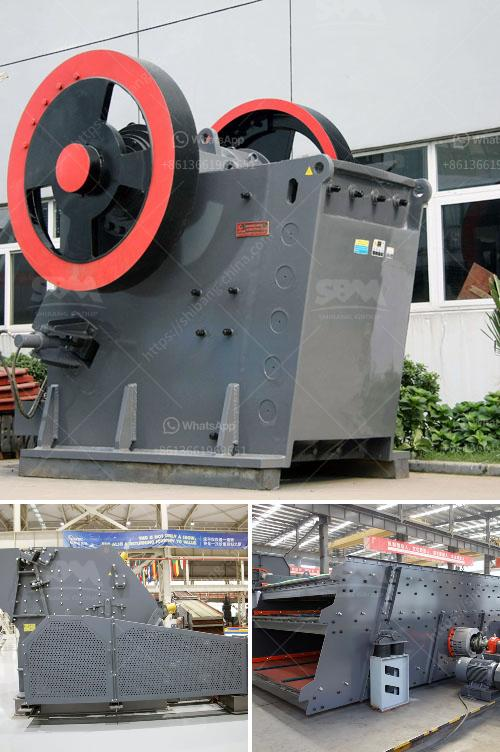

<h3>How to design a hopper feeder?</h3>
Hopper feeders are a type of bird feeder that can attract a wide range of bird species to your backyard. These feeders are designed with a large reservoir or hopper that holds seeds or other bird food, and gravity allows the food to flow down into a feeding tray for birds to access. If you are interested in designing a hopper feeder for your garden, here are some key steps to consider:

1. Determine the size and shape: The first step is to decide on the size and shape of your hopper feeder. Consider the space you have available and the number of birds you want to attract. A larger hopper will require less frequent refilling, but it may also be more challenging to clean. A rectangular or hexagonal design is commonly used, but you can get creative and choose any shape that suits your aesthetic preferences.

2. Select the material: Hopper feeders can be made from a variety of materials, including wood, metal, plastic, or a combination. Wood is a popular choice as it provides durability and insulation against extreme weather conditions. Ensure that the material you select is non-toxic and safe for the birds that will be using the feeder.

3. Include drainage holes: To prevent the seeds or food from becoming damp and moldy, it is essential to include drainage holes in the bottom of the hopper. These holes will allow any excess moisture to escape and keep the food fresh. Be sure to position the drainage holes in an appropriate location to avoid attracting unwanted pests or predators.

4. Design the feeding tray: The feeding tray at the bottom of the hopper should provide a spacious and comfortable area for birds to access the food. It should be sloped slightly downward to allow the seeds to flow easily. You can add small perches or landing platforms around the feeding tray to make it more convenient for birds to feed.

5. Consider a roof or cover: Including a roof or cover above the hopper feeder can protect the food from rain and snow, keeping it dry and fresh for longer periods. This is particularly important if you live in an area with unpredictable weather. The roof can also provide shade during hot summer days, making the feeder more appealing to birds.

6. Mounting options: Decide on how you want to mount or hang the hopper feeder. It can be attached to a post, hung from a tree limb, or even mounted on a window using suction cups for close-up bird watching. Ensure that the chosen mounting option is secure and stable to prevent accidents or damage to the feeder.

7. Test before permanent installation: Before finalizing the design and placing the hopper feeder in its permanent location, test it out for functionality. Ensure that the seeds flow smoothly from the hopper into the feeding tray and that birds can access the food easily. Adjustments may be necessary before inviting birds to enjoy your creation.

By following these steps, you can create a well-designed hopper feeder that not only attracts a variety of bird species but also adds aesthetic appeal to your garden. Remember to clean and refill the feeder regularly to maintain good hygiene and keep the birds coming back for more. Happy birdwatching!
<h3>Contact us</h3><ul><li><strong>Whatsapp:&nbsp;<a href="https://wa.me/8613661969651">+8613661969651</a></strong></li><li><a href="https://swt.shibang-china.com/?git&amp;zhl&amp;How to design a hopper feeder"><strong>Online Service(chat now)</strong></a></li></ul><h3>Related</h3><ul><li><a href='How to grind white cement clinker.md'>How to grind white cement clinker?</a></li><li><a href='How to get gold from ore crushing.md'>How to get gold from ore crushing?</a></li><li><a href='How to extract silver from lead ore ？.md'>How to extract silver from lead ore ？</a></li><li><a href='How to overhaul a jaw crusher.md'>How to overhaul a jaw crusher?</a></li><li><a href='How to choose the suitable jaw crusher model.md'>How to choose the suitable jaw crusher model?</a></li></ul>