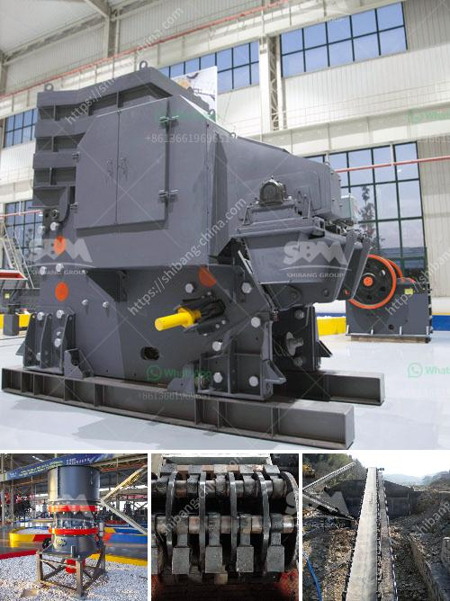

<h3>How to design a marble or stone processing production line?</h3>
Designing a marble or stone processing production line requires careful planning, meticulous attention to detail, and thorough knowledge of the industry. The goal of a well-designed production line is to optimize each step of the process, minimize waste, improve efficiency, and create a high-quality end product. Here are some important factors to consider when designing a marble or stone processing production line.

1. Understanding the materials: Before designing a production line, it is crucial to have a comprehensive understanding of the materials being processed. Marble and stone come in various types, each with different characteristics that may affect the processing methods and machinery required. Factors like hardness, density, and size will determine the type of crushers, saws, grinders, and other machinery needed for the production line.

2. Determining production capacity: The next step in designing a production line is to assess the desired production capacity. This involves estimating the amount of marble or stone that needs to be processed within a given time frame. Production capacity will dictate the size and scale of the machinery, the number of workers required, and the overall layout of the production line.

3. Layout and flow: Efficient flow of materials is essential in a production line. Each step of the process, from initial cutting to final polishing, should be meticulously planned to ensure smooth movement of materials and minimize bottlenecks. The layout should be designed to optimize space utilization and facilitate easy access for workers and machinery.

4. Automation and machinery selection: The use of automation and advanced machinery can significantly improve the efficiency and productivity of a marble or stone processing production line. Careful consideration should be given to selecting the right machinery for each step of the process. Factors like precision, speed, and compatibility with other equipment should be evaluated. Automated sorting, cutting, and polishing machines can help streamline the production line, reduce the reliance on manual labor, and improve the overall quality of the end product.

5. Quality control and waste management: Quality control is of utmost importance in marble and stone processing. Implementing quality control measures at each stage of the production line can help identify and rectify any defects or inconsistencies, ensuring that only high-quality products reach the market. Waste management is also crucial to reduce costs and environmental impact. Proper disposal of waste materials, recycling options, and reusing scrap can contribute to a more sustainable production process.

In conclusion, designing a marble or stone processing production line requires a multidisciplinary approach, taking into consideration factors like materials, production capacity, flow, machinery selection, quality control, and waste management. A well-designed production line will result in improved efficiency, increased productivity, reduced costs, and high-quality end products, contributing to the success of the business in the competitive stone processing industry.
<h3>Contact us</h3><ul><li><strong>Whatsapp:&nbsp;<a href="https://wa.me/8613661969651">+8613661969651</a></strong></li><li><a href="https://swt.shibang-china.com/?git&amp;zhl&amp;How to design a marble or stone processing production line"><strong>Online Service(chat now)</strong></a></li></ul><h3>Related</h3><ul><li><a href='How to operate a calcite crusher plant.md'>How to operate a calcite crusher plant?</a></li><li><a href='How to calculate the cemnet grinding aid requirement for cement .md'>How to calculate the cemnet grinding aid requirement for cement ?</a></li><li><a href='How is nickel extracted from its ore.md'>How is nickel extracted from its ore?</a></li><li><a href='How to install impact crusher .md'>How to install impact crusher ?</a></li><li><a href='How to process lightweight aggregates in Ethiopia.md'>How to process lightweight aggregates in Ethiopia?</a></li></ul>