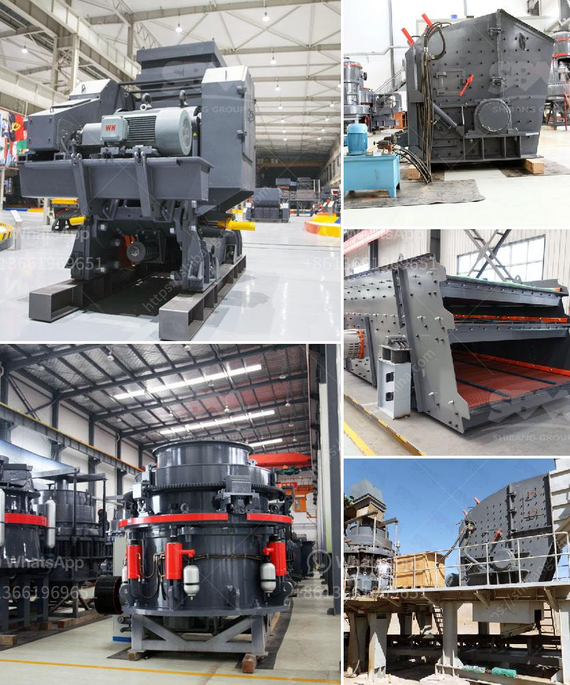

<h3>How to design a rotor for a VSI crusher?</h3>
Designing a rotor for a VSI (Vertical Shaft Impactor) crusher requires careful consideration of the desired product size, shape, and quality, as well as the operating conditions and desired performance. It is crucial to choose the right rotor design and materials to ensure optimal crushing efficiency and longevity of the crusher.

The rotor is the main component in a VSI crusher that determines the speed and impact force produced by the crusher. It consists of a rotor body, a wear-resistant overlay, and a number of rotor discs with vertical bars or spacers that maintain a uniform gap between them. Here are some key factors to consider when designing a rotor for a VSI crusher:

1. Material Selection: The material used for the rotor should have high resistance to wear, abrasion, and impact. Usually, high-strength low-alloy (HSLA) steel or high-chromium iron is used to manufacture the rotor. The choice of material depends on the type of rock or ore being processed and the expected operating conditions.

2. Rotor Geometry: The rotor geometry, including the shape and arrangement of the bars or spacers, has a significant impact on the performance of the crusher. The number of bars or spacers and their spacing should be optimized to ensure efficient crushing and minimize the chance of material buildup or blockage.

3. Bar Design: The bars or spacers on the rotor can be straight, curved, or a combination of both. Straight bars provide better impact energy transfer and are suitable for hard and abrasive materials, while curved bars allow for better particle acceleration and are better suited for soft or less abrasive materials. The design of the bars should be carefully considered to achieve the desired product shape and size.

4. Tip Configuration: The configuration of the tips on the rotor bars also affects the crushing performance. Different tip designs, such as flat, round, or square, can impact the energy transfer and particle acceleration within the crusher. The tip configuration should be chosen based on the material properties and desired product characteristics.

5. Balancing and Vibration: Proper rotor balancing is essential to ensure smooth operation and minimize vibration. Unbalanced rotors can lead to premature wear of components, increased power consumption, and reduced crusher performance. It is important to balance the rotor during the manufacturing process and regularly inspect and rebalance if necessary.

In conclusion, designing a rotor for a VSI crusher involves careful consideration of various factors, including material selection, rotor geometry, bar design, tip configuration, and balancing. It is essential to optimize these factors to achieve the desired product size, shape, and quality while ensuring efficient and reliable crusher performance. Collaborating with experienced engineers and utilizing advanced design techniques can help in the successful design of a rotor for a VSI crusher.
<h3>Contact us</h3><ul><li><strong>Whatsapp:&nbsp;<a href="https://wa.me/8613661969651">+8613661969651</a></strong></li><li><a href="https://swt.shibang-china.com/?git&amp;zhl&amp;How to design a rotor for a VSI crusher"><strong>Online Service(chat now)</strong></a></li></ul><h3>Related</h3><ul><li><a href='How to adjust the discharge opening of a spring cone crusher.md'>How to adjust the discharge opening of a spring cone crusher?</a></li><li><a href='How to wash manufacturing sand .md'>How to wash manufacturing sand ?</a></li><li><a href='How will the bauxite crusher work.md'>How will the bauxite crusher work?</a></li><li><a href='How does a jaw crusher crush limestone.md'>How does a jaw crusher crush limestone?</a></li><li><a href='How to set up a coal pulverizer plant.md'>How to set up a coal pulverizer plant?</a></li></ul>