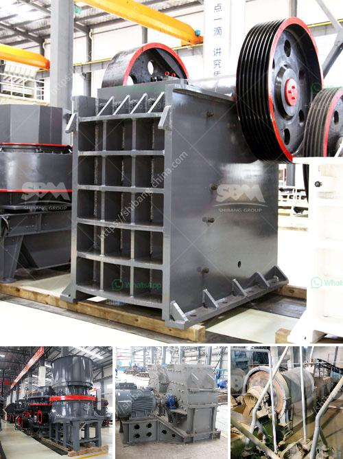

<h3>How to design a vibrating screen?</h3>
A vibrating screen is a crucial piece of machinery used for screening and classifying various materials. They are commonly used in mining, construction, and industrial applications. The success of any operation depends heavily on the efficiency of the screen, thereby making it imperative for professionals to design a screen that meets their specific requirements. This article will outline some key considerations and steps involved in designing an effective vibrating screen.

Understanding the purpose and primary function of the vibrating screen is essential before beginning the design process. Factors to consider include material type, desired screening efficiency, desired screen capacity, and the physical properties of the material (such as size, shape, moisture content, and corrosiveness).

Various types of vibrating screens are available in the market, including linear vibrating screens, circular vibrating screens, high-frequency vibrating screens, and flip-flop screens. Each type has its advantages and limitations. It is crucial to select a suitable type based on the intended application and screening requirements.

a) Screening Surface Area: The larger the screening surface area, the higher the screening efficiency. This can be achieved by designing a screen with the appropriate length, width, and number of decks.

b) Inclination Angle: The inclination angle of the vibrating screen affects the material's flow pattern on the screen surface. It can significantly impact screening efficiency and material throughput.

c) Vibration Amplitude and Frequency: These factors influence the degree of material stratification, particle movement, and separation efficiency. Careful consideration should be given to determining optimal vibration amplitude and frequency to achieve the desired screening results.

d) Material feed rate: The rate at which material is fed onto the screen can impact screening efficiency. Uneven feed rates can result in material clustering and reduced screening effectiveness.

Choosing the right screen media is vital, as it directly impacts the screening effectiveness. Options include woven wire mesh, rubber, polyurethane, and perforated plates. The selection should be based on the material being screened, desired size separation, and maintenance requirements.

Proper supporting structures, such as springs, isolators, and dampeners, are essential for minimizing vibrations and noise. Additionally, the screen box, drive unit, and motor must be designed to withstand the expected load and ensure smooth operation.

Once the initial design is complete, it is crucial to evaluate the screen's performance through testing. Adjustments may be necessary to optimize efficiency, such as altering the vibration frequency and amplitude or modifying the screen opening sizes.

Designing a vibrating screen that meets the specific requirements of an operation can significantly impact its success. By considering factors such as objective, screen type, parameters, screen media, supporting structures, and conducting design tests, professionals can ensure the end product performs efficiently and effectively. A well-designed vibrating screen leads to increased productivity, improved product quality, and reduced operational costs.
<h3>Contact us</h3><ul><li><strong>Whatsapp:&nbsp;<a href="https://wa.me/8613661969651">+8613661969651</a></strong></li><li><a href="https://swt.shibang-china.com/?git&amp;zhl&amp;How to design a vibrating screen"><strong>Online Service(chat now)</strong></a></li></ul><h3>Related</h3><ul><li><a href='How to open a crusher plant in Fujairah.md'>How to open a crusher plant in Fujairah?</a></li><li><a href='How To Build A Top Quarry In Nigeria.md'>How To Build A Top Quarry In Nigeria?</a></li><li><a href='How is manganese extracted.md'>How is manganese extracted?</a></li><li><a href='How to install crusher.md'>How to install crusher?</a></li><li><a href='How to build a 600TPH mobile cone crusher.md'>How to build a 600TPH mobile cone crusher?</a></li></ul>