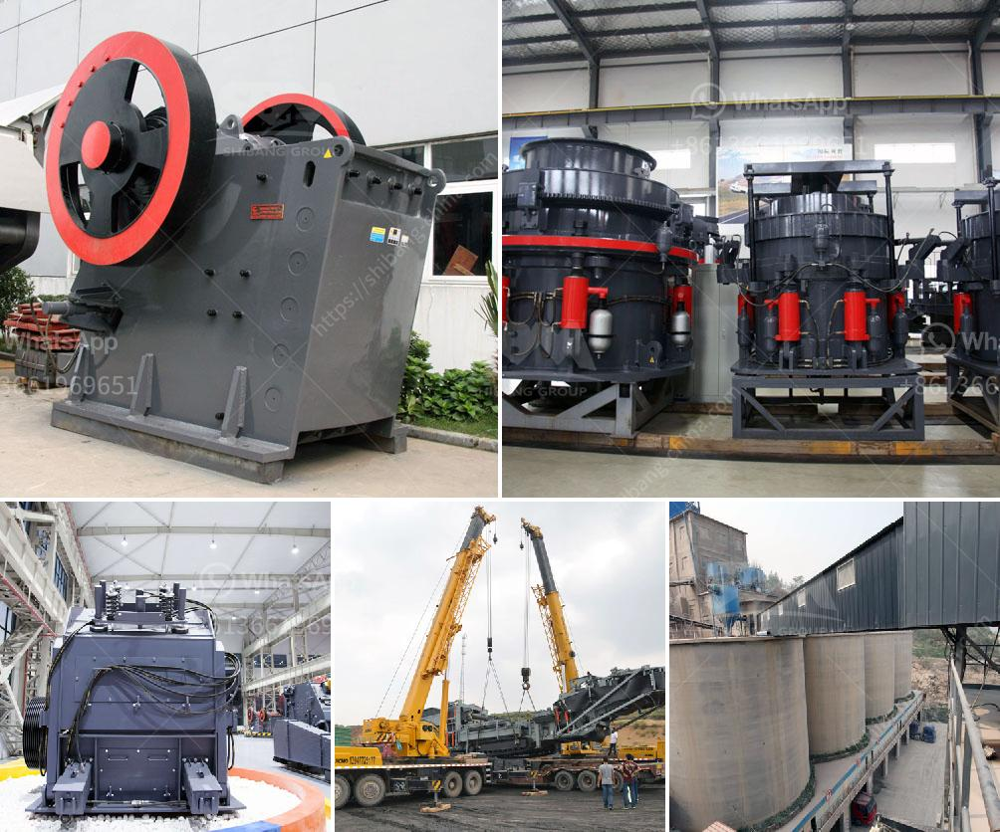

<h3>How to design an impact crusher?</h3>
An impact crusher is a versatile and efficient machine that is widely used in the mining, construction, and recycling industries. In order to design an impact crusher, it is important to understand the physical, mechanical, and performance requirements of the machine, as well as the common materials it will be handling. In this article, we will explore the key factors to consider when designing an impact crusher.

First and foremost, define the purpose of the impact crusher. Is it intended for primary, secondary, or tertiary crushing? The purpose will determine the size, capacity, and features required. Additionally, consider the application and the type of material the crusher will be processing. Harder materials like granite or basalt will require higher impact forces compared to softer materials like limestone.

Determine the desired performance specifications of the impact crusher. This includes the required capacity, reduction ratio, and the particle size distribution of the final product. These factors will help determine the size and shape of the crusher’s rotor, as well as the type and number of impact bars or hammers.

The rotor is the heart of an impact crusher. It consists of a central shaft with multiple protruding impact bars or hammers. The design of the rotor should consider factors such as the rotational speed, the shape of the impact bars, and the material composition. These factors influence the impact force and the energy transfer to the material.

The crushing chamber is the area where the impact takes place. It is critical to design a chamber that allows the material to be effectively crushed and to ensure maximum energy transfer. Factors to consider include the chamber shape, size, and the presence of wear liners. A well-designed chamber can improve the efficiency and reduce the wear on the crusher.

Selecting the right materials for the impact bars, hammers, and wear liners is paramount to ensure the durability of the crusher. High-strength alloys, such as manganese steel, are commonly used for this purpose, as they provide excellent impact resistance.

Designing with safety in mind is crucial. Incorporate safety features such as guards and emergency stop buttons to protect operators from potential hazards. Additionally, consider accessibility for maintenance and repair tasks to minimize downtime.

Consider adding optional features to enhance the functionality and performance of the impact crusher. This may include variable speed controllers, automated control systems, or an adjustable apron to regulate the feed size.

In conclusion, designing an impact crusher requires careful consideration of various factors, including the purpose and application, performance requirements, rotor design, crushing chamber, material selection, safety features, and optional features. By keeping these factors in mind, a well-designed impact crusher can deliver optimal performance, efficiency, and durability in various crushing applications.
<h3>Contact us</h3><ul><li><strong>Whatsapp:&nbsp;<a href="https://wa.me/8613661969651">+8613661969651</a></strong></li><li><a href="https://swt.shibang-china.com/?git&amp;zhl&amp;How to design an impact crusher"><strong>Online Service(chat now)</strong></a></li></ul><h3>Related</h3><ul><li><a href='How to choose crushing limestone machinery.md'>How to choose crushing limestone machinery?</a></li><li><a href='How to operate mine crushing machinery.md'>How to operate mine crushing machinery?</a></li><li><a href='How to make quartz powder grinding mill in Kenya ？.md'>How to make quartz powder grinding mill in Kenya ？</a></li><li><a href='How to weld the broken jaw plate of jaw crusher.md'>How to weld the broken jaw plate of jaw crusher?</a></li><li><a href='How does a raw mill work in a cement plant.md'>How does a raw mill work in a cement plant?</a></li></ul>