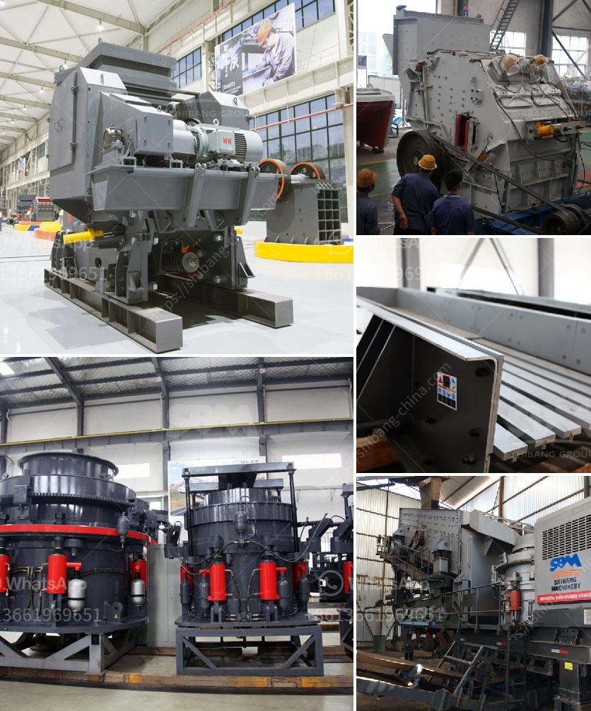

<h3>How to design an iron ore conveyor?</h3>
Belt conveyors are a critical component for transporting bulk materials in industries that handle iron ore, coal, cement, and other mined materials. A robust and durable conveyor system plays a crucial role in the smooth and efficient transport of materials from the mine to the processing plant and vice versa.

Designing an iron ore conveyor requires thoughtful planning and meticulous engineering. Here are some key factors to consider:

1. Material Properties: Understanding the characteristics of the iron ore material is essential for accurate conveyor design. Factors such as particle size, bulk density, abrasiveness, and flowability influence the selection of conveyor components and power requirements. Conducting material testing and analysis will provide crucial data needed for designing the appropriate conveyor system.

2. Belt Selection: Choosing the right belt is crucial for optimum performance. Factors such as tensile strength, flexibility, and resistance to abrasion and impacts play a significant role. Conveyor belts for iron ore transportation must be able to withstand high loads, speed, and temperature fluctuations. Specialized belting solutions, such as high-temp resistant belts or self-extinguishing belts for potentially flammable materials, may be necessary depending on the specific application.

3. Conveyor Length and Layout: The length and layout of the conveyor system depend on the site conditions, terrain, and operational requirements. Factors such as incline/decline angles, horizontal curve radii, transfer points, and discharge locations need to be carefully planned to ensure efficient material flow. Minimizing transfer points and maintaining a continuous flow will reduce dust emissions and material spillage.

4. Conveyor Components: Choosing the appropriate conveyor components is vital for reliability and longevity. High-quality idlers, pulleys, and belting accessories should be selected based on the application's specific needs. Components designed for heavy-duty operations will ensure minimal maintenance and extended service life, reducing downtime and operational costs.

5. Safety Considerations: Safety is paramount in any conveyor design. Guards, emergency stop devices, and safety switches should be incorporated to protect personnel and prevent accidents. Regular maintenance and inspections should be conducted to identify and address potential safety hazards.

6. Dust Control: Iron ore conveyors can produce significant amounts of dust, which can be harmful to both equipment and personnel. Implementing efficient dust control measures is crucial to maintain a clean and safe working environment. Techniques such as enclosure systems, dust suppression sprays, and regular cleaning will minimize dust emissions and improve air quality.

7. Environmental Considerations: Conveyor design should consider environmental sustainability. Implementing eco-friendly approaches, such as energy-efficient drives, waste reduction, and material recycling, can help minimize the project's ecological impact.

In conclusion, designing an iron ore conveyor requires a comprehensive understanding of material properties, site conditions, safety requirements, and environmental considerations. Collaborating with experienced professionals and leveraging advanced engineering technologies will ensure the design of a reliable and cost-effective conveyor system for transporting iron ore. A well-designed conveyor will optimize material flow, increase productivity, and contribute to the overall efficiency of mining and processing operations.
<h3>Contact us</h3><ul><li><strong>Whatsapp:&nbsp;<a href="https://wa.me/8613661969651">+8613661969651</a></strong></li><li><a href="https://swt.shibang-china.com/?git&amp;zhl&amp;How to design an iron ore conveyor"><strong>Online Service(chat now)</strong></a></li></ul><h3>Related</h3><ul><li><a href='How to Design a Copper Processing Plant.md'>How to Design a Copper Processing Plant?</a></li><li><a href='How do you extract limestone from a quarry.md'>How do you extract limestone from a quarry?</a></li><li><a href='How does the operation of crusher plants work.md'>How does the operation of crusher plants work?</a></li><li><a href='how to build marble processing mill .md'>how to build marble processing mill ?</a></li><li><a href='How to make talcum powder.md'>How to make talcum powder?</a></li></ul>