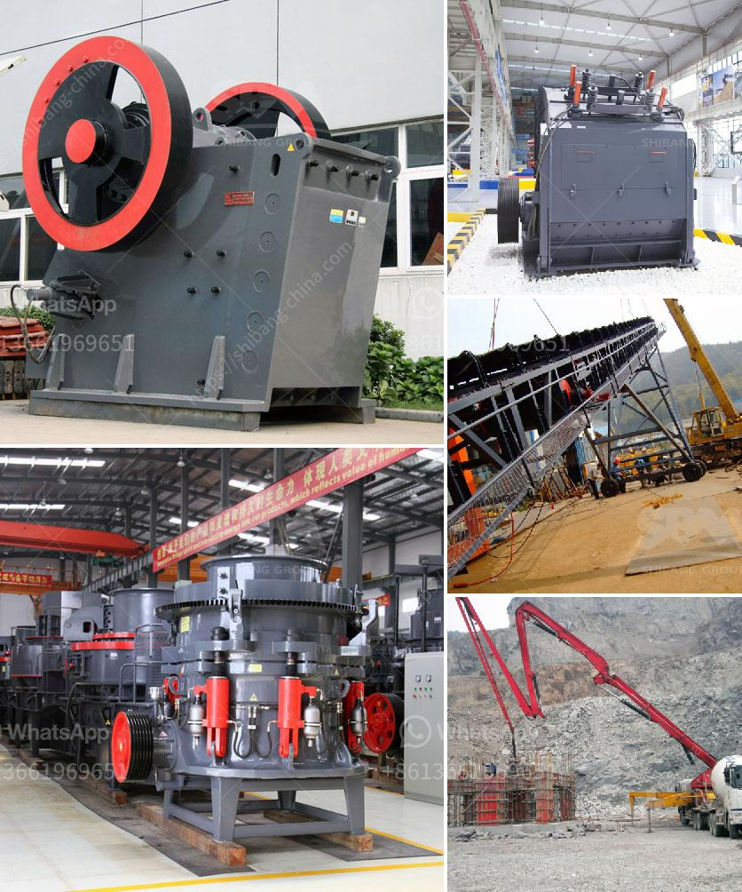

<h3>How to determine hp for aggregate conveyor ?</h3>
When it comes to determining the horsepower required for an aggregate conveyor, there are several factors that need to be considered. The power of the motor plays a crucial role in the overall efficiency and performance of the conveyor system. By following a few steps and considering the specific requirements of your operation, you can determine the appropriate horsepower for your aggregate conveyor.

Firstly, you need to determine the characteristics of the material being conveyed. Factors such as bulk density, size, and flowability of the aggregate are essential in calculating the power required. The material's bulk density refers to the mass per unit volume, and this information can be obtained from the material's specification or through testing.

The size of the aggregate also plays a vital role in determining the horsepower required. Larger-sized materials may require more power to overcome the initial resistance and start the conveyor movement. Additionally, the flowability of the aggregate needs to be considered. Materials with poor flowability may require higher horsepower to maintain a consistent flow rate.

Next, you need to consider the conveyor's design parameters. The length, width, and slope of the conveyor are crucial factors in determining the power requirements. Longer conveyors generally require more horsepower to overcome the resistance of the material being conveyed. Similarly, wider conveyors can also result in higher power requirements.

The slope of the conveyor is another critical factor. If the conveyor is inclined or has an upward slope, more power is needed to lift the material against gravity. It's important to measure the actual slope accurately to ensure accurate calculations.

Additionally, the starting and stopping characteristics of the conveyor system need to be considered. If the conveyor is expected to start and stop frequently, such as in batching or loading operations, the horsepower requirements may increase to compensate for the additional torque needed for acceleration and deceleration.

Once you have determined the material characteristics and design parameters, you need to calculate the total resistive forces acting on the conveyor. This includes the frictional resistance between the belt and the material, idler resistance, and any other additional resistance in the system. It's essential to consult the conveyor manufacturer or refer to design manuals for accurate resistance values.

Finally, you can use the calculated resistive forces to determine the horsepower required. Various formulas and equations are available to calculate the power requirements, which typically include multiplying the total resistive forces by the belt speed to obtain the horsepower.

In conclusion, determining the horsepower required for an aggregate conveyor involves considering factors such as material characteristics, design parameters, and resistive forces. By accurately calculating these factors, you can determine the appropriate power requirements for your specific conveyor system. This ensures optimal performance and efficiency, enhancing the productivity of your operation.
<h3>Contact us</h3><ul><li><strong>Whatsapp:&nbsp;<a href="https://wa.me/8613661969651">+8613661969651</a></strong></li><li><a href="https://swt.shibang-china.com/?git&amp;zhl&amp;How to determine hp for aggregate conveyor "><strong>Online Service(chat now)</strong></a></li></ul><h3>Related</h3><ul><li><a href='How to Use a Hammer Mill Kenya ？.md'>How to Use a Hammer Mill Kenya ？</a></li><li><a href='How to beneficiation tungsten ore.md'>How to beneficiation tungsten ore?</a></li><li><a href='How does a line ball mill working.md'>How does a line ball mill working?</a></li><li><a href='How to replace the hammer of a hammer crusher.md'>How to replace the hammer of a hammer crusher?</a></li><li><a href='How to buy a stone crusher.md'>How to buy a stone crusher?</a></li></ul>