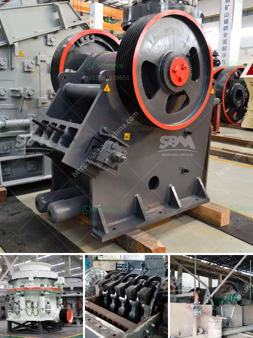

<h3>How to determine the capacity of impact crusher？</h3>
Impact crushers are used in various industries to crush large rocks and other materials. They play an important role in industries such as mining, construction, and recycling. The capacity of an impact crusher is determined by several factors, including the feed size, material properties, and the desired product size. In this article, we will discuss how to determine the capacity of an impact crusher.

The feed size refers to the largest piece of material that the crusher can accept. In general, the larger the feed size, the higher the capacity. However, the feed size should not exceed the maximum allowable size of the crusher. If the feed size is too large, it may cause blockages and lead to decreased capacity. Therefore, it is important to ensure that the feed size is within the specified range.

The material properties, such as hardness, abrasiveness, and moisture content, also affect the capacity of the impact crusher. Harder materials require more energy to crush, which may result in a lower capacity. Similarly, more abrasive materials may cause higher wear and tear on the crusher, reducing its capacity. Additionally, materials with high moisture content can cause blockages in the crusher, affecting its performance. Therefore, it is necessary to consider the material properties when determining the crusher capacity.

The rotor is the main working component of an impact crusher. The rotor speed and design have a significant impact on the capacity of the crusher. A higher rotor speed can generate more impact energy, resulting in a higher crushing capacity. However, a higher rotor speed also means higher energy consumption and increased wear on the machine. Therefore, the rotor speed should be carefully optimized to balance capacity and energy efficiency. Additionally, the design of the rotor, including the number and arrangement of the hammers, can affect the crushing capacity. A well-designed rotor ensures efficient crushing and high capacity.

The size of the crushing chamber also plays a role in determining the capacity of the impact crusher. A larger crushing chamber allows more material to be processed at a time, resulting in higher capacity. However, a larger crushing chamber requires a larger physical size of the crusher, which may not be feasible in all applications. Therefore, it is important to choose the appropriate crushing chamber size based on the desired capacity and space limitations.

In conclusion, determining the capacity of an impact crusher involves considering various factors, such as feed size, material properties, rotor speed, and crushing chamber size. By optimizing these factors, it is possible to achieve higher capacity and efficiency in impact crushing. It is important to consult with experts and manufacturers to ensure that the crusher is appropriately selected for the desired capacity and application.
<h3>Contact us</h3><ul><li><strong>Whatsapp:&nbsp;<a href="https://wa.me/8613661969651">+8613661969651</a></strong></li><li><a href="https://swt.shibang-china.com/?git&amp;zhl&amp;How to determine the capacity of impact crusher？"><strong>Online Service(chat now)</strong></a></li></ul><h3>Related</h3><ul><li><a href='How to maintain stone grinding machine？.md'>How to maintain stone grinding machine？</a></li><li><a href='7 Factors Affecting the Price of Jaw Crusher.md'>7 Factors Affecting the Price of Jaw Crusher</a></li><li><a href='How to crush material from 12mm to 6mm.md'>How to crush material from 12mm to 6mm?</a></li><li><a href='How to calculate the volume of ball mill packing .md'>How to calculate the volume of ball mill packing ?</a></li><li><a href='How to replace the bearing of the jaw crusher machine.md'>How to replace the bearing of the jaw crusher machine?</a></li></ul>