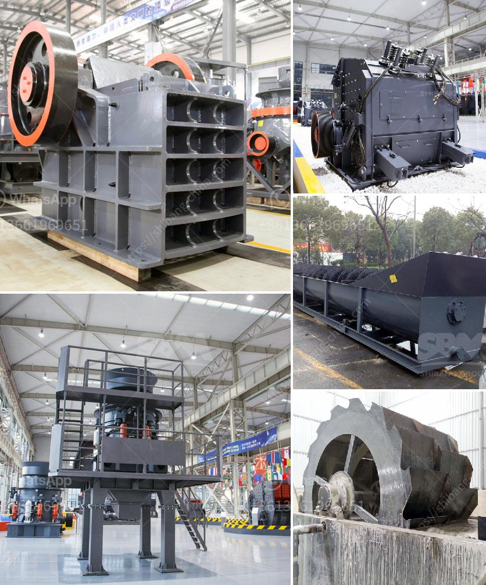

<h3>How to determine the fineness of dolomite and how to make it reach the target fineness?</h3>
Dolomite is a naturally occurring mineral found in sedimentary rocks around the world. In various industries, dolomite is used for its diverse properties, including its high level of carbonates and magnesium content. However, the fineness of dolomite is a crucial factor determining its applications and effectiveness in different fields.

Determining the fineness of dolomite is essential as it directly impacts its functionality. Fineness refers to the particle size distribution of the dolomite powder, which affects its reactivity and chemical composition. To measure the fineness, various methods can be employed, the most common being the sieve analysis technique.

To determine the fineness of dolomite using the sieve analysis technique, a representative sample of the dolomite powder is collected. Next, the sample is sieved through a set of standard sieves with different mesh sizes. The weight of materials retained on each sieve is measured, and the results are tabulated. By analyzing the weight percentage distribution on different sieves, the fineness of the dolomite can be calculated.

Once the fineness of the dolomite sample has been determined, the next step is to make it reach the target fineness if necessary. This can be achieved through various methods, including grinding and milling processes.

Grinding is an effective technique to reduce the particle size of dolomite and increase its overall fineness. The grinding process involves using specialized machinery or equipment to crush the dolomite into smaller particles. This can be achieved through methods like ball milling, impact grinding, or fluid energy milling.

In ball milling, dolomite particles are placed in a rotating drum with heavy balls that collide with and pulverize the dolomite, resulting in its reduced particle size. Similarly, impact grinding utilizes high-speed rotating hammers or blades to crush and grind the dolomite. Fluid energy milling, on the other hand, uses high-pressure gas jets to break down the dolomite particles.

Milling is another common method used to achieve the desired fineness of dolomite. In milling, dolomite is fed into a milling machine equipped with rotating cutters or blades that cut and shape the dolomite particles into the desired fineness.

Additionally, various factors should be considered to ensure the dolomite reaches the target fineness effectively. The parameters like the speed of the grinding or milling process, the characteristics of the dolomite, and the size of the milling or grinding equipment should be optimized to achieve the desired fineness.

In conclusion, determining the fineness of dolomite is crucial for its applications in different fields. The sieve analysis technique is commonly used to measure the fineness of dolomite, providing valuable insights into its particle size distribution. To achieve the target fineness, grinding and milling processes are employed, wherein dolomite particles are crushed and reduced in size. The chosen method and parameters should be optimized according to the specific dolomite characteristics and the desired application.

By understanding the importance of fineness and employing the appropriate techniques, dolomite can be effectively utilized in various industries such as agriculture, construction, and manufacturing.
<h3>Contact us</h3><ul><li><strong>Whatsapp:&nbsp;<a href="https://wa.me/8613661969651">+8613661969651</a></strong></li><li><a href="https://swt.shibang-china.com/?git&amp;zhl&amp;How to determine the fineness of dolomite and how to make it reach the target fineness"><strong>Online Service(chat now)</strong></a></li></ul><h3>Related</h3><ul><li><a href='How to build a barrel type rock crusher .md'>How to build a barrel type rock crusher ?</a></li><li><a href='How to set up a limestone processing plant.md'>How to set up a limestone processing plant?</a></li><li><a href='How to break material using a hammer crusher.md'>How to break material using a hammer crusher?</a></li><li><a href='how is iron ore transported to kenya.md'>how is iron ore transported to kenya</a></li><li><a href='How to become a large mineral processing equipment supplier.md'>How to become a large mineral processing equipment supplier?</a></li></ul>