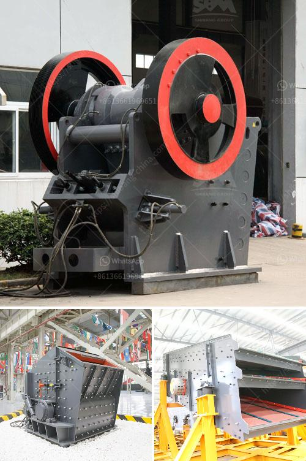

<h3>How to determine the size of the conveyor belt in mining？</h3>
Conveyor belts play a significant role in the mining industry as they are responsible for the transportation of bulk materials over long distances. Determining the correct conveyor belt size is crucial to ensure the smooth operation of the mining process. Here are some key considerations to determine the appropriate size of the conveyor belt in mining.

1. Material Type and Characteristics: The first step in determining the conveyor belt size is to understand the type and characteristics of the material being transported. Different materials, such as coal, ore, or gravel, have varying densities and sizes, which affect the load capacity and belt speed requirements. Understanding the material's physical properties allows for the selection of a belt that can handle the specific environment and minimize the risk of material spillage or belt damage.

2. Capacity and Tonnage: Another critical aspect to consider when determining conveyor belt size in mining is the desired capacity and tonnage. The conveyor's ability to handle the required volume of material should align with the production goals of the mining operation. Determining the production targets and the average tonnage per hour will help calculate the necessary belt width, speed, and overall size of the conveyor system.

3. Belt Speed and Tension: The belt's speed plays a significant role in determining the size of the conveyor belt. In mining applications, the belt speed depends on the material's abrasiveness and the desired efficiency. Higher speeds may result in increased wear and tear on the belt, requiring more frequent maintenance. Additionally, the conveyor's tension should be carefully considered to prevent belt slippage or excessive sagging. A properly tensioned belt ensures efficient material transportation.

4. Conveyor Length and Incline: The distance that the material needs to travel is an essential factor in sizing a conveyor belt. Longer distances may require larger belt widths to accommodate higher volumes of material, while shorter conveyors may operate efficiently with narrower belts. The incline or decline of the conveyor is also vital, as it affects the belt's tension and capacity requirements.

5. Environmental Factors: The environment in which the conveyor operates must be taken into account to determine the appropriate belt size. Conditions such as temperature, humidity, and dust levels influence the choice of belt material and design. Extreme temperatures or abrasive elements may require specialized belts that can withstand these harsh conditions, ensuring optimal performance and prolonged belt life.

6. Safety Considerations: Safety should always be a priority when determining the size of the conveyor belt in mining. The conveyor must be designed to handle the load safely and prevent any potential hazards or accidents. Adequate guards, emergency stops, and other safety features should be incorporated into the conveyor system to protect workers and equipment.

In conclusion, various factors should be considered when determining the correct size of the conveyor belt in mining. Material characteristics, capacity requirements, belt speed and tension, conveyor length and incline, environmental factors, and safety considerations all have significant impacts on the conveyor's sizing. Taking these factors into account ensures the safe and efficient transportation of bulk materials in the mining industry.
<h3>Contact us</h3><ul><li><strong>Whatsapp:&nbsp;<a href="https://wa.me/8613661969651">+8613661969651</a></strong></li><li><a href="https://swt.shibang-china.com/?git&amp;zhl&amp;How to determine the size of the conveyor belt in mining？"><strong>Online Service(chat now)</strong></a></li></ul><h3>Related</h3><ul><li><a href='How to Make Plaster of Phosphogypsum.md'>How to Make Plaster of Phosphogypsum</a></li><li><a href='How much does a mobile crusher plant cost.md'>How much does a mobile crusher plant cost?</a></li><li><a href='How to increase the efficiency coal pulveriser on power plant.md'>How to increase the efficiency coal pulveriser on power plant?</a></li><li><a href='How to build crushing plant foundation .md'>How to build crushing plant foundation ?</a></li><li><a href='how to maintainance stone cone crusher.md'>how to maintainance stone cone crusher?</a></li></ul>