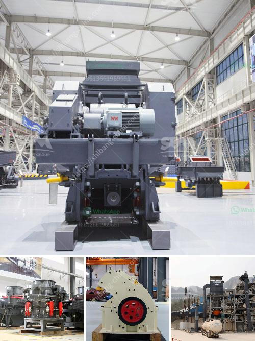

<h3>How to determine the value of a rock quarry?</h3>
Determining the value of a rock quarry can be a complex task. Several factors need to be taken into consideration before arriving at a fair and accurate valuation. Whether you are looking to purchase, sell, or invest in a rock quarry, understanding its value is crucial for making informed decisions. In this article, we will explore some key considerations and approaches to determine the value of a rock quarry.

One of the first factors to consider is the geology and accessibility of the quarry. The quality and quantity of the rock available in the quarry are essential to estimate its value. Evaluate the type of rock present, its demand in the market, and the estimated reserve size. Additionally, consider the location of the quarry and its accessibility to major transportation routes, as it affects the cost of extraction and transportation, which ultimately impacts its value.

Next, assess the market demand for the specific type of rock extracted from the quarry. Research construction and infrastructure projects in the region that utilize the rock. Understanding the market dynamics, including current and future demand, can help estimate the potential profitability of the quarry. Explore the competition and market pricing, as this will influence the value as well.

The operational aspects of the quarry are crucial in determining its value. Evaluate the current and historical production rates, extraction methods, and equipment in use. Consider any existing contracts or agreements with suppliers and customers. Assess the labor and operating costs involved, such as wages, utilities, and maintenance expenses. All these factors play a significant role in evaluating the quarry's value.

Furthermore, consider any environmental and regulatory factors that may affect the quarry's value. Compliance with local and national regulations, such as permits, licenses, and reclamation obligations, is crucial for the quarry's sustainability and long-term value. Evaluate the potential risks and liabilities associated with the quarry’s environmental impact and ensure all necessary measures are in place.

Professional expertise may be required to determine the value accurately. Engage with experts such as geologists, appraisers, and consultants experienced in the quarry industry. These professionals can conduct a thorough assessment of the quarry's assets, financials, and future potential. Their expertise will provide a comprehensive evaluation and aid in making informed decisions.

Lastly, consider the quarry's financial performance and profitability. Review financial statements, cash flows, and profitability ratios to assess the quarry's earning potential. Analyze historical performance trends and forecasts to gauge the future profitability of the quarry. The quarry's financial health is a key determinant of its value.

In conclusion, determining the value of a rock quarry requires a comprehensive analysis incorporating geological, market, operational, environmental, and financial factors. Thorough due diligence, expert advice, and market research are crucial to arrive at an accurate valuation. By understanding these factors, you can make informed decisions whether you are buying, selling, or investing in a rock quarry.
<h3>Contact us</h3><ul><li><strong>Whatsapp:&nbsp;<a href="https://wa.me/8613661969651">+8613661969651</a></strong></li><li><a href="https://swt.shibang-china.com/?git&amp;zhl&amp;How to determine the value of a rock quarry"><strong>Online Service(chat now)</strong></a></li></ul><h3>Related</h3><ul><li><a href='How to find granite quarries in Salem Tamil Nadu.md'>How to find granite quarries in Salem, Tamil Nadu?</a></li><li><a href='How to choose the right primary crusher for your plant.md'>How to choose the right primary crusher for your plant?</a></li><li><a href='How to Improve the Crusher Productivity of Jaw Crusher ？.md'>How to Improve the Crusher Productivity of Jaw Crusher ？</a></li><li><a href='how to own quarry in nigeria.md'>how to own quarry in nigeria?</a></li><li><a href='How to install the impact crusher .md'>How to install the impact crusher ?</a></li></ul>