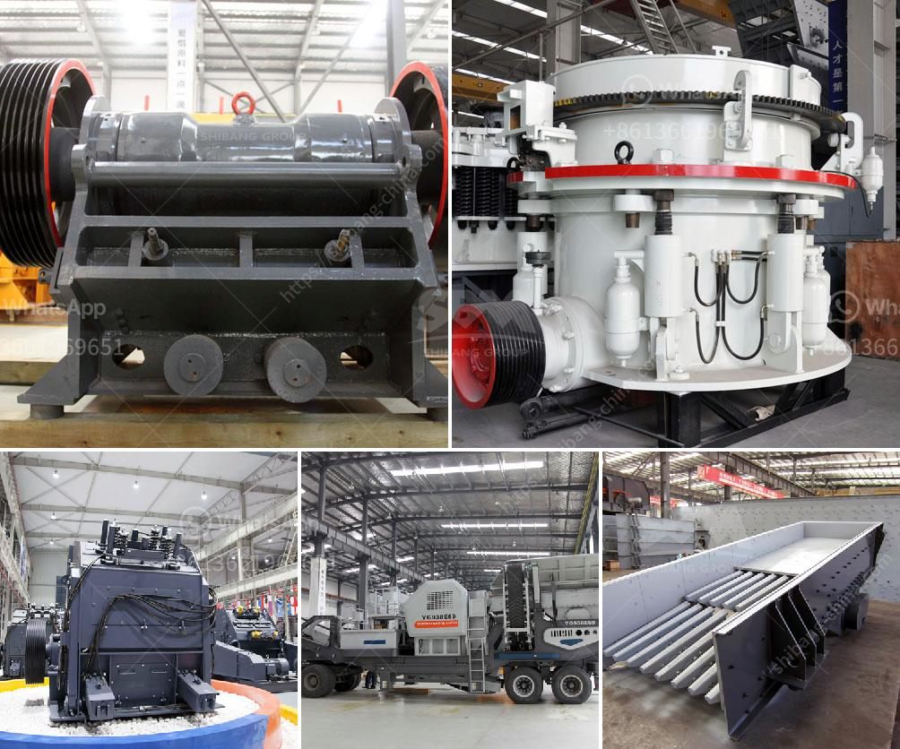

<h3>How to develope stone quarry ?</h3>
Developing a stone quarry can be a challenging yet rewarding endeavor, as it plays a vital role in meeting the growing demand for construction materials. This article will provide insights into the process of developing and managing a prosperous stone quarry. From finding the ideal location to obtaining relevant permits, implementing sustainable practices, and building a strong team, we will explore the key steps necessary to establish a thriving quarry business.

The first step in quarry development is identifying a suitable location rich in quality stone deposits. This can be done by conducting comprehensive geological surveys to assess the presence, quantity, and quality of the stone. Additionally, factors such as accessibility, proximity to markets, and transportation infrastructure must be considered. Engaging the services of experienced geologists and surveyors can be invaluable during this phase to ensure accurate assessments and informed decision-making.

The next crucial step is obtaining the necessary permits and environmental clearances to operate legally. Depending on the country or region, this may involve obtaining licenses, leases, and agreements from government authorities, as well as adhering to environmental impact assessments and mitigation plans. Engaging with local communities and stakeholders is essential to ensure compliance with regulations and to alleviate any concerns regarding environmental impact, noise, and dust pollution.

Sustainable quarrying practices are essential for the long-term viability of a stone quarry. These include mitigating environmental impacts through soil and water management, restoration plans, and reclamation of disturbed lands. Efficient energy and resource management should be prioritized, with cutting-edge technologies being employed to reduce carbon emissions and minimize waste production. Collaborating with local communities and environmental experts to develop responsible quarrying practices will enhance the reputation of the quarry and strengthen relationships with stakeholders.

A knowledgeable and skilled workforce is critical for the success of a stone quarry. Hiring experienced quarry managers, geologists, engineers, and operators will ensure technical expertise and effective day-to-day operations. Providing adequate training and safety programs is essential to promote a safe working environment and maintain high productivity levels. A cohesive team comprising individuals who share a passion for maintaining quality standards and environmental stewardship is vital for the long-term success of the quarry.

Developing a stone quarry involves a comprehensive and meticulous approach that prioritizes sustainability, compliance with regulations, and building a skilled workforce. By carefully assessing stone deposits, obtaining legal permits, implementing sustainable practices, and fostering a strong team, quarry developers can pave the way to a profitable and environmentally conscious business. Through responsible quarrying, we can meet society's demand for construction materials while preserving the environment for future generations.
<h3>Contact us</h3><ul><li><strong>Whatsapp:&nbsp;<a href="https://wa.me/8613661969651">+8613661969651</a></strong></li><li><a href="https://swt.shibang-china.com/?git&amp;zhl&amp;How to develope stone quarry "><strong>Online Service(chat now)</strong></a></li></ul><h3>Related</h3><ul><li><a href='How does the ball mill produce cement.md'>How does the ball mill produce cement</a></li><li><a href='How to remove feldspars from sand production.md'>How to remove feldspars from sand production?</a></li><li><a href='how to calculate tons per hour ball mill machine .md'>how to calculate tons per hour ball mill machine ?</a></li><li><a href='How to start a granite quarry.md'>How to start a granite quarry?</a></li><li><a href='How to extract gold from limonite ore .md'>How to extract gold from limonite ore ?</a></li></ul>