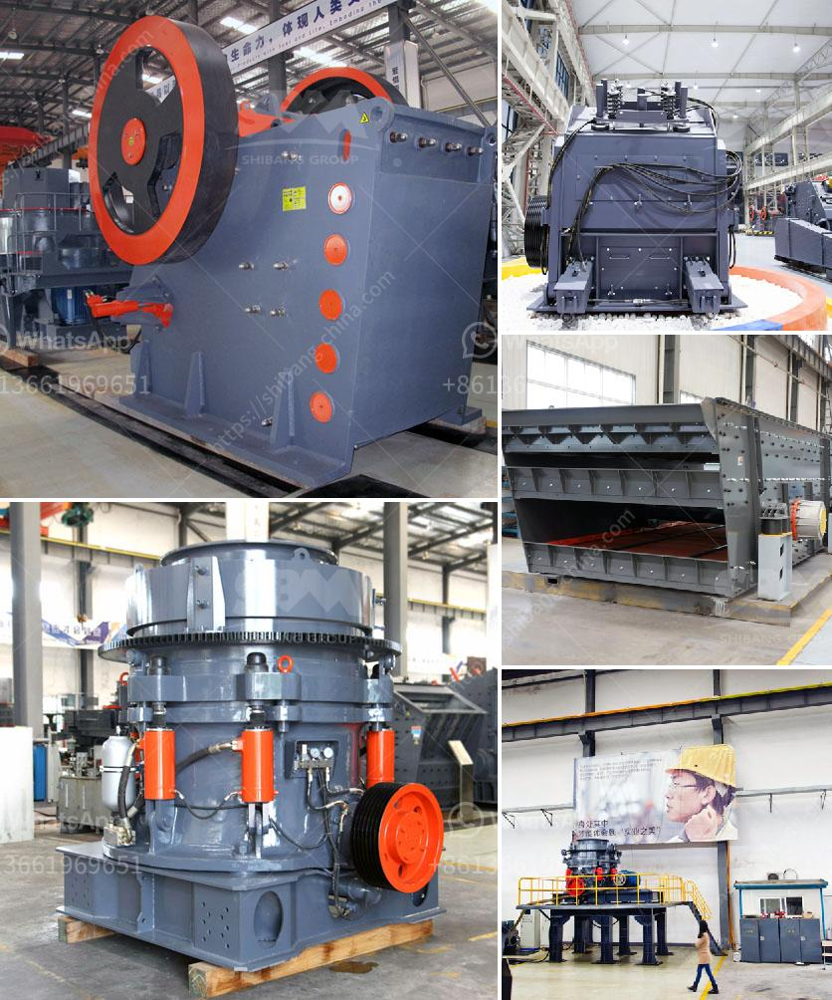

<h3>How to disassemble a cone crusher?</h3>
A cone crusher is a type of rock crusher commonly used in mining, construction, and other industries. Sometimes maintenance is needed on these machines to remove worn parts and rust. Here is how to disassemble a cone crusher step by step.

2. Remove the oil drain plugs from the countershaft and drive pinion gear assembly and allow the oil to drain.

3. Use a socket wrench to turn the hex head bolts counterclockwise and remove the socket retainer ring.

3. Use a special socket wrench to turn the hex head bolt counterclockwise until the bowl assembly starts lifting.

- Follow the manufacturer's manual or consult with a qualified technician if you encounter any difficulties or have questions during the disassembly process.

By following these step-by-step instructions, you can successfully disassemble a cone crusher. This knowledge will come in handy for maintenance purposes, repairs, or when replacing certain components. However, it is important to exercise caution and seek professional help if needed to ensure a safe and efficient disassembly process.
<h3>Contact us</h3><ul><li><strong>Whatsapp:&nbsp;<a href="https://wa.me/8613661969651">+8613661969651</a></strong></li><li><a href="https://swt.shibang-china.com/?git&amp;zhl&amp;How to disassemble a cone crusher"><strong>Online Service(chat now)</strong></a></li></ul><h3>Related</h3><ul><li><a href='How to crush metallurgical coke.md'>How to crush metallurgical coke?</a></li><li><a href='How do you calculate the motor power for a vibrator screen.md'>How do you calculate the motor power for a vibrator screen?</a></li><li><a href='How to improve stone crusher production.md'>How to improve stone crusher production?</a></li><li><a href='How to build crushing plant foundation .md'>How to build crushing plant foundation ?</a></li><li><a href='How does a coal crusher work.md'>How does a coal crusher work?</a></li></ul>