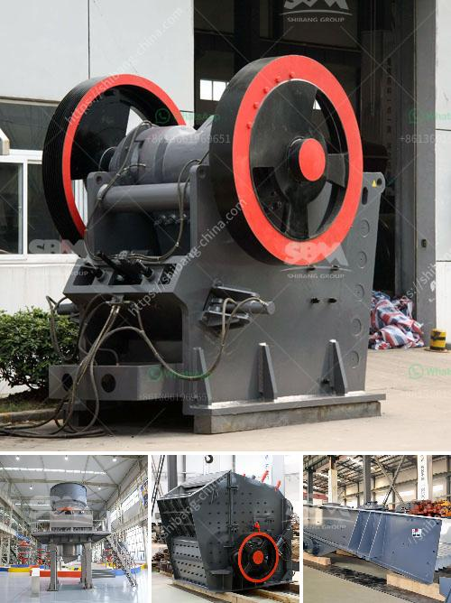

<h3>How to disassemble jaw crushers?</h3>
Jaw crushers are used in various industries to break down large pieces of rock into manageable and smaller-sized stones. In order to disassemble the jaw crusher, many components need to be removed, including the jaw plate, the toggle plate, as well as the flywheel. However, a number of different procedures are required to dismantle these important parts in a safe and efficient manner. In this article, we will explore the steps involved in disassembling jaw crushers.

Before starting the disassembly process, it is important to ensure proper safety precautions are in place. Make sure the jaw crusher is disconnected from the power source and the surrounding area is free of any potential hazards. Additionally, it is recommended to wear protective gear such as safety glasses and gloves to avoid any injuries during the disassembly process.

The first step in disassembling the jaw crusher is to remove the tension rod and spring assembly together with the hydraulic cylinder. This will prevent any unintended movement of the jaw plate while the crusher is being dismantled. After the tension rod and spring assembly are removed, simply unscrew the nut that holds the tension rod in place and lower the hydraulic cylinder.

Next, the toggle plate needs to be removed by loosening the tension bolts on both sides of the jaw crusher. Once the tension bolts are loosened, the toggle plate can be lifted out and the jaw plate can be removed. The jaw plates are held in place by wedges, which can be removed by simply loosening the bolts on each side. Once the bolts are removed, the wedges can be lifted out, allowing the jaw plates to be taken off.

After removing the jaw plates, the next step is to remove the flywheel. Begin by disconnecting the belt that is attached to the flywheel. This can be done by loosening the tension on the belt using the tensioner pulley. Once the belt is disconnected, the flywheel can be unbolted and removed from the crusher.

Finally, the last step in disassembling the jaw crusher is to remove the bearing cap and the cap bolts. These bolts hold the bearing cap in place, which, once removed, will allow access to the bearings. Take care when removing the bearing cap bolts, as they can be quite tight. Additionally, be cautious when removing the bearing cap, as it may be heavy and difficult to handle.

In conclusion, disassembling jaw crushers requires careful attention to detail and adherence to specific safety protocols. By following the steps outlined in this article, the necessary components of the jaw crusher can be safely and efficiently disassembled. It is important to note that the order of disassembly may vary depending on the specific model of the jaw crusher, so referring to the manufacturer's manual is highly recommended. With proper care and attention, the disassembly process can be completed successfully, allowing for maintenance or replacement of key components as needed.
<h3>Contact us</h3><ul><li><strong>Whatsapp:&nbsp;<a href="https://wa.me/8613661969651">+8613661969651</a></strong></li><li><a href="https://swt.shibang-china.com/?git&amp;zhl&amp;How to disassemble jaw crushers"><strong>Online Service(chat now)</strong></a></li></ul><h3>Related</h3><ul><li><a href='How to design a cement processing plant.md'>How to design a cement processing plant?</a></li><li><a href='How to set up a stone crusher plant.md'>How to set up a stone crusher plant?</a></li><li><a href='How does bulk density affect the capacity of a rock crusher.md'>How does bulk density affect the capacity of a rock crusher?</a></li><li><a href='How to separate the gold from the powdered sand .md'>How to separate the gold from the powdered sand ?</a></li><li><a href='how to increase the amplitude of vibrating screen ？.md'>how to increase the amplitude of vibrating screen ？</a></li></ul>