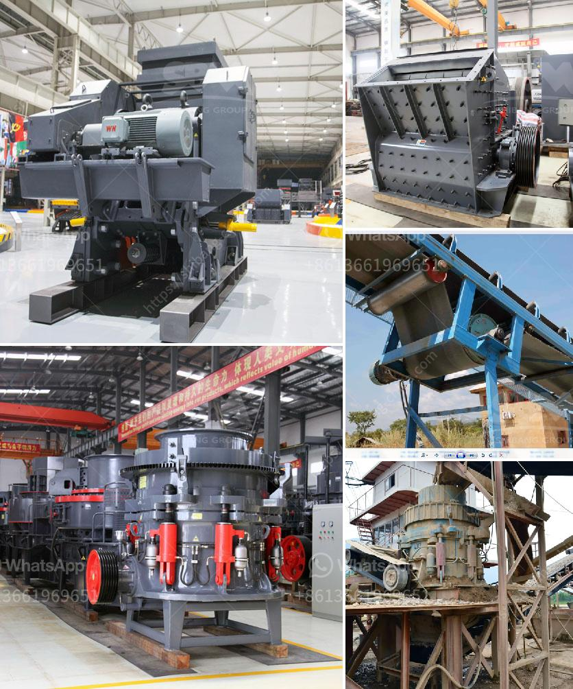

<h3>How to disassemble the jaw plate of jaw crusher?</h3>
Jaw crushers are heavy-duty machines used for crushing rocks, ores, and other materials. They are designed to efficiently break down large chunks of material into smaller pieces, reducing the need for further crushing. One crucial component of a jaw crusher is the jaw plate, which is also known as the fixed jaw plate or the stationary jaw plate. Over time, the jaw plate may become worn or damaged, requiring replacement. In this article, we will discuss the step-by-step process of disassembling the jaw plate of a jaw crusher.

First and foremost, it is essential to ensure the jaw crusher is turned off and disconnected from the power source before beginning the disassembly process. This ensures the safety of the person conducting the disassembly.

The next step involves the removal of the guards and protective covers that may be present around the jaw plates. These guards and covers provide protection against any debris or other material that may inadvertently enter the crusher. Care must be taken to remove them without causing any damage.

Once the guards and covers have been removed, the next step is to lower the tension rod and spring assembly. These are responsible for keeping the jaw plate in place and must be released before attempting to remove the jaw plate. Some jaw crushers may have a tension rod located at the top of the crusher, while others may have it located at the bottom. Refer to the manufacturer's instructions to correctly identify the location and method of releasing the tension.

After releasing the tension rod and spring assembly, the next step is to remove the worn or damaged jaw plate. Depending on the design of the jaw crusher, there may be one or two jaw plates that need to be removed. Typically, the jaw plate can be unbolted from the crusher's mounting brackets using a wrench or pliers.

Once the jaw plate has been unbolted, it can be carefully lifted out of the crusher. It is important to handle the jaw plate with care to avoid any damage or injury. The jaw plate may be heavy, so it is recommended to have another person assist in lifting and removing it.

After the old jaw plate has been removed, the next step is to install the new jaw plate. Ensure the new jaw plate matches the specifications of the original one and is securely bolted in place. Take care to evenly tighten the bolts to avoid any imbalance.

Finally, reassemble the tension rod and spring assembly, ensuring it is properly tensioned. Replace any guards or protective covers that were removed earlier, and reconnect the power source to the jaw crusher. It is essential to test the jaw crusher to ensure the new jaw plate is functioning correctly.

In conclusion, disassembling the jaw plate of a jaw crusher is a straightforward process that requires caution and attention to detail. By following the steps outlined in this article and referring to the manufacturer's instructions, individuals can safely and effectively disassemble and replace the jaw plate. It is crucial to regularly inspect the jaw plate and replace it when necessary to ensure the jaw crusher continues to function optimally.
<h3>Contact us</h3><ul><li><strong>Whatsapp:&nbsp;<a href="https://wa.me/8613661969651">+8613661969651</a></strong></li><li><a href="https://swt.shibang-china.com/?git&amp;zhl&amp;How to disassemble the jaw plate of jaw crusher"><strong>Online Service(chat now)</strong></a></li></ul><h3>Related</h3><ul><li><a href='How to choose a stone grinding machine ？.md'>How to choose a stone grinding machine ？</a></li><li><a href='How to unjam a mine crushing mill.md'>How to unjam a mine crushing mill?</a></li><li><a href='How to clean copper ore with equipment .md'>How to clean copper ore with equipment ?</a></li><li><a href='How to install limestone sand washing machine ？.md'>How to install limestone sand washing machine ？</a></li><li><a href='How to adjust a jaw crusher .md'>How to adjust a jaw crusher ?</a></li></ul>