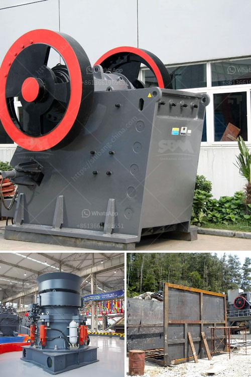

<h3>How to do ball mill operation and maintenance?</h3>
Ball mill operation is a complex process and there is no unanimous agreement about its operation and maintenance. However, if you follow some basic steps, you will be able to keep your ball mill in perfect operation for a long time.

The first step in mill maintenance is to conduct an inventory and inspection of the mill components, including the drives, bearings, gears, and lubrication system. This should be done on a regular basis to keep track of any potential issues and to ensure that everything is in good working condition.

Next, you should check the temperature and lubrication of the main parts. The temperature of the main bearing, the reducer, and the motor should be checked regularly to prevent overheating. In addition, you should ensure that the lubrication system is working effectively and that there is enough lubricating oil in the mill.

During the operation of the ball mill, you should check the condition of all the lubricating points and the oil level indicator regularly to ensure the normal operation and prolong the service life of the mill.

Another important aspect of ball mill operation is the control system, which is responsible for the smooth and stable operation of the mill. Poorly designed control systems or improper operation can lead to various issues, such as mill overloading, unstable product size distribution, and inconsistent grinding performance. Therefore, it is crucial to have a well-designed and properly functioning control system.

In addition to regular maintenance, the ball mill should also be operated correctly. It is important to avoid excessive grinding or insufficient grinding, as these can lead to inefficient operation and reduced productivity. It is also important to operate the mill within its design limitations and to follow the recommended operating guidelines provided by the manufacturer.

Furthermore, attention should be given to the grinding media used in the ball mill. The type and quality of the grinding media can significantly affect the grinding efficiency and the product quality. Therefore, it is important to choose the appropriate grinding media and to regularly inspect and replace worn-out media.

Overall, ball mill operation and maintenance require comprehensive knowledge and experience. It is essential to have a solid understanding of the ball mill's principles and operation, as well as the various measures that can be taken to prolong its lifespan and ensure optimal performance. By following the above-mentioned steps and paying attention to relevant details, you can ensure the smooth and efficient operation of your ball mill for years to come.
<h3>Contact us</h3><ul><li><strong>Whatsapp:&nbsp;<a href="https://wa.me/8613661969651">+8613661969651</a></strong></li><li><a href="https://swt.shibang-china.com/?git&amp;zhl&amp;How to do ball mill operation and maintenance"><strong>Online Service(chat now)</strong></a></li></ul><h3>Related</h3><ul><li><a href='How to Design a Copper Processing Plant.md'>How to Design a Copper Processing Plant?</a></li><li><a href='How can we solve the problem of the crusher bearing heating.md'>How can we solve the problem of the crusher bearing heating?</a></li><li><a href='How do you find the feed rate for a jaw crusher.md'>How do you find the feed rate for a jaw crusher?</a></li><li><a href='How to achieve a smooth coal pulverizer.md'>How to achieve a smooth coal pulverizer?</a></li><li><a href='How to install a stone crusher plant.md'>How to install a stone crusher plant?</a></li></ul>