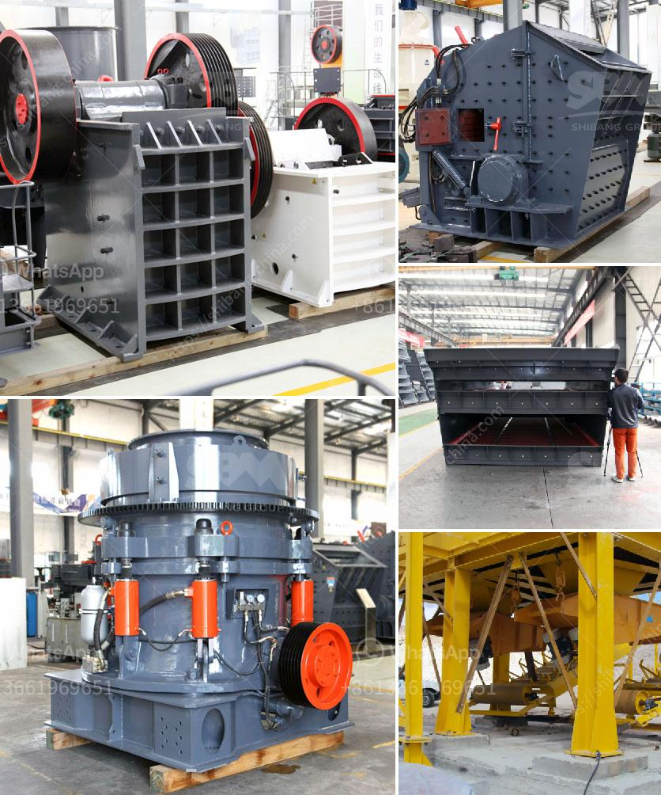

<h3>How to do manganese mining ?</h3>
Manganese mining is the process of extracting manganese ore from the ground for use in various applications. Manganese is a commonly used metal, known for its antioxidant properties and ability to resist corrosion. It is widely used in the chemical industry, as well as for alloy production, construction, steel manufacturing, and batteries. This article will outline the basic steps involved in manganese mining and highlight some key considerations.

The first step in manganese mining is exploration to identify potential deposits. Geologists utilize various methods, including aerial surveys, satellite imagery, and geological mapping, to locate areas with high manganese content. Additionally, historical data and existing mines can provide valuable insights. Once a potential site is identified, detailed geological surveys and tests are conducted to assess the quality and quantity of the manganese ore.

Before mining can commence, the site has to be prepared by clearing vegetation and removing the topsoil and overburden (layers of soil, rock, and vegetation covering the ore). Often, this step involves the use of heavy machinery, such as bulldozers and excavators, to remove the layers and expose the manganese ore.

- Open-Pit Mining: In open-pit mining, manganese ore is extracted through a series of mining pits or borrow areas. Large-scale excavators, shovels, and trucks are used to go deep into the pits and excavate the ore. The extracted ore is then transported to a processing plant for further processing.

- Underground Mining: Underground mining is typically employed when the manganese ore is located at greater depths below the surface. This method involves vertical shafts and tunnels to access the ore. Underground mining is more expensive and requires specialized equipment and additional safety precautions due to the potentially hazardous conditions.

After the ore is extracted, it needs to be processed to remove impurities and prepare it for use. The extracted manganese ore is crushed into smaller pieces and then sorted using different techniques, such as gravity separation, magnetic separation, or dense media separation. This process helps concentrate the ore and increase its manganese content.

The concentrated ore undergoes beneficiation, which involves further processing to remove impurities and increase the manganese content. Techniques such as flotation, leaching, and high-intensity magnetic separation are commonly used for beneficiation. Once the ore is refined, it can be used for various applications, such as alloy production or manufacturing of batteries, steel, and other manganese-based products.

Manganese mining, like any other mining activity, has environmental implications that need careful consideration. Mining operations should adhere to proper waste management practices, reclamation efforts to restore the area after mining, and minimize the impact on surrounding ecosystems. Strict regulatory guidelines and environmental assessments are necessary to ensure sustainable mining practices.

In conclusion, manganese mining involves a multi-step process, including exploration, clearing, mining, crushing, screening, beneficiation, and refining. Proper planning, site selection, and adherence to environmental regulations are essential for responsible mining. With its versatile properties and widespread applications, manganese continues to be an important metal in various industries.
<h3>Contact us</h3><ul><li><strong>Whatsapp:&nbsp;<a href="https://wa.me/8613661969651">+8613661969651</a></strong></li><li><a href="https://swt.shibang-china.com/?git&amp;zhl&amp;How to do manganese mining "><strong>Online Service(chat now)</strong></a></li></ul><h3>Related</h3><ul><li><a href='How to build a manganese ore concentrator What crushing machinery do you need.md'>How to build a manganese ore concentrator? What crushing machinery do you need?</a></li><li><a href='How to Operate Calcite Crushing Plant ？.md'>How to Operate Calcite Crushing Plant ？</a></li><li><a href='How to Install a crusher equipment ？.md'>How to Install a crusher equipment ？</a></li><li><a href='How to make quartz powder grinding mill in Kenya ？.md'>How to make quartz powder grinding mill in Kenya ？</a></li><li><a href='How to adjust the discharge opening of a spring cone crusher.md'>How to adjust the discharge opening of a spring cone crusher?</a></li></ul>