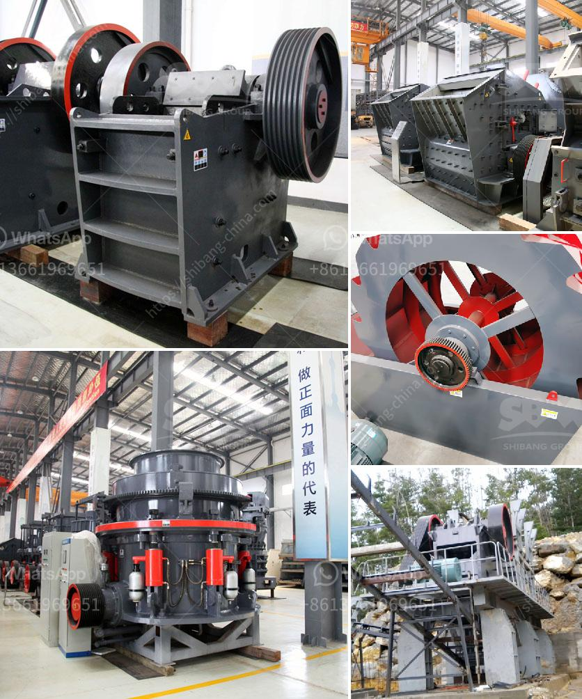

<h3>How to do the maintenance of crushing screening plant?</h3>
Crushing and screening plants are utilized in various industries for mineral processing and material handling. They play a vital role in the construction industry as they provide the vital aggregates required for concrete production as well as for road construction. In order to ensure a smooth operation of the plant and maintain high production rates, proper maintenance is essential. This article outlines the key maintenance tips for these plants.

Preventive maintenance is perhaps the most important aspect of any crushing and screening plant. Poor maintenance can result in costly downtime and low production, which can have a detrimental impact on business operations. To avoid such situations, it is necessary to utilize a maintenance checklist regularly, ensuring preventive tasks are completed in a timely manner.

One of the most common maintenance practices is the regular rotation of wear parts. This includes rotating jaw liners, replaceable impact bars, and blow bars, feed cones, mantles, and other wear parts. By regularly rotating these parts, the wear is distributed evenly, resulting in extended part life and reduced downtime.

Lubrication is another critical aspect of crushing and screening plant maintenance. Proper lubrication ensures friction-free operation and prevents premature wearing of bearings, bushings, and other moving parts. It is important to follow the manufacturer's recommendations for lubrication frequency and use the correct lubricants for each application.

Regular inspections of the crushing and screening plant are also necessary. These inspections help identify potential problems before they escalate into major issues. Inspections should be conducted on a daily, weekly, and monthly basis, focusing on areas such as belts, guards, motor mounts, hydraulic systems, and electrical wiring. Any signs of wear, damage, or potential issues should be addressed promptly.

In addition to regular inspections, cleaning and housekeeping are crucial for the maintenance of these plants. Dust and debris can accumulate in various parts of the plant, leading to reduced performance and potential breakdowns. Regular cleaning of the screens, bins, and other equipment is necessary to ensure optimal operation.

Training and educating plant operators is another essential aspect of maintenance. Well-trained operators are more likely to detect any potential issues and perform routine maintenance tasks effectively. Training should cover the operation and maintenance of the plant, safety protocols, troubleshooting techniques, and emergency procedures.

Lastly, it is vital to keep accurate records of all maintenance activities. These records serve as a valuable resource for future reference, enabling better planning and identification of ongoing maintenance requirements. Detailed records should include maintenance schedules, parts replacements, repairs, and any other relevant information.

In conclusion, properly maintaining a crushing and screening plant ensures optimal performance, reduces downtime, and extends the life of the equipment. Regular inspections, lubrication, parts rotation, cleaning, training, and maintaining accurate records are all crucial for effective maintenance. By following these maintenance tips, operators can maximize the productivity and efficiency of their crushing and screening plants.
<h3>Contact us</h3><ul><li><strong>Whatsapp:&nbsp;<a href="https://wa.me/8613661969651">+8613661969651</a></strong></li><li><a href="https://swt.shibang-china.com/?git&amp;zhl&amp;How to do the maintenance of crushing screening plant"><strong>Online Service(chat now)</strong></a></li></ul><h3>Related</h3><ul><li><a href='How does a work of impact crusher.md'>How does a work of impact crusher?</a></li><li><a href='How to install a sand making machine.md'>How to install a sand making machine?</a></li><li><a href='How to Design a Copper Processing Plant.md'>How to Design a Copper Processing Plant?</a></li><li><a href='how to size vibrating screen.md'>how to size vibrating screen?</a></li><li><a href='how many tons per hour for the rock crusher .md'>how many tons per hour for the rock crusher ?</a></li></ul>