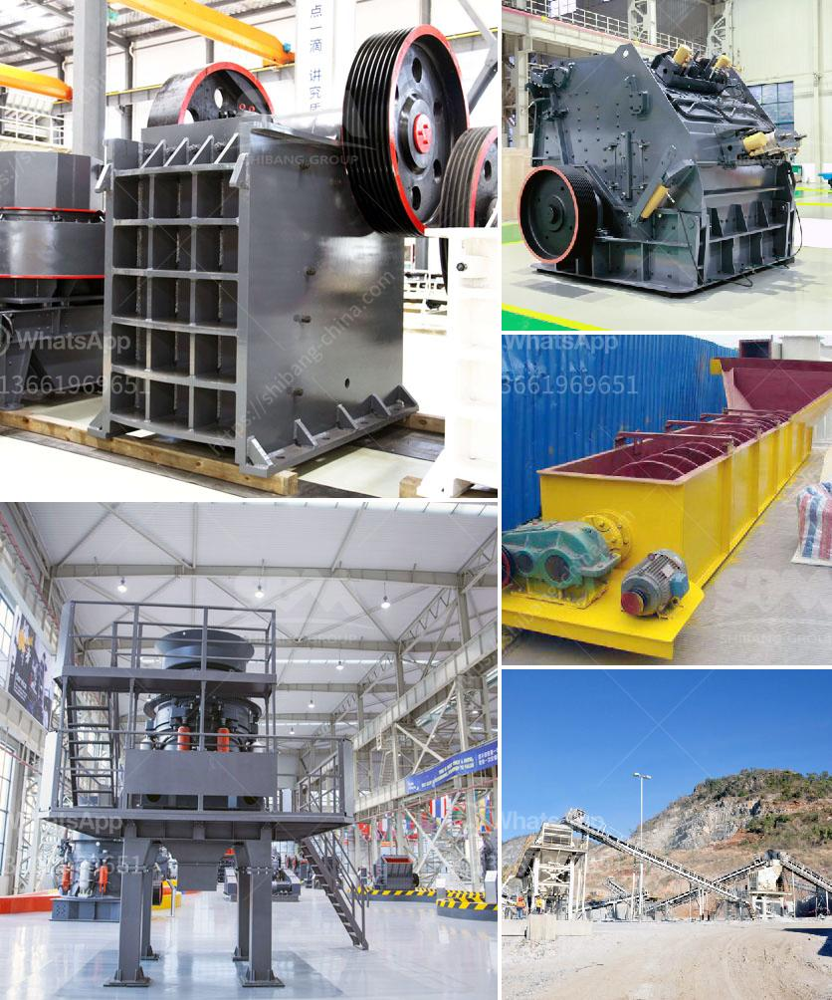

<h3>How to effectively improve the production capacity of the crusher?</h3>
The crusher is an essential piece of machinery in mining, construction, and other industries. Its primary function is to break large stones into smaller pieces for further processing. Increasing the production capacity of the crusher is crucial for optimizing operational efficiency and maximizing profits. In this article, we will discuss some effective strategies to enhance the production capacity of the crusher.

1. Ensure proper maintenance: Regular maintenance is the key to keep the crusher operating at peak performance. Conduct routine inspections, check for wear and tear, and replace damaged or worn parts promptly. Lubricate all moving parts as per the manufacturer's recommendations to reduce friction and prevent unnecessary breakdowns.

2. Optimize the feeding arrangement: The crusher's performance greatly depends on the quality and quantity of the material being fed into it. Ensure a consistent and controlled feed by using a properly sized feeder. Avoid overloading the crusher as it can lead to decreased production and increased wear on the equipment. Additionally, ensure that the material is evenly distributed across the crushing chamber for efficient operation.

3. Adjust the CSS (Closed Side Setting): The CSS, or the gap between the concave and the mantle, plays a crucial role in determining the size of the crushed product. By adjusting the CSS, the crusher's output can be increased or decreased. However, it's important to find the right balance as an excessively tight CSS may cause unnecessary wear on the machine while an excessively wide CSS may result in larger than desired product size.

4. Opt for advanced automation systems: Implementing automation technology can significantly improve the crusher's production capacity. Automation allows for precise control of various parameters such as CSS, feed rate, and power consumption. It also enables remote monitoring and troubleshooting, helping to reduce downtime and optimize the overall efficiency of the crushing process.

5. Regularly monitor performance and analyze data: Utilize advanced monitoring systems to track the crusher's performance in real-time. Collect and analyze data related to production rates, power consumption, and overall efficiency. This data-driven approach provides valuable insights into identifying bottlenecks or inefficiencies in the crushing process, allowing for targeted improvements.

6. Invest in modern equipment: Upgrading to modern crushers with superior design and technology can significantly enhance production capacity. Newer models often feature improved crushing chambers, better throughput capacity, and reduced energy consumption. Additionally, advanced control systems and automation features are commonly found in modern crushers, further optimizing their performance.

7. Train operators and promote best practices: Well-trained operators can make a significant difference in maximizing the crusher's production capacity. Training programs should focus on operating procedures, safety protocols, and maintenance practices. By instilling a culture of best practices and continuous improvement, operators can efficiently utilize the machinery and achieve higher production outputs.

In conclusion, improving the production capacity of the crusher requires a combination of proper maintenance, optimized feeding arrangement, adjustment of CSS, implementation of automation systems, regular monitoring and analysis of performance data, investment in modern equipment, and operator training. By following these strategies, mining and construction companies can optimize their crushing operations, increase productivity, and ultimately, improve their profitability.
<h3>Contact us</h3><ul><li><strong>Whatsapp:&nbsp;<a href="https://wa.me/8613661969651">+8613661969651</a></strong></li><li><a href="https://swt.shibang-china.com/?git&amp;zhl&amp;How to effectively improve the production capacity of the crusher"><strong>Online Service(chat now)</strong></a></li></ul><h3>Related</h3><ul><li><a href='How to increase the efficiency coal pulveriser on power plant.md'>How to increase the efficiency coal pulveriser on power plant?</a></li><li><a href='How to control the dust of stone crusher .md'>How to control the dust of stone crusher ?</a></li><li><a href='How to manufacture marble powder with a mesh size of 1000.md'>How to manufacture marble powder with a mesh size of 1000?</a></li><li><a href='how to remove the roller of  vertical roller mill.md'>how to remove the roller of  vertical roller mill</a></li><li><a href='How to set up a jaw crusher production line ？.md'>How to set up a jaw crusher production line ？</a></li></ul>