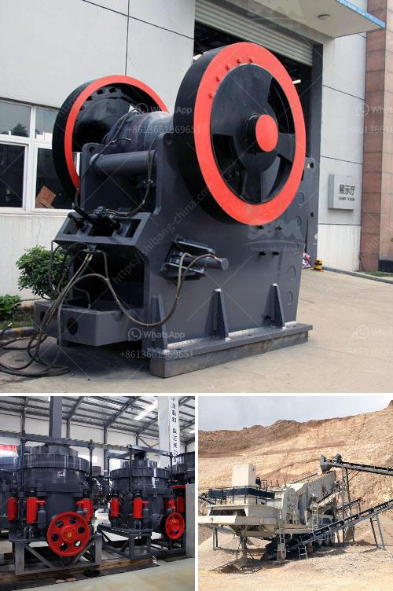

<h3>How to electrify a ball mill?</h3>
Ball mills are popularly used for grinding and blending materials in the ceramic, metallurgical, chemical, pharmaceutical, and mining industries. However, conventional ball mills consume high amounts of energy and generate substantial carbon emissions. In order to promote sustainable practices and achieve greater efficiency in these processes, electrifying a ball mill can be a transformative step. This article aims to provide a comprehensive guide on how to electrify a ball mill, focusing on key considerations and benefits.

1. Energy Efficiency: A traditional ball mill typically operates through the rotation of a drum containing grinding media, which crushes the material into fine particles. By replacing the conventional mechanical drive system with an electric motor and frequency converter, the electrified ball mill can significantly reduce energy consumption. The motor allows for precise control over the rotational speed, optimizing the grinding process and saving energy.

2. Environmental Sustainability: Electrification of ball mills promotes sustainable practices by reducing dependence on fossil fuels. Generating electricity from renewable sources, such as solar or wind, decreases carbon emissions and helps mitigate climate change. Moreover, electrification reduces noise pollution and enhances the working environment by eliminating the need for diesel-powered generators.

3. Maintenance and Reliability: Electrifying a ball mill eliminates the need for complex mechanical components such as gears, gearboxes, and clutch systems. This simplifies the overall design, reducing the chances of component failures and the need for extensive maintenance. Consequently, downtime is minimized, resulting in increased production capacity and enhanced reliability.

1. Motor Selection: Choose a motor with the required power and torque output based on the specific requirements of the ball mill. Consider factors such as load characteristics, operating speed range, and the need for variable speed control.

2. Frequency Converter: Install a frequency converter in the electrical system to control the motor's speed and torque. This allows for adjustments to suit varying material characteristics and desired grinding requirements, optimizing efficiency.

3. Electrical Systems: Ensure the electrical infrastructure is properly designed to accommodate the new electric motor and frequency converter. Work with a qualified electrical engineer to assess and adapt the existing electrical systems if necessary.

4. Safety Measures: Implement safety protocols, such as correctly grounding the electrical system, installing proper overload protection mechanisms, and implementing safety interlocks to prevent unauthorized access and protect personnel.

5. Monitoring and Control: Incorporate a real-time monitoring and control system to ensure the electrified ball mill operates within optimal parameters. This allows for constant monitoring of the motor's performance, power consumption, and temperature, ensuring safe and efficient operation.

Electrifying a ball mill presents an excellent opportunity to enhance efficiency, reduce energy consumption, and foster sustainable practices within various industries. By following the steps outlined above, the transformation from conventional to electrically-driven ball milling can be accomplished. This transition not only reduces carbon emissions and environmental impact but also improves overall productivity, reliability, and maintenance. Electrification is a key advancement that paves the way for a greener and more sustainable future in materials processing.
<h3>Contact us</h3><ul><li><strong>Whatsapp:&nbsp;<a href="https://wa.me/8613661969651">+8613661969651</a></strong></li><li><a href="https://swt.shibang-china.com/?git&amp;zhl&amp;How to electrify a ball mill"><strong>Online Service(chat now)</strong></a></li></ul><h3>Related</h3><ul><li><a href='How can we prevent rocks from coming out of the impact crushers work.md'>How can we prevent rocks from coming out of the impact crusher's work?</a></li><li><a href='How to improve pulveriser capacity.md'>How to improve pulveriser capacity?</a></li><li><a href='How to set up a jaw crusher production line ？.md'>How to set up a jaw crusher production line ？</a></li><li><a href='How to Make Plaster of Phosphogypsum.md'>How to Make Plaster of Phosphogypsum</a></li><li><a href='How to set up a quarry business in india.md'>How to set up a quarry business in india?</a></li></ul>