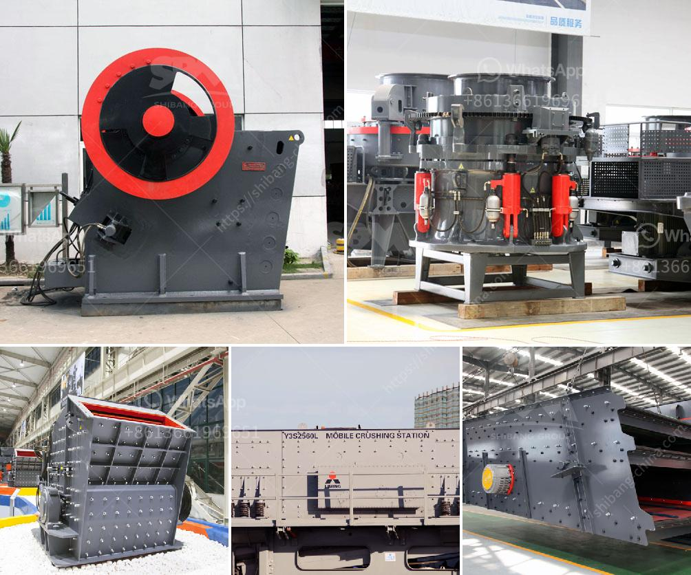

<h3>How to ensure the efficient operation of impact crusher?</h3>
An impact crusher is a vital machine used in the mining industry. While it is highly effective, it also has its fair share of challenges. Understanding how to efficiently operate this machine is crucial for its proper functioning. Here are some tips on how to ensure the efficient operation of an impact crusher.

1. Regularly inspect and clean the equipment: Regular maintenance is vital for the efficient operation of any machine, including impact crushers. Inadequate maintenance can lead to equipment failure and production downtime. Therefore, it is essential to inspect the impact crusher regularly, paying close attention to the wear and tear of parts. Clean the machine thoroughly to remove any debris or buildup that may affect its efficiency. 

2. Optimize feeding: Proper feeding is crucial for the efficient operation of an impact crusher. The material should be evenly distributed and fed into the crushing chamber to avoid overloading the machine. Uneven feeding can cause power overload and even damage the machine. It is recommended to use a vibrating feeder or a grizzly feeder to control the flow of materials and ensure consistent feeding.

3. Maintain the correct rotor speed: The rotor speed of an impact crusher plays a significant role in its efficiency. It determines the particle size distribution of the crushed material. Adjusting the rotor speed can change the product gradation and capacity of the crusher. It is essential to maintain the correct rotor speed to maximize the production efficiency of the machine.

4. Regularly check and replace wear parts: The wear parts of an impact crusher, such as the blow bars and impact plates, undergo significant wear during the crushing process. As these parts wear down, the efficiency of the crusher decreases. Regularly inspect the wear parts and replace them as needed to ensure optimal performance. High-quality wear parts can significantly enhance the efficiency and productivity of the impact crusher.

5. Monitor and control the discharge size: The discharge size of an impact crusher affects the product quality and production efficiency. It is essential to monitor and control the discharge size using the appropriate screening equipment or adjusting the crusher settings. This ensures that the final product meets the required specifications and maximizes efficiency.

6. Train operators and follow safety guidelines: Proper operator training is essential for the efficient and safe operation of an impact crusher. Operators should be familiar with the equipment's operation, maintenance procedures, and safety guidelines. Following the manufacturer's instructions and safety protocols minimizes the risk of accidents and equipment damage.

In conclusion, ensuring the efficient operation of an impact crusher requires regular inspection, cleaning, and maintenance. Optimal feeding, correct rotor speed, and proper wear parts replacement are crucial factors to maximize the machine's efficiency. Additionally, monitoring and controlling the discharge size and providing proper training to operators are vital for safe and efficient operation. By implementing these tips, operators can enhance the performance and productivity of their impact crushers in the mining industry.
<h3>Contact us</h3><ul><li><strong>Whatsapp:&nbsp;<a href="https://wa.me/8613661969651">+8613661969651</a></strong></li><li><a href="https://swt.shibang-china.com/?git&amp;zhl&amp;How to ensure the efficient operation of impact crusher"><strong>Online Service(chat now)</strong></a></li></ul><h3>Related</h3><ul><li><a href='How to maintenance coal mill.md'>How to maintenance coal mill?</a></li><li><a href='How to clean manganese ore .md'>How to clean manganese ore ?</a></li><li><a href='How to select a vibrating screen in Britain.md'>How to select a vibrating screen in Britain?</a></li><li><a href='How to produce silica sand 7 steps.md'>How to produce silica sand? 7 steps</a></li><li><a href='How much does a rock crusher cost in Zimbabwe.md'>How much does a rock crusher cost in Zimbabwe?</a></li></ul>