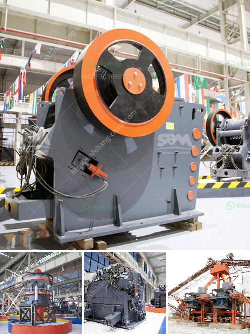

<h3>How to enter into a business of stone crusher plant in Malaysia ?</h3>
Malaysia has been a prominent destination for the exporting and importing of various types of stones. With its vibrant culture, rich history, and geological diversity, it is well-known for its wide array of stones that are commonly used in construction and landscaping projects. As such, starting a stone crusher plant in Malaysia can be a lucrative and profitable venture for aspiring entrepreneurs.

Here are a few important steps to follow for anyone who wants to enter into the stone crushing business in Malaysia:

1. Determine the Market Demand: The first step before establishing a stone crusher plant is to determine the market demand for the stones you want to crush. This will help you understand the potential profitability of the business and the specific types of stones that are in high demand. Conduct thorough market research to identify the target customers and the quantity of stones they require.

2. Identify Suitable Locations: After identifying the market demand, it is essential to find suitable locations to set up the stone crusher plant. Ideal locations would have ample stone resources nearby, easy access to transportation, and comply with local regulations. Consider factors such as proximity to raw materials, availability of utilities, and the potential for future expansion.

3. Obtain Necessary Licenses and Permits: Before commencing operations, it is crucial to obtain all the necessary licenses and permits required by the local regulatory authorities. These may include land use permits, environmental clearances, and operational licenses. Compliance with all legalities will ensure the smooth functioning and credibility of the business.

4. Secure Funding: The establishment of a stone crusher plant requires a significant investment. Therefore, it is essential to secure the necessary funding before proceeding. Consider approaching financial institutions, investors, or venture capitalists to acquire the required capital. Prepare a detailed business plan showcasing the market potential, financial projections, and repayment schedules to attract potential investors.

5. Procure Essential Equipment and Machinery: A stone crusher plant requires various types of machinery for crushing, mixing, and handling stones efficiently. In addition to the stone crushers, you will also need feeding and screening equipment, conveyors, and hoppers. Select reliable suppliers who can provide the necessary machinery at competitive prices without compromising on quality.

6. Recruit Skilled Workforce: A competent workforce is vital to operate and maintain the stone crusher plant effectively. Recruit qualified professionals who have experience in stone crushing and are familiar with the local regulations. Ensure that all employees receive proper training on safe and efficient operation procedures.

7. Develop Marketing Strategies: Once the stone crusher plant is operational, it is crucial to market and promote the products effectively. Develop a robust marketing strategy targeting construction companies, landscapers, and other potential customers. Utilize both traditional and digital marketing channels to create awareness about the stone crusher plant and its offerings.

8. Maintain Quality and Timely Delivery: Consistently delivering high-quality crushed stones and fulfilling orders on time are essential factors in sustaining the business. Invest in quality control measures to ensure that the stones meet the required specifications and comply with industry standards. Additionally, efficient logistics management will facilitate timely delivery.

In conclusion, entering the stone crusher plant business in Malaysia requires thorough planning and a solid understanding of the market. By following the above-mentioned steps, entrepreneurs can successfully establish and operate a profitable stone crushing business in Malaysia.
<h3>Contact us</h3><ul><li><strong>Whatsapp:&nbsp;<a href="https://wa.me/8613661969651">+8613661969651</a></strong></li><li><a href="https://swt.shibang-china.com/?git&amp;zhl&amp;How to enter into a business of stone crusher plant in Malaysia "><strong>Online Service(chat now)</strong></a></li></ul><h3>Related</h3><ul><li><a href='How to Build a Marble Mill ？.md'>How to Build a Marble Mill ？</a></li><li><a href='How to set up a clinker grinding unit.md'>How to set up a clinker grinding unit?</a></li><li><a href='How to balance a cement mill separator.md'>How to balance a cement mill separator?</a></li><li><a href='How to install quarry equipment.md'>How to install quarry equipment?</a></li><li><a href='how to calculate belt feeder ？.md'>how to calculate belt feeder ？</a></li></ul>