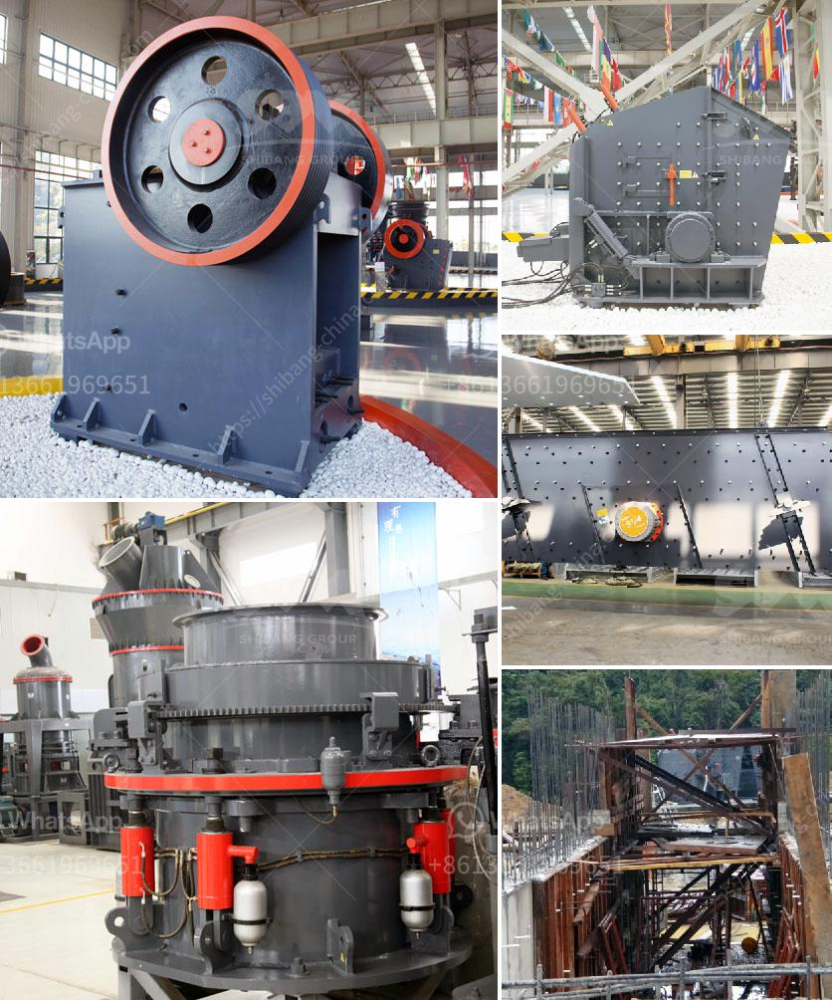

<h3>How to establish a 60-ton coal crusher plant?</h3>
Coal plays a vital role in electricity generation worldwide. Coal-fired power plants currently fuel 38% of global electricity and, in some countries, this number is even higher. However, to ensure a steady supply of coal for these power plants, it is essential to establish and maintain coal crusher plants. In this article, we will discuss the steps required to establish a 60-ton coal crusher plant.

Before starting any business venture, it is essential to conduct thorough market research. In this case, evaluate the demand and supply of coal in your target area. Identify potential competitors and understand their operations. Analyze market trends and economic conditions that affect the coal industry. This research will help you make informed decisions regarding the establishment and operation of your coal crusher plant.

To establish a coal crusher plant, you need to obtain several licenses and permits from the relevant authorities. These may include environmental permits, mining licenses, operational permits, and safety certifications. Contact your local government or regulatory agencies to determine the specific requirements in your area.

The location of your coal crusher plant is crucial for the success of your operation. Look for areas near coal mines with reliable transportation infrastructure. Accessibility to major roads, railways, and ports is essential for the transportation of coal. Additionally, consider factors such as the availability of water and electricity supply, as well as zoning regulations and community impact.

After finalizing the location, you need to prepare the site for your coal crusher plant. This includes clearing the land, leveling the ground, and ensuring proper drainage. Create a layout plan that optimizes the use of space and ensures smooth flow of operations. Construct necessary infrastructure such as access roads, offices, and storage facilities.

A coal crusher plant requires specialized equipment for efficient and safe operation. Essential equipment includes crushers, conveyors, stackers, generators, and dust suppression systems. You may also need heavy machinery like loaders, excavators, and large trucks for hauling coal. It is crucial to choose reliable and durable equipment to minimize downtime and maintenance costs.

Recruit a competent and skilled workforce to operate and maintain your coal crusher plant. Look for experienced personnel familiar with coal crusher plants and coal handling systems. Provide appropriate training to ensure safe and efficient operation. Ensure compliance with health and safety regulations to protect your workers and minimize accidents.

To ensure the longevity of your coal crusher plant, establish a comprehensive maintenance plan. Regularly inspect and maintain the equipment to prevent breakdowns and maximize productivity. Create a spare parts inventory to avoid delays due to equipment failure. Additionally, train your staff in preventive maintenance techniques to identify potential issues before they escalate.

Coal crusher plants have a significant environmental impact. Implement measures to mitigate air pollution, noise, and dust emissions. Install dust control systems, implement reclamation plans, and monitor water usage. Comply with environmental regulations and establish good relations with the community by being a responsible corporate citizen.

In conclusion, establishing a 60-ton coal crusher plant requires careful planning and implementation. Conduct market research, obtain necessary licenses, choose the right location, procure the right equipment, hire skilled workers, and comply with environmental regulations. By following these steps, you can establish a successful coal crusher plant that ensures a steady supply of coal to meet the demand for electricity generation.
<h3>Contact us</h3><ul><li><strong>Whatsapp:&nbsp;<a href="https://wa.me/8613661969651">+8613661969651</a></strong></li><li><a href="https://swt.shibang-china.com/?git&amp;zhl&amp;How to establish a 60ton coal crusher plant"><strong>Online Service(chat now)</strong></a></li></ul><h3>Related</h3><ul><li><a href='How to calculate the running cost of a crusher.md'>How to calculate the running cost of a crusher?</a></li><li><a href='how to load cone crusher .md'>how to load cone crusher ?</a></li><li><a href='How to replace a broken bearing in a jaw crusher.md'>How to replace a broken bearing in a jaw crusher?</a></li><li><a href='How to improve stone crusher production.md'>How to improve stone crusher production?</a></li><li><a href='How to choose a stone crusher station .md'>How to choose a stone crusher station ?</a></li></ul>