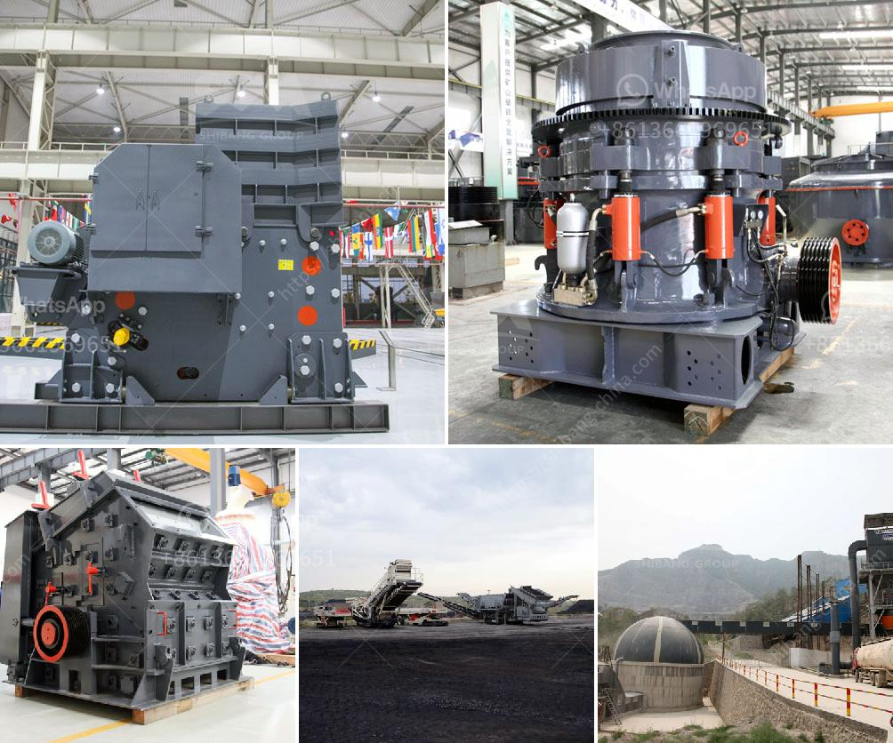

<h3>How to establish a powdered calcium carbonate plant ?</h3>
Calcium carbonate is a compound commonly found in rocks, shells, and even pearls. It holds significant importance in various industries, including construction, agriculture, and healthcare. Precipitated calcium carbonate (PCC) and ground calcium carbonate (GCC) are two forms of calcium carbonate that are widely used. Establishing a powdered calcium carbonate plant requires careful planning, market research, and the consideration of various factors. Here, we will discuss the key steps involved in setting up a successful plant.

Before establishing a powdered calcium carbonate plant, it is essential to conduct comprehensive market research. This research should identify the demand for calcium carbonate, including potential customers and their specific requirements. Understanding market trends, competition, and pricing will help you make informed decisions and create a robust business plan.

Selecting an appropriate location for your plant is crucial. Look for an area close to the source of limestone, the main raw material for calcium carbonate production. Additionally, consider the proximity to transportation networks and target markets. Availabilities of utilities such as water, electricity, and natural gas are also important factors to consider.

Complying with legal requirements is essential for establishing any plant. Contact local authorities to understand the necessary licenses and permits needed for setting up a calcium carbonate plant. These may include environmental permits, building permits, operational licenses, and more. Ensure you complete the required paperwork and obtain approvals before starting your operations.

To establish a powdered calcium carbonate plant, you will need various equipment, including crushers, mills, classifiers, serial air separators, magnetic separators, and dust collectors. These machines will aid in the crushing, grinding, and separation processes involved in converting limestone into powdered calcium carbonate. Ensure you purchase high-quality equipment to ensure long-lasting and efficient operations.

To maintain a steady production cycle, it is crucial to establish a reliable supply chain for raw materials and packaging materials. Identify and build relationships with reputable suppliers of limestone, packaging materials, and other necessary inputs. This will help avoid interruptions in production and maintain the quality of your powdered calcium carbonate.

Quality control is vital in ensuring that your powdered calcium carbonate meets the required standards. Establish a comprehensive quality control system that includes regular testing, inspections, and analysis of your final product. Consistent quality will enhance your brand reputation, attract more customers, and contribute to long-term business success.

Once your powdered calcium carbonate plant is established, it is time to focus on marketing and building relationships with potential customers. Develop a marketing strategy to promote your product, highlighting its quality, competitive pricing, and unique selling propositions. Build strong relationships with manufacturers, distributors, and wholesalers to ensure a steady flow of orders.

In conclusion, establishing a powdered calcium carbonate plant requires careful planning, market research, and consideration of various factors. By following the key steps outlined above, you can create a successful plant that meets the demand for calcium carbonate, provides a reliable supply of high-quality product, and contributes to your business growth.
<h3>Contact us</h3><ul><li><strong>Whatsapp:&nbsp;<a href="https://wa.me/8613661969651">+8613661969651</a></strong></li><li><a href="https://swt.shibang-china.com/?git&amp;zhl&amp;How to establish a powdered calcium carbonate plant "><strong>Online Service(chat now)</strong></a></li></ul><h3>Related</h3><ul><li><a href='How to replace a broken bearing in a jaw crusher.md'>How to replace a broken bearing in a jaw crusher?</a></li><li><a href='How to unjam a mine crushing mill.md'>How to unjam a mine crushing mill?</a></li><li><a href='How does a raw mill work in a cement plant.md'>How does a raw mill work in a cement plant?</a></li><li><a href='How to make sand from quartzite customer case .md'>How to make sand from quartzite customer case ?</a></li><li><a href='How to make sand from rocks.md'>How to make sand from rocks?</a></li></ul>