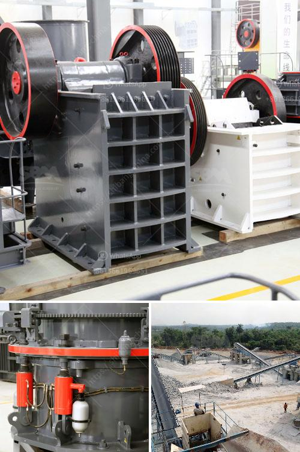

<h3>How to extend the working life of a jaw crushing plate?</h3>
A jaw crushing plate is an essential part of a jaw crusher. This plate is responsible for constantly moving the stones to be crushed into smaller sizes. There are many types of jaw crushers available in the market, but not all of them are designed equally. Unfortunately, jaw plates tend to wear out quickly, especially when the crushing materials are hard and abrasive. This inevitably leads to reduced efficiency and increased operating costs. However, there are several ways to extend the working life of jaw crushing plates.

First and foremost, it is essential to regularly inspect the jaw plates for any cracks or other signs of damage. Ideally, jaw plates should be replaced before they are worn down to the point where they cannot be used effectively anymore. By catching cracks early on, it is possible to prevent further damage and keep the jaw plates running optimally.

Regularly cleaning the crushing chamber is also a vital part of extending the life of jaw crushing plates. Removing build-up from the surface of the plates will help maintain the proper crushing angle and prevent uneven wear. Regular inspections should also include checking the tightness of the nuts and bolts on the jaw plates to ensure that they are securely fastened.

Choosing the right jaw plate for a specific crushing application is also important. Different materials are used for a variety of industrial applications, and each material has its own specific qualities that make it ideal for a particular situation. For instance, manganese steel is a high-strength material often used in the mining industry, while titanium carbide inserts are becoming increasingly popular for their exceptional durability and wear resistance.

Using the correct tooth profile is another consideration for extending the life of a jaw crushing plate. Different tooth profiles allow for better grip and control of the crushing process. A deeper tooth profile maximizes jaw plate life and ensures a proper nip angle, allowing the material to be effectively crushed and reducing the risk of tooth breakage.

Regularly rotating the jaw crushing plates to distribute the wear evenly along the tooth profile is another useful strategy to extend the working life of the plates. This also helps maximize the wear surface and prevent excessive wear on specific areas, ultimately reducing the frequency of jaw plate replacements.

Lastly, it is crucial to properly feed the material into the crusher. Overloading the crusher can cause the jaw plates to wear down unevenly, leading to more frequent replacements. Maintaining a consistent and appropriate feed rate will help prolong the life of the jaw plates and overall crusher efficiency.

In conclusion, extending the working life of jaw crushing plates requires a combination of proper jaw plate maintenance, careful material selection, and attention to detail during the crushing process. By following these steps and taking care of your jaw crusher, you can significantly extend its lifespan, reduce costs, and achieve optimal crushing performance.
<h3>Contact us</h3><ul><li><strong>Whatsapp:&nbsp;<a href="https://wa.me/8613661969651">+8613661969651</a></strong></li><li><a href="https://swt.shibang-china.com/?git&amp;zhl&amp;How to extend the working life of a jaw crushing plate"><strong>Online Service(chat now)</strong></a></li></ul><h3>Related</h3><ul><li><a href='How to crush aggregates.md'>How to crush aggregates?</a></li><li><a href='How to beneficiation tungsten ore.md'>How to beneficiation tungsten ore?</a></li><li><a href='how to eliminate titaniumsulphur and silica in iron sand？.md'>how to eliminate titaniumsulphur and silica in iron sand？</a></li><li><a href='How to fit water pipes on vibrating screen in sand washing plant.md'>How to fit water pipes on vibrating screen in sand washing plant?</a></li><li><a href='how can work the crusher house in thermal power plant .md'>how can work the crusher house in thermal power plant ?</a></li></ul>