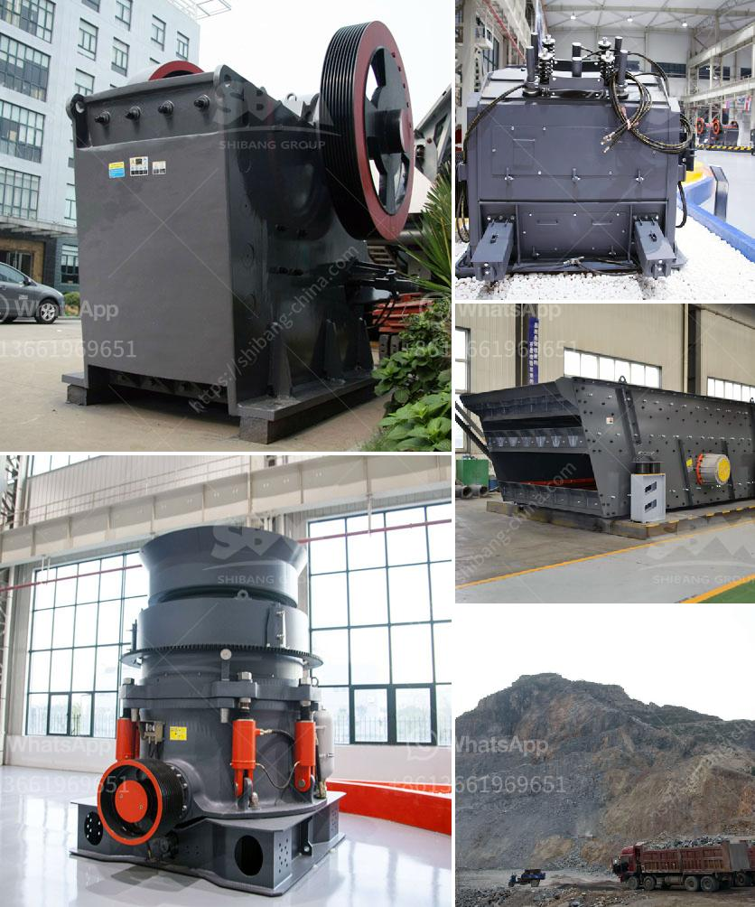

<h3>How to extract copper from tailings?</h3>
Copper is a vital element in various industries due to its excellent thermal and electrical conductivity. As a result, the demand for copper is constantly increasing, leading to the extraction of more ores from the earth. However, mining ores generates vast quantities of tailings, which are mineral-rich waste materials that pose a significant environmental challenge. Fortunately, extracting copper from tailings is an innovative approach that can not only minimize environmental impact but also obtain valuable resources.

Before proceeding with the extraction process, it is crucial to conduct a thorough assessment of the tailings composition. This will help determine the concentration of copper present and other impurities that may affect extraction methods. The composition analysis can be conducted through laboratory assays and should include the examination of the particle size distribution, moisture content, and chemical makeup of the tailings.

Several methods can be employed to extract copper from tailings, depending on the specific composition and characteristics of the tailings. One commonly used method is the froth flotation process, where chemicals and air bubbles are introduced to separate the copper minerals from the rest of the tailings. Other techniques include leaching, where a solvent is used to dissolve copper from the tailings, and electrorefining, where electrolysis is utilized to purify copper-rich solutions.

Preparation is crucial to ensure the success of copper extraction from tailings. Adequate crushing, grinding, and milling of the tailings are essential to expose copper minerals for proper extraction. This can be done using crushers and mills to reduce the size of the tailings particles.

Froth flotation is a widely used method to separate copper minerals from tailings. Firstly, chemicals called collectors are added to the tailings slurry, which selectively binds to copper minerals. Air is then introduced into the slurry to create bubbles, which attach to the copper minerals, forming a froth. The froth can be skimmed off, and the copper concentrate can be further processed to obtain pure copper.

Leaching involves the use of a chemical solvent to dissolve copper minerals from the tailings. The solvent may be acidic or alkaline, depending on the specific minerals present. The resulting copper-rich solution, known as the leachate, can undergo further purification processes such as solvent extraction and electrowinning to obtain pure copper.

While extracting copper from tailings is an effective way to mitigate environmental impact, it is crucial to handle the process responsibly. Proper waste management, including the containment and treatment of tailings, should be implemented. Additionally, the usage of environmentally friendly chemicals and responsible water management practices can further minimize the ecological footprint of the extraction process.

In conclusion, extracting copper from tailings offers a sustainable solution to lessen the environmental consequences of mining while recovering valuable resources. However, it is essential to conduct detailed assessments, choose the appropriate extraction method, and consider environmental aspects when undertaking this process. By embracing these steps, the mining industry can simultaneously fulfill its copper demand while reducing waste and preserving the environment.
<h3>Contact us</h3><ul><li><strong>Whatsapp:&nbsp;<a href="https://wa.me/8613661969651">+8613661969651</a></strong></li><li><a href="https://swt.shibang-china.com/?git&amp;zhl&amp;How to extract copper from tailings"><strong>Online Service(chat now)</strong></a></li></ul><h3>Related</h3><ul><li><a href='how to maintainance stone cone crusher.md'>how to maintainance stone cone crusher?</a></li><li><a href='How to move a mobile screen crusher.md'>How to move a mobile screen crusher?</a></li><li><a href='How to crush and clean stone.md'>How to crush and clean stone?</a></li><li><a href='How to set up a jaw crusher production line ？.md'>How to set up a jaw crusher production line ？</a></li><li><a href='How to check the stone crusher and daily maintenance？.md'>How to check the stone crusher and daily maintenance？</a></li></ul>