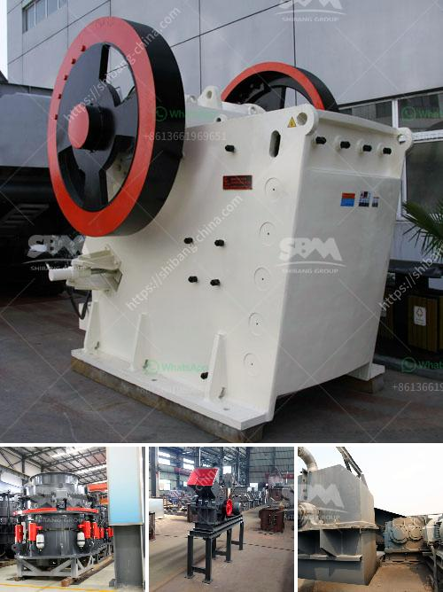

<h3>How to extract dust from a ball mill?</h3>
A ball mill is a grinding machine widely used in construction, mining, and other industries to reduce the size of various materials. However, the dust generated during the grinding process can be hazardous to operators and nearby workers. To alleviate this issue, dust extraction systems are commonly utilized to effectively collect and remove dust particles from the air. In this article, we will explore various methods to extract dust from a ball mill, ensuring a safer and cleaner working environment.

One common approach to dust extraction is the use of cyclone separators. These devices separate particles from the air by creating a cyclonic vortex, where centrifugal force pushes the dust particles towards the outer walls. By installing a cyclone separator near the ball mill, the majority of dust particles can be efficiently separated and collected. The separated particles can then be collected in a separate container for proper disposal or recycling.

Another effective method to extract dust from a ball mill is through the use of vacuum systems. Vacuum systems are designed to create suction, drawing dust particles into a collection chamber or filter. By strategically placing vacuum nozzles near the grinding area of the ball mill, the dust particles can be easily captured and transported away from the workspace. Integrated filters in the vacuum system ensure that the extracted air is cleaned before being released back into the environment.

Moreover, it is crucial to ensure proper ventilation in the ball mill area. Adequate ventilation helps to minimize the accumulation of dust particles and provides a fresh and clean atmosphere for the workers. Installing exhaust fans or ventilation systems near the ball mill can effectively remove dust-laden air, significantly reducing the risk of inhalation for the operators. Additionally, maintaining a constant airflow helps to prevent the settling of dust on surfaces, further enhancing the cleanliness of the workspace.

Regular maintenance and cleaning of the ball mill are also essential to minimize dust generation. Accumulation of dust on the equipment can lead to the dispersion of particles during operation. Implementing a routine cleaning schedule for the ball mill and its surrounding areas will help prevent excessive dust accumulation and ensure that the extraction systems operate at peak efficiency.

Finally, it is crucial to prioritize safety protocols and provide proper personal protective equipment (PPE) for workers. Dust extraction systems can effectively remove a significant amount of dust; however, wearing appropriate PPE, such as masks and goggles, is necessary to further protect against any potential inhalation or eye irritation caused by residual dust particles.

In conclusion, the extraction of dust from a ball mill is crucial to maintaining a safe and clean working environment. The use of cyclone separators, vacuum systems, and adequate ventilation can effectively eliminate dust particles. Furthermore, regular maintenance and cleaning, along with the implementation of appropriate safety protocols, are essential to ensure a healthier workplace for operators and nearby workers. By adopting these measures, the harmful effects of dust generation can be significantly minimized, leading to improved overall workplace safety.
<h3>Contact us</h3><ul><li><strong>Whatsapp:&nbsp;<a href="https://wa.me/8613661969651">+8613661969651</a></strong></li><li><a href="https://swt.shibang-china.com/?git&amp;zhl&amp;How to extract dust from a ball mill"><strong>Online Service(chat now)</strong></a></li></ul><h3>Related</h3><ul><li><a href='How to size grinding mills.md'>How to size grinding mills?</a></li><li><a href='How to Build an Ore Processing Plant ？.md'>How to Build an Ore Processing Plant ？</a></li><li><a href='How to Buy a Stone Crusher in India ？.md'>How to Buy a Stone Crusher in India ？</a></li><li><a href='How to crush coal in power plant.md'>How to crush coal in power plant?</a></li><li><a href='How to increase the output of jaw crusher ？.md'>How to increase the output of jaw crusher ？</a></li></ul>