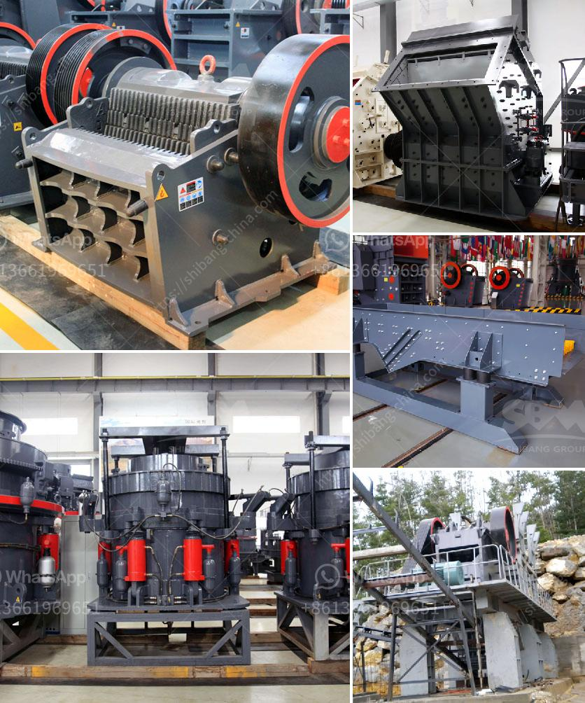

<h3>How to extract gold from limonite ore ?</h3>
Limonite is a common iron oxide mineral found in various sedimentary rocks, such as clay, mudstones, and sandstones. It is often associated with other minerals, such as goethite, magnetite, and hematite. While limonite itself does not contain a high concentration of gold, it can be a valuable source of the precious metal. This article will outline the steps involved in extracting gold from limonite ore.

Before attempting to extract gold from limonite ore, it is crucial to conduct a comprehensive geological investigation. This will involve studying the geological formation, mineralogy, and the distribution of gold-bearing regions. By understanding the geological characteristics of the ore deposit, one can determine the most effective and efficient method of extraction.

After the ore has been collected, it needs to be crushed into smaller particles. This can be done through mechanical methods or by using a crusher. The pulverized ore is then subjected to grinding, which further reduces its size and allows for better extraction.

One of the most common methods used to extract gold from limonite ore is gravity separation. This process relies on the difference in density between gold particles and the surrounding gangue materials. Several devices, such as jigs, spirals, and shaking tables, can be used to separate the heavier gold particles from the lighter gangue.

Since limonite is often associated with other iron oxide minerals, such as magnetite and hematite, magnetic separation can be employed to concentrate the gold. Magnetic separation utilizes the magnetic properties of these minerals to separate them from the non-magnetic gangue. This process is especially effective when dealing with fine particles.

Cyanidation is a widely used method for extracting gold from ores that contain low concentrations of the precious metal. After the limonite ore has been concentrated using gravity or magnetic separation, it can be subjected to cyanidation. Cyanide, a highly toxic chemical, is used to dissolve the gold particles, forming a soluble complex. The gold can then be recovered from the solution through various methods, such as precipitation or activated carbon absorption.

Once the gold has been successfully extracted from the limonite ore, it is necessary to refine it to obtain pure gold. Refining involves removing impurities and contaminants, such as other metals and non-metallic substances. Common refining methods include smelting, where the gold is melted and separated from other elements, and chemical processes like electrolysis.

In conclusion, extracting gold from limonite ore requires a series of steps that involve crushing, grinding, gravity separation, magnetic separation, cyanidation, and refining. Each stage plays a vital role in obtaining the desired gold concentration and purity. However, it is important to consult with geologists and metallurgists to determine the most appropriate extraction method for a specific ore deposit. Additionally, strict safety protocols should be followed when dealing with chemicals, such as cyanide, to ensure the well-being of those involved in the extraction process.
<h3>Contact us</h3><ul><li><strong>Whatsapp:&nbsp;<a href="https://wa.me/8613661969651">+8613661969651</a></strong></li><li><a href="https://swt.shibang-china.com/?git&amp;zhl&amp;How to extract gold from limonite ore "><strong>Online Service(chat now)</strong></a></li></ul><h3>Related</h3><ul><li><a href='How can we prevent rocks from coming out of the impact crushers work.md'>How can we prevent rocks from coming out of the impact crusher's work?</a></li><li><a href='How to establish a 60ton coal crusher plant.md'>How to establish a 60-ton coal crusher plant?</a></li><li><a href='How to operate a vibrating screen.md'>How to operate a vibrating screen?</a></li><li><a href='how to manage a granite quarry factory .md'>how to manage a granite quarry factory ?</a></li><li><a href='How can one avoid chalking during kaolin crushing.md'>How can one avoid chalking during kaolin crushing?</a></li></ul>