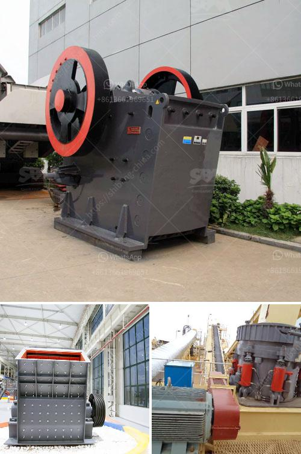

<h3>How to extract iron ore flow chart?</h3>
Iron ore is one of the most abundant elements on Earth, comprising about 5% of the Earth's crust. It exists in various forms, including magnetite, hematite, geothite, limonite, and siderite. Iron ore is a vital resource for several industries, namely steel production, which is essential for infrastructure, machinery, and construction. Extracting iron ore is a rigorous process that involves various stages, but the end result is significant, making it worth the effort.

To understand how iron ore is extracted, a flow chart illustrating the process is needed. Here is a brief overview:

The first step involves the raw ore being crushed and ground into smaller pieces. This preparation process greatly improves the efficiency of subsequent stages. Crushing reduces the ore to small fragments, while grinding pulverizes it into a fine powder.

After the mineral-rich ore has been ground, it undergoes magnetic separation. This process utilizes magnets to separate the iron-rich particles from the non-iron minerals. Magnetic separators attract and separate the magnetic fractions, leaving behind the non-magnetic particles.

The magnetic concentrate obtained from the previous step is further concentrated using separation techniques like froth flotation. Froth flotation involves injecting air into a mixture of water and reagents, which causes the desired minerals to adhere to the air bubbles. These mineral-bearing bubbles then rise to the surface, where they can be collected and further processed.

To make the iron ore suitable for use in blast furnaces, it needs to be converted into small, uniform pellets. Pelletizing involves agglomerating the finely ground concentrate with other additives such as limestone, bentonite, and fluxing agents. The resulting mixture is then processed into small pellets through a pelletizing machine.

The green pellets produced in the previous step contain moisture and require further processing. The pellets are dried in large, rotating drums to remove excess moisture. Once dried, they are fired in high-temperature kilns to harden and strengthen them, making them ready for use in iron and steel production processes.

The final stage involves shipping and distributing the iron ore to steel manufacturers. This is done via trains, trucks, or ships, depending on the location of the steel mills. The iron ore is loaded into appropriate transport vessels and transported to the mill, where it will be further processed into the final product.

Extracting iron ore through this flow chart requires significant energy, time, and resources. However, the end product is essential for various industries and has a significant impact on global development. The process ensures that the high-grade iron ore needed for steel production is extracted efficiently and effectively.

In conclusion, the extraction of iron ore follows a comprehensive flow chart involving crushing, grinding, magnetic separation, concentration, pelletization, drying, and firing. This unearthing process is vital for numerous industries, with steel production being the most prominent. Through careful implementation of each stage, iron ore can be extracted and utilized as a valuable resource.
<h3>Contact us</h3><ul><li><strong>Whatsapp:&nbsp;<a href="https://wa.me/8613661969651">+8613661969651</a></strong></li><li><a href="https://swt.shibang-china.com/?git&amp;zhl&amp;How to extract iron ore flow chart"><strong>Online Service(chat now)</strong></a></li></ul><h3>Related</h3><ul><li><a href='How to change the blow bars on an impact crusher.md'>How to change the blow bars on an impact crusher?</a></li><li><a href='How to design a crushing plant .md'>How to design a crushing plant ?</a></li><li><a href='how to calculate belt feeder ？.md'>how to calculate belt feeder ？</a></li><li><a href='How to calculate the payback period for a coal mine.md'>How to calculate the payback period for a coal mine?</a></li><li><a href='How to adjust the discharge port of stone cone crusher ？.md'>How to adjust the discharge port of stone cone crusher ？</a></li></ul>