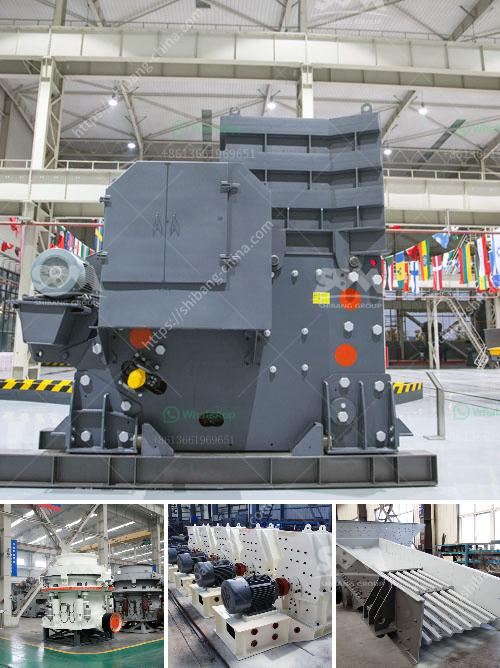

<h3>How to extract manganese from ore?</h3>
Manganese is a widely used element in various industries due to its unique properties and abundance in nature. It is predominantly found as ore deposits in the form of manganese dioxide (MnO2), which needs to be extracted and processed for further use. In this article, we will discuss the process of extracting manganese from its ore.

One of the first steps in the extraction process is physical beneficiation, which involves crushing the manganese ore into smaller pieces. The ore is then sorted and classified, using techniques such as magnetic separation, gravity separation, and floatation, to remove impurities and improve the manganese grade.

Once the ore is properly prepared, it undergoes a chemical process called leaching. Leaching involves the use of chemicals, such as sulfuric acid or hydrochloric acid, to dissolve the manganese from the ore. The crushed ore is mixed with the acid solution in large tanks, and the manganese is selectively extracted from the solution.

The leaching process typically takes place at high temperatures and pressures to increase the efficiency of the reaction. The acid solution dissolves the manganese, forming soluble compounds, while leaving behind the other elements present in the ore. This selective leaching ensures that only manganese is extracted, while minimizing the extraction of other metals.

After leaching, the manganese-rich solution is subjected to various purification steps to remove impurities. One common purification method is precipitation, wherein a specific chemical is added to the solution to react with the manganese and form a solid precipitate. This precipitate is then filtered and washed to remove any residual impurities.

The next step in the extraction process is the conversion of the precipitate into a more useful form of manganese. This is typically done through a process called electrolysis, where an electric current is passed through the purified precipitate. The electric current causes the manganese ions to gain or lose electrons, resulting in the formation of metallic manganese.

The metallic manganese is then refined and processed to meet the desired specifications for its various applications. It can be alloyed with other metals to enhance their properties, such as in the production of stainless steel. Manganese can also be used as a pigment in paints, ceramics, and glass, or as a catalyst in chemical reactions.

In conclusion, extracting manganese from its ore involves a series of physical and chemical processes. The ore is first crushed and classified to remove impurities. Then, it undergoes leaching, where a chemical solution is used to selectively dissolve the manganese. The resulting solution is purified, and the manganese is converted into a usable form, such as metallic manganese. Through these extraction processes, manganese can be efficiently obtained and utilized in various industries.
<h3>Contact us</h3><ul><li><strong>Whatsapp:&nbsp;<a href="https://wa.me/8613661969651">+8613661969651</a></strong></li><li><a href="https://swt.shibang-china.com/?git&amp;zhl&amp;How to extract manganese from ore"><strong>Online Service(chat now)</strong></a></li></ul><h3>Related</h3><ul><li><a href='how to pulverized limestone crusher ？.md'>how to pulverized limestone crusher ？</a></li><li><a href='How to calibrate the belt conveyor.md'>How to calibrate the belt conveyor</a></li><li><a href='how much price for used stone crusher in Uae.md'>how much price for used stone crusher in Uae</a></li><li><a href='how does the jaw crusher works.md'>how does the jaw crusher works</a></li><li><a href='how to size vibrating screen.md'>how to size vibrating screen?</a></li></ul>