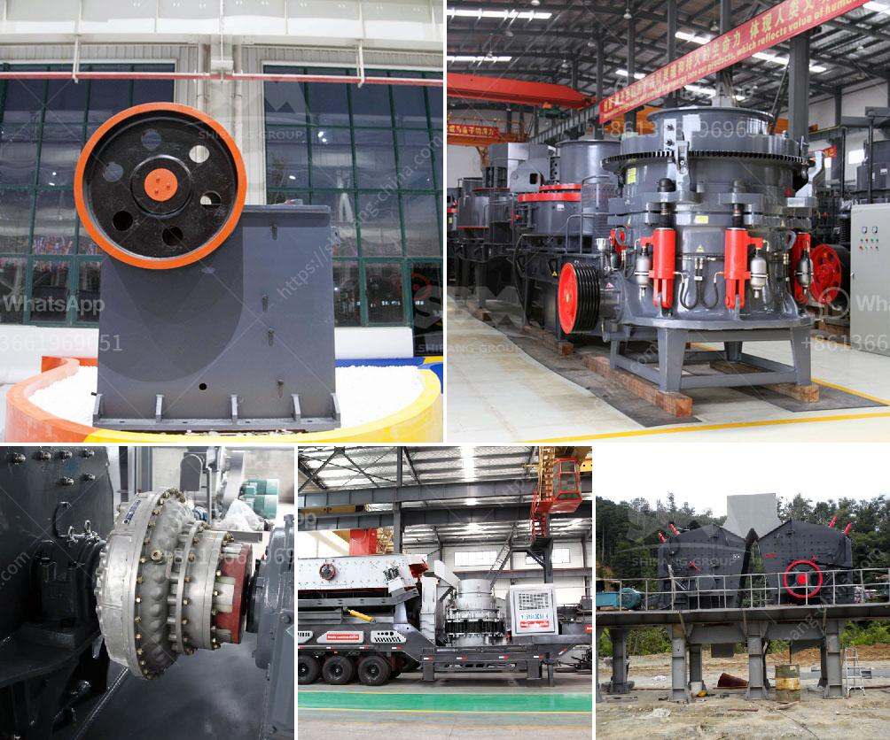

<h3>How to extract manganese ore in Pakistan?</h3>
Manganese ore is a mineral resource that is essential for the production of steel and other alloys. It is commonly found in deposits around the world, including Pakistan. The extraction of manganese ore in Pakistan is a complex process that involves several stages. In this article, we will discuss the steps involved in extracting manganese ore in Pakistan.

Manganese ore deposits can be found in various areas of Pakistan, including Lasbela, Balochistan, Swat, and Khyber Pakhtunkhwa. These deposits are spread over a vast area and require extensive exploration to determine their exact location and size. Once the presence of manganese ore is confirmed, the extraction process can begin.

The first step in extracting manganese ore is exploration. This involves studying geological maps, conducting satellite surveys, and even drilling test holes to determine the presence of manganese ore deposits. This process can take several months or even years.

Once the manganese ore deposits have been identified, they need to be extracted from the earth. The most common method of extracting manganese ore is through open-pit mining. This method involves removing the overlying layers of soil and rock to expose the manganese ore deposit. Heavy machinery, such as bulldozers and excavators, are used to remove the top layer and create a pit.

After the pit has been created, the next step is to extract the manganese ore from the deposit. This is usually done using blasting techniques, where explosives are used to break the ore into smaller pieces. The broken ore is then loaded onto trucks or conveyor belts and transported to a processing plant.

At the processing plant, the manganese ore is crushed into smaller sizes and then undergoes several stages of beneficiation. Beneficiation is a process that removes impurities from the ore and increases its manganese content. This is typically done through processes such as crushing, screening, washing, and magnetic separation.

After beneficiation, the manganese ore is ready to be transported for further processing or sold. It is often shipped to steel mills or alloy plants where it is used to produce steel and other alloys. Manganese is an essential element in steel production, as it helps improve the strength, hardness, and durability of the metal.

In conclusion, extracting manganese ore in Pakistan involves several stages, including exploration, open-pit mining, blasting, beneficiation, and transportation. This process requires significant investment in terms of time, resources, and equipment. However, manganese ore is a valuable resource that plays a crucial role in the production of steel and other alloys, making the extraction process important for the industrial development of Pakistan.
<h3>Contact us</h3><ul><li><strong>Whatsapp:&nbsp;<a href="https://wa.me/8613661969651">+8613661969651</a></strong></li><li><a href="https://swt.shibang-china.com/?git&amp;zhl&amp;How to extract manganese ore in Pakistan"><strong>Online Service(chat now)</strong></a></li></ul><h3>Related</h3><ul><li><a href='How to install a jaw crusher.md'>How to install a jaw crusher?</a></li><li><a href='How much does an iron ore crushing machine cost.md'>How much does an iron ore crushing machine cost?</a></li><li><a href='How much does a mobile crusher plant cost.md'>How much does a mobile crusher plant cost?</a></li><li><a href='how to own quarry in nigeria.md'>how to own quarry in nigeria?</a></li><li><a href='How to operate ball mills.md'>How to operate ball mills?</a></li></ul>