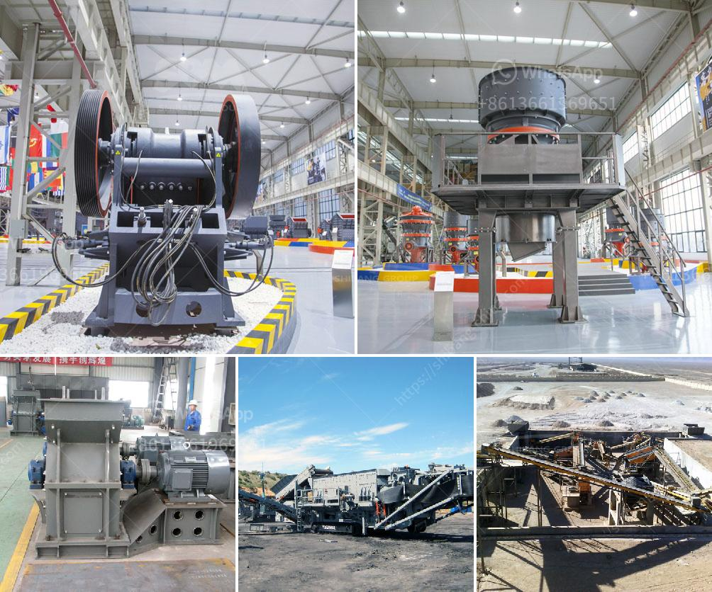

<h3>How to extract silver from lead ore ？</h3>
Silver, a precious metal known for its high value and versatility, can be extracted from various sources, including lead ore. Lead ore is a common material found in underground mining sites and is often associated with other valuable minerals, including silver. Extracting silver from lead ore requires several steps and specialized machinery to ensure its successful separation. In this article, we will explore the process of extracting silver from lead ore and the methods used.

The first step in extracting silver from lead ore is to crush the ore into small pieces. Crushing the ore helps to increase its surface area, making it easier to extract the silver. This can be done using various crushing equipment such as jaw crushers or cone crushers. Once the ore is crushed, it is then ground into a fine powder using a ball mill or similar machinery.

After the ore has been crushed and ground, it is then mixed with water to create a slurry. The slurry is then subjected to a process known as froth flotation. Froth flotation is a method commonly used for separating valuable minerals from ore based on their physical and chemical properties. In the case of extracting silver from lead ore, the slurry is mixed with chemicals called collectors, which selectively capture the silver particles. Air is then blown into the mixture, causing the silver to float to the surface in the form of a froth. The froth is then skimmed off and sent to a separate tank for further processing.

Once the silver-rich froth has been collected, it undergoes a series of processes to further purify and extract the silver. This process typically involves adding chemicals such as cyanide or mercury to remove impurities and separate the silver from other elements present in the ore. The resulting solution or mixture is then heated to evaporate the liquid, leaving behind the silver in its pure form.

It is important to note that the extraction of silver from lead ore can be a complex and potentially hazardous process. Therefore, it is crucial to have proper safety measures in place and to follow industry regulations and guidelines. Protective clothing, gloves, and goggles should be worn, and proper ventilation should be ensured.

In conclusion, extracting silver from lead ore is a multi-step process that requires specialized machinery and chemical treatments. Crushing and grinding the ore, followed by froth flotation, are essential steps in achieving successful silver extraction. Further purification and separation using chemicals are required to obtain pure silver. This process should be carried out in a safe and controlled environment, following all necessary safety precautions. With proper knowledge and equipment, extracting silver from lead ore can be a lucrative endeavor.
<h3>Contact us</h3><ul><li><strong>Whatsapp:&nbsp;<a href="https://wa.me/8613661969651">+8613661969651</a></strong></li><li><a href="https://swt.shibang-china.com/?git&amp;zhl&amp;How to extract silver from lead ore ？"><strong>Online Service(chat now)</strong></a></li></ul><h3>Related</h3><ul><li><a href='How to Build an Ore Processing Plant ？.md'>How to Build an Ore Processing Plant ？</a></li><li><a href='How to start gold ball mill unit.md'>How to start gold ball mill unit?</a></li><li><a href='How to commission a mobile cone crusher.md'>How to commission a mobile cone crusher?</a></li><li><a href='How to measure the theoretical output of a jaw crusher .md'>How to measure the theoretical output of a jaw crusher ?</a></li><li><a href='how to increase is of the output of cement mill .md'>how to increase is of the output of cement mill ?</a></li></ul>