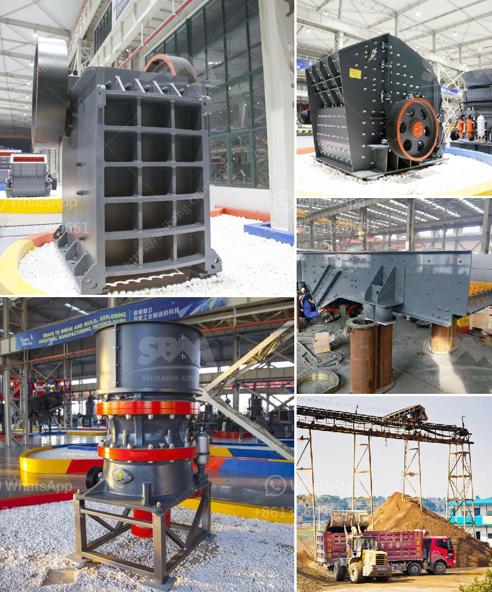

<h3>How to feed a jaw crusher from a concrete hopper?</h3>
A jaw crusher is a powerful machine that breaks down large rocks into smaller, manageable sizes. The main objective of a jaw crusher is to crush hard materials such as granite, limestone, and concrete to smaller pieces that can be used in construction projects. In order to feed a jaw crusher from a concrete hopper, a few things should be considered to ensure efficient operation and maximize productivity.

Choosing the right equipment is crucial for feeding a jaw crusher from a concrete hopper. Consider the size and type of the jaw crusher, as well as the capacity and configuration of the concrete hopper. Ensure that the equipment is designed to handle the size and weight of the materials to be processed, as well as the anticipated feed rate.

The placement of the concrete hopper is essential to ensure a steady flow of materials into the jaw crusher. Ideally, the hopper should be positioned directly above the crusher to minimize the distance traveled by the materials. This reduces the risk of material spillage, blockages, and excessive wear on the equipment.

Designing an effective concrete hopper is key to achieving an optimal feeding process. The hopper should be made of sturdy materials that can withstand the weight of the materials being fed and the force exerted by the jaw crusher. The hopper should have a sloping design to promote the free flow of materials towards the crusher, preventing the accumulation of material and minimizing the risk of blockages.

Proper material handling is crucial to ensure a smooth feed of materials into the jaw crusher. Consider using a conveyor belt system to transport the materials from the concrete hopper to the crusher. This eliminates the need for manual labor and reduces the risk of injuries or accidents. Make sure the conveyor belt is properly maintained and aligned to prevent material spillage and ensure a consistent feed.

Regulating the feed rate is essential to avoid overloading the jaw crusher and achieve optimal performance. Use a vibrating feeder or a grizzly screen to control the feed rate and prevent the jaw crusher from being overwhelmed by excessive material. These devices help distribute the material evenly, allowing the crusher to operate at its full capacity without any interruptions.

Regular maintenance and inspections are crucial to ensure the smooth operation of the jaw crusher. Check the concrete hopper and the feeding equipment regularly for any signs of wear, damage, or blockages. Make sure to remove any debris or foreign objects that may have accumulated in the hopper. Additionally, inspect and lubricate the moving parts of the jaw crusher to prevent premature wear and optimize performance.

In conclusion, feeding a jaw crusher from a concrete hopper requires careful planning and attention to detail. Proper equipment selection, hopper placement, and design, along with effective material handling and feed control, are essential for efficient operation and maximum productivity. Regular maintenance and inspections are also vital to ensure the smooth operation of the jaw crusher. By following these guidelines, you can ensure a steady feed of materials into the jaw crusher, leading to optimal performance and improved overall efficiency.
<h3>Contact us</h3><ul><li><strong>Whatsapp:&nbsp;<a href="https://wa.me/8613661969651">+8613661969651</a></strong></li><li><a href="https://swt.shibang-china.com/?git&amp;zhl&amp;How to feed a jaw crusher from a concrete hopper"><strong>Online Service(chat now)</strong></a></li></ul><h3>Related</h3><ul><li><a href='How to produce silica sand 7 steps.md'>How to produce silica sand? 7 steps</a></li><li><a href='How to remove pyrite stones from coal.md'>How to remove pyrite stones from coal?</a></li><li><a href='How to service a coal crusher.md'>How to service a coal crusher?</a></li><li><a href='How to buy mobile crusher .md'>How to buy mobile crusher ?</a></li><li><a href='How to Adjust a Cone Crusher ？.md'>How to Adjust a Cone Crusher ？</a></li></ul>