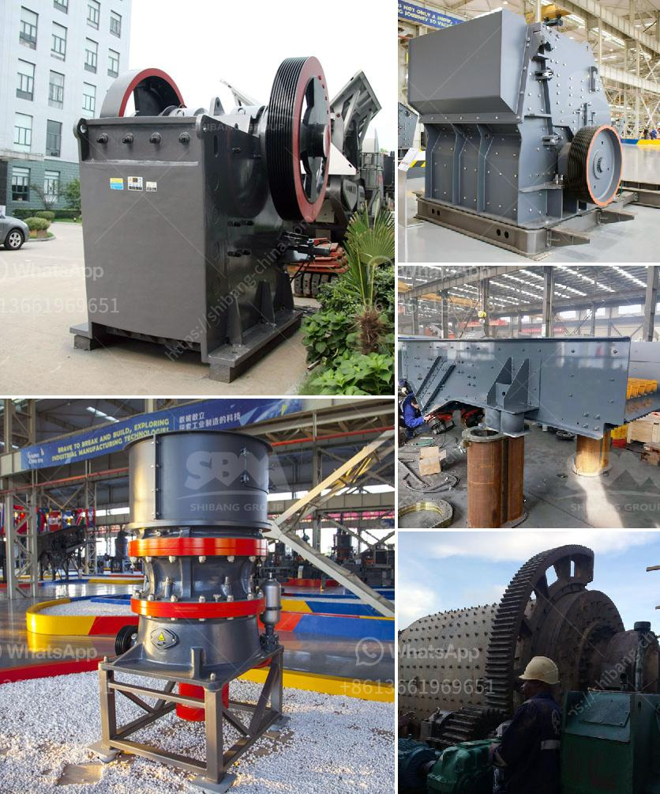

<h3>How to find granite quarries in Salem, Tamil Nadu?</h3>
Salem, a vibrant city in the southern part of India's Tamil Nadu state, is well-known for its rich history, bustling textile industry, and remarkable granite reserves. The region is home to numerous granite quarries, which play a crucial role in the economic development of the area. If you're looking to find granite quarries in Salem, here's a helpful guide to assist you in your search.

Before starting your quest to find granite quarries in Salem, it's essential to conduct thorough research and gather relevant information. Utilize various resources such as local directories, online databases, and government websites to identify potential quarries. These platforms often provide contact details and essential background information on granite quarries in the region.

Reach out to the local authorities, such as the Salem District Collector's office or the Department of Geology and Mining. These offices are responsible for overseeing the quarrying activities and can provide valuable information about licensed quarries in the area. The officials may also guide you on proper granite quarrying procedures and legal requirements.

Connect with local stone associations, trade organizations, and industry groups that can provide insights into the granite quarrying industry in Salem. These groups often have a comprehensive network of quarry owners and professionals. Attend their meetings, seminars, or events to network and learn more about the granite quarrying business.

Engage with the local community, businesses, and individuals involved in the stone industry in Salem. Seek recommendations from reputable architects, contractors, or builders who have previous experience sourcing granite from the region. They may be able to guide you to reliable quarries and connect you with the right stakeholders.

Participate in granite trade fairs and exhibitions regularly held in Salem and neighboring cities. These events provide a platform for granite quarry owners and suppliers to showcase their products and services. Attending these events will give you a firsthand experience of the industry and allow you to network with potential quarry owners.

Venture into Salem's surrounding regions such as Namakkal, Rasipuram, and Dharmapuri, as these areas are known for their abundant granite reserves. Consult local residents, granite traders, or industry professionals in these areas to get recommendations or contacts of quarry owners. Exploring the region will give you a wider range of options to choose from.

In today's digital era, online resources and platforms are valuable tools to find granite quarries. Utilize search engines, online directories, and specialized stone industry websites to locate quarries in Salem. These platforms often provide detailed information about the type of granite produced, contact details, and location maps.

In conclusion, finding granite quarries in Salem, Tamil Nadu requires thorough research, networking, and engagement with local authorities and industry professionals. By following these steps and utilizing various resources, you can successfully locate and connect with granite quarry owners in the region. Remember to exercise due diligence and comply with legal requirements before engaging in any granite quarrying activities.
<h3>Contact us</h3><ul><li><strong>Whatsapp:&nbsp;<a href="https://wa.me/8613661969651">+8613661969651</a></strong></li><li><a href="https://swt.shibang-china.com/?git&amp;zhl&amp;How to find granite quarries in Salem Tamil Nadu"><strong>Online Service(chat now)</strong></a></li></ul><h3>Related</h3><ul><li><a href='how crusher metal detectors work .md'>how crusher metal detectors work ?</a></li><li><a href='How to design a rotor for a VSI crusher.md'>How to design a rotor for a VSI crusher?</a></li><li><a href='How to increase the production capacity of stone grinding machine ？.md'>How to increase the production capacity of stone grinding machine ？</a></li><li><a href='How to crush concrete for recycling .md'>How to crush concrete for recycling ?</a></li><li><a href='How to ensure the efficient operation of impact crusher.md'>How to ensure the efficient operation of impact crusher?</a></li></ul>