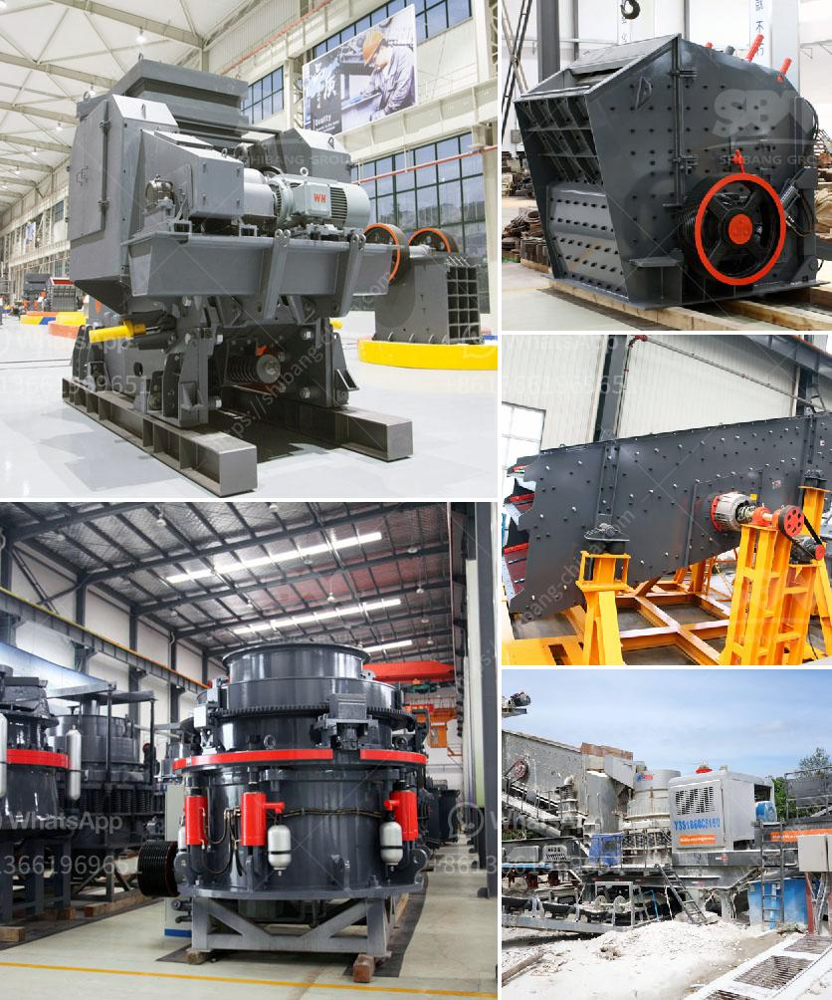

<h3>How to fit a jaw crusher flywheel?</h3>
The flywheel is an often overlooked, but very important component of a jaw crusher. It plays an essential role in the operation of the equipment. In order to ensure the normal operation of the jaw crusher, the flywheel must be installed properly.

Firstly, before assembling the flywheel, it is necessary to check whether the flywheel and the related parts are clean and free of foreign objects. Any dirt or debris on the flywheel or the connecting parts can cause imbalance during operation, leading to excessive vibration and even damage to the equipment.

Next, carefully inspect the flywheel for any signs of damage or cracks. If any defects are found, it is recommended to replace the flywheel with a new one to avoid potential safety hazards. Additionally, it is important to ensure that the flywheel is of the correct specification and size for the jaw crusher model being used.

To fit the flywheel into the jaw crusher properly, the flywheel should be placed parallel to the axial line of the jaw crusher. With the help of jacks, adjust the opening of the crusher discharge cavity to the desired size. However, in order to avoid overload, it is recommended to install a safety device on the retaining ring.

When fitting the flywheel, pay attention to the installation direction. The jaw crusher flywheel should rotate clockwise if viewed from the side of the fixed jaw plate. Conversely, the flywheel should rotate counterclockwise if viewed from the side of the movable jaw plate. Incorrect installation of the flywheel may cause the equipment to malfunction or even break down.

Furthermore, the tightening torque of the flywheel bolts should be checked and adjusted accordingly. Insufficient tightening can result in the flywheel becoming loose during operation, leading to abnormal noises and reduced performance. On the other hand, over-tightening could damage the bolts or threads.

After the flywheel is securely installed, conduct a thorough inspection to ensure its smooth operation. Observe whether there is any abnormal vibration, noise, or other performance issues during the operation of the jaw crusher. If any abnormalities are detected, promptly shut down the equipment and conduct necessary repairs or adjustments.

In conclusion, fitting a jaw crusher flywheel requires careful preparation and attention to detail. It is crucial to ensure the cleanliness of the components, inspect for any damages or cracks, and verify the correct specification and size of the flywheel. The installation direction, tightening torque, and post-installation inspection should also be meticulously carried out. By following these steps, the jaw crusher flywheel can be properly fitted, ensuring the safe and efficient operation of the equipment.
<h3>Contact us</h3><ul><li><strong>Whatsapp:&nbsp;<a href="https://wa.me/8613661969651">+8613661969651</a></strong></li><li><a href="https://swt.shibang-china.com/?git&amp;zhl&amp;How to fit a jaw crusher flywheel"><strong>Online Service(chat now)</strong></a></li></ul><h3>Related</h3><ul><li><a href='How to build iron ore crushing line in Malaysia .md'>How to build iron ore crushing line in Malaysia ?</a></li><li><a href='How to choose jaw crusher in Malaysia 7 suggestions for you.md'>How to choose jaw crusher in Malaysia? 7 suggestions for you</a></li><li><a href='How to process metallic minerals .md'>How to process metallic minerals ?</a></li><li><a href='How to adjust a singletoggle jaw crusher.md'>How to adjust a single-toggle jaw crusher?</a></li><li><a href='How to grind bentonite clay .md'>How to grind bentonite clay ?</a></li></ul>